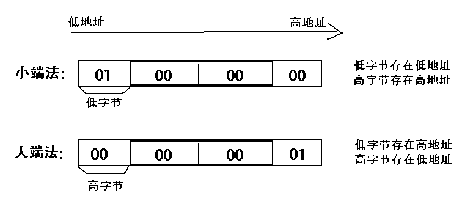

# NumPy 教程


NumPy(Numerical Python) 是 Python 语言的一个扩展程序库，支持大量的维度数组与矩阵运算，此外也针对数组运算提供大量的数学函数库。

NumPy 的前身 Numeric 最早是由 Jim Hugunin 与其它协作者共同开发，2005 年，Travis Oliphant 在 Numeric 中结合了另一个同性质的程序库 Numarray 的特色，并加入了其它扩展而开发了 NumPy。NumPy  为开放源代码并且由许多协作者共同维护开发。

NumPy 是一个运行速度非常快的数学库，主要用于数组计算，包含：

- 一个强大的N维数组对象 ndarray
- 广播功能函数
- 整合 C/C++/Fortran 代码的工具
- 线性代数、傅里叶变换、随机数生成等功能


------

## NumPy 应用

NumPy 通常与 SciPy（Scientific Python）和 Matplotlib（绘图库）一起使用， 这种组合广泛用于替代 MatLab，是一个强大的科学计算环境，有助于我们通过 Python 学习数据科学或者机器学习。

SciPy 是一个开源的 Python 算法库和数学工具包。

SciPy 包含的模块有最优化、线性代数、积分、插值、特殊函数、快速傅里叶变换、信号处理和图像处理、常微分方程求解和其他科学与工程中常用的计算。

Matplotlib 是 Python 编程语言及其数值数学扩展包 NumPy 的可视化操作界面。它为利用通用的图形用户界面工具包，如 Tkinter, wxPython, Qt 或 GTK+ 向应用程序嵌入式绘图提供了应用程序接口（API）。

------

## 相关链接

- NumPy 官网 http://www.numpy.org/
- NumPy 源代码：https://github.com/numpy/numpy
- SciPy 官网：https://www.scipy.org/
- SciPy 源代码：https://github.com/scipy/scipy
- Matplotlib 教程：[Matplotlib 教程](https://www.runoob.com/matplotlib/matplotlib-tutorial.html)
- Matplotlib 官网：https://matplotlib.org/
- Matplotlib 源代码：https://github.com/matplotlib/matplotlib

# NumPy 安装

Python 官网上的发行版是不包含 NumPy 模块的。 

我们可以使用以下几种方法来安装。

## 1、使用已有的发行版本

对于许多用户，尤其是在 Windows 上，最简单的方法是下载以下的 Python 发行版，它们包含了所有的关键包（包括 NumPy，SciPy，matplotlib，IPython，SymPy 以及 Python 核心自带的其它包）：

- [Anaconda](https://www.anaconda.com/download/): 免费 Python 发行版，用于进行大规模数据处理、预测分析，和科学计算，致力于简化包的管理和部署。支持 Linux, Windows 和 Mac 系统。
- [Enthought Canopy](https://www.enthought.com/products/canopy): 提供了免费和商业发行版。持 Linux, Windows 和 Mac 系统。
- [Python(x,y)](https://python-xy.github.io/): 免费的 Python 发行版，包含了完整的 Python 语言开发包 及 [Spyder IDE](https://www.spyder-ide.org/)。支持 Windows，仅限 Python 2 版本。
- [WinPython](https://winpython.github.io): 另一个免费的 Python 发行版，包含科学计算包与 Spyder IDE。支持 Windows。
- [Pyzo](http://www.pyzo.org/): 基于 Anaconda 的免费发行版本及 IEP 的交互开发环境，超轻量级。 支持 Linux, Windows 和 Mac 系统。

------

## 2、使用 pip 安装

安装 NumPy 最简单的方法就是使用 [pip 工具](https://www.runoob.com/w3cnote/python-pip-install-usage.html)：

```
pip3 install --user numpy scipy matplotlib
```

--user 选项可以设置只安装在当前的用户下，而不是写入到系统目录。

默认情况使用国外线路，国外太慢，我们使用清华的镜像就可以:

```
pip3 install numpy scipy matplotlib -i https://pypi.tuna.tsinghua.edu.cn/simple
```

------

## Linux 下安装

**Ubuntu & Debian**

```
sudo apt-get install python3-numpy python3-scipy python3-matplotlib ipython ipython-notebook python-pandas python-sympy python-nose
```

**CentOS/Fedora**

```
sudo dnf install numpy scipy python-matplotlib ipython python-pandas sympy python-nose atlas-devel
```

**Mac 系统**

Mac 系统的 Homebrew 不包含 NumPy 或其他一些科学计算包，所以可以使用以下方式来安装：

```
pip3 install numpy scipy matplotlib -i https://pypi.tuna.tsinghua.edu.cn/simple
```

------

## 安装验证

测试是否安装成功：

```
>>> from numpy import *
>>> eye(4)
array([[1., 0., 0., 0.],
       [0., 1., 0., 0.],
       [0., 0., 1., 0.],
       [0., 0., 0., 1.]])
```

**from numpy import \*** 为导入 numpy 库。

**eye(4)** 生成对角矩阵。

# NumPy Ndarray 对象

NumPy 最重要的一个特点是其 N 维数组对象 ndarray，它是一系列同类型数据的集合，以 0 下标为开始进行集合中元素的索引。 

ndarray 对象是用于存放同类型元素的多维数组。 

ndarray 中的每个元素在内存中都有相同存储大小的区域。 

ndarray 内部由以下内容组成： 

- 一个指向数据（内存或内存映射文件中的一块数据）的指针。
- 数据类型或 dtype，描述在数组中的固定大小值的格子。
- 一个表示数组形状（shape）的元组，表示各维度大小的元组。
- 一个跨度元组（stride），其中的整数指的是为了前进到当前维度下一个元素需要"跨过"的字节数。


ndarray 的内部结构:


跨度可以是负数，这样会使数组在内存中后向移动，切片中 obj[::-1] 或 obj[:,::-1] 就是如此。

创建一个 ndarray 只需调用 NumPy 的 array 函数即可：

```
numpy.array(object, dtype = None, copy = True, order = None, subok = False, ndmin = 0)
```

**参数说明：**

| 名称   | 描述                                                      |
| :----- | :-------------------------------------------------------- |
| object | 数组或嵌套的数列                                          |
| dtype  | 数组元素的数据类型，可选                                  |
| copy   | 对象是否需要复制，可选                                    |
| order  | 创建数组的样式，C为行方向，F为列方向，A为任意方向（默认） |
| subok  | 默认返回一个与基类类型一致的数组                          |
| ndmin  | 指定生成数组的最小维度                                    |

### 实例

接下来可以通过以下实例帮助我们更好的理解。

## 实例 1

import numpy as np  a = np.array([1,2,3])   print (a)

输出结果如下：

```
[1 2 3]
```

## 实例 2

\# 多于一个维度   import numpy as np  a = np.array([[1,  2],  [3,  4]])   print (a)

输出结果如下：

```
[[1  2] 
 [3  4]]
```

## 实例 3

\# 最小维度   import numpy as np  a = np.array([1, 2, 3, 4, 5], ndmin =  2)   print (a)

输出如下：

```
[[1 2 3 4 5]]
```

## 实例 4

\# dtype 参数   import numpy as np  a = np.array([1,  2,  3], dtype = complex)   print (a)

输出结果如下：

```
[1.+0.j 2.+0.j 3.+0.j]
```

ndarray 对象由计算机内存的连续一维部分组成，并结合索引模式，将每个元素映射到内存块中的一个位置。内存块以行顺序(C样式)或列顺序(FORTRAN或MatLab风格，即前述的F样式)来保存元素。

# NumPy 数据类型

numpy 支持的数据类型比 Python 内置的类型要多很多，基本上可以和 C 语言的数据类型对应上，其中部分类型对应为 Python 内置的类型。下表列举了常用 NumPy 基本类型。

| 名称       | 描述                                                         |
| ---------- | ------------------------------------------------------------ |
| bool_      | 布尔型数据类型（True 或者 False）                            |
| int_       | 默认的整数类型（类似于 C 语言中的 long，int32 或 int64）     |
| intc       | 与 C 的 int 类型一样，一般是 int32 或 int 64                 |
| intp       | 用于索引的整数类型（类似于 C 的 ssize_t，一般情况下仍然是 int32 或 int64） |
| int8       | 字节（-128 to 127）                                          |
| int16      | 整数（-32768 to 32767）                                      |
| int32      | 整数（-2147483648 to 2147483647）                            |
| int64      | 整数（-9223372036854775808 to 9223372036854775807）          |
| uint8      | 无符号整数（0 to 255）                                       |
| uint16     | 无符号整数（0 to 65535）                                     |
| uint32     | 无符号整数（0 to 4294967295）                                |
| uint64     | 无符号整数（0 to 18446744073709551615）                      |
| float_     | float64 类型的简写                                           |
| float16    | 半精度浮点数，包括：1 个符号位，5 个指数位，10 个尾数位      |
| float32    | 单精度浮点数，包括：1 个符号位，8 个指数位，23 个尾数位      |
| float64    | 双精度浮点数，包括：1 个符号位，11 个指数位，52 个尾数位     |
| complex_   | complex128 类型的简写，即 128 位复数                         |
| complex64  | 复数，表示双 32 位浮点数（实数部分和虚数部分）               |
| complex128 | 复数，表示双 64 位浮点数（实数部分和虚数部分）               |

numpy 的数值类型实际上是 dtype 对象的实例，并对应唯一的字符，包括 np.bool_，np.int32，np.float32，等等。

------

## 数据类型对象 (dtype)

数据类型对象（numpy.dtype 类的实例）用来描述与数组对应的内存区域是如何使用，它描述了数据的以下几个方面：：

- 数据的类型（整数，浮点数或者 Python 对象）
- 数据的大小（例如， 整数使用多少个字节存储）
- 数据的字节顺序（小端法或大端法）
- 在结构化类型的情况下，字段的名称、每个字段的数据类型和每个字段所取的内存块的部分
- 如果数据类型是子数组，那么它的形状和数据类型是什么。

字节顺序是通过对数据类型预先设定 <  或 > 来决定的。 < 意味着小端法(最小值存储在最小的地址，即低位组放在最前面)。> 意味着大端法(最重要的字节存储在最小的地址，即高位组放在最前面)。

dtype 对象是使用以下语法构造的：

```
numpy.dtype(object, align, copy)
```

- object - 要转换为的数据类型对象
- align - 如果为 true，填充字段使其类似 C 的结构体。
- copy - 复制 dtype 对象 ，如果为 false，则是对内置数据类型对象的引用

### 实例

接下来我们可以通过实例来理解。

## 实例 1

import numpy as np # 使用标量类型 dt = np.dtype(np.int32) print(dt)

输出结果为：

```
int32
```

## 实例 2

import numpy as np # int8, int16, int32, int64 四种数据类型可以使用字符串 'i1', 'i2','i4','i8' 代替 dt = np.dtype('i4') print(dt)

输出结果为：

```
int32
```

## 实例 3

import numpy as np # 字节顺序标注 dt = np.dtype('<i4') print(dt)

输出结果为：

```
int32
```

下面实例展示结构化数据类型的使用，类型字段和对应的实际类型将被创建。

## 实例 4

\# 首先创建结构化数据类型 import numpy as np dt = np.dtype([('age',np.int8)])  print(dt)

输出结果为：

```
[('age', 'i1')]
```

## 实例 5

\# 将数据类型应用于 ndarray 对象 import numpy as np dt = np.dtype([('age',np.int8)])  a = np.array([(10,),(20,),(30,)], dtype = dt)  print(a)

输出结果为：

```
[(10,) (20,) (30,)]
```

## 实例 6

\# 类型字段名可以用于存取实际的 age 列 import numpy as np dt = np.dtype([('age',np.int8)])  a = np.array([(10,),(20,),(30,)], dtype = dt)  print(a['age'])

输出结果为：

```
[10 20 30]
```

下面的示例定义一个结构化数据类型 student，包含字符串字段 name，整数字段 age，及浮点字段 marks，并将这个 dtype 应用到 ndarray 对象。

## 实例 7

import numpy as np student = np.dtype([('name','S20'), ('age', 'i1'), ('marks', 'f4')])  print(student)

输出结果为：

```
[('name', 'S20'), ('age', 'i1'), ('marks', 'f4')]
```

## 实例 8

import numpy as np student = np.dtype([('name','S20'), ('age', 'i1'), ('marks', 'f4')])  a = np.array([('abc', 21, 50),('xyz', 18, 75)], dtype = student)  print(a)

输出结果为：

```
[('abc', 21, 50.0), ('xyz', 18, 75.0)]
```

每个内建类型都有一个唯一定义它的字符代码，如下：

| 字符 | 对应类型              |
| ---- | --------------------- |
| b    | 布尔型                |
| i    | (有符号) 整型         |
| u    | 无符号整型 integer    |
| f    | 浮点型                |
| c    | 复数浮点型            |
| m    | timedelta（时间间隔） |
| M    | datetime（日期时间）  |
| O    | (Python) 对象         |
| S, a | (byte-)字符串         |
| U    | Unicode               |
| V    | 原始数据 (void)       |

# NumPy 数组属性

本章节我们将来了解 NumPy 数组的一些基本属性。

NumPy 数组的维数称为秩（rank），秩就是轴的数量，即数组的维度，一维数组的秩为 1，二维数组的秩为 2，以此类推。

在   NumPy中，每一个线性的数组称为是一个轴（axis），也就是维度（dimensions）。比如说，二维数组相当于是两个一维数组，其中第一个一维数组中每个元素又是一个一维数组。所以一维数组就是 NumPy 中的轴（axis），第一个轴相当于是底层数组，第二个轴是底层数组里的数组。而轴的数量——秩，就是数组的维数。

很多时候可以声明 axis。axis=0，表示沿着第 0 轴进行操作，即对每一列进行操作；axis=1，表示沿着第1轴进行操作，即对每一行进行操作。

NumPy 的数组中比较重要 ndarray 对象属性有：

| 属性             | 说明                                                         |
| ---------------- | ------------------------------------------------------------ |
| ndarray.ndim     | 秩，即轴的数量或维度的数量                                   |
| ndarray.shape    | 数组的维度，对于矩阵，n 行 m 列                              |
| ndarray.size     | 数组元素的总个数，相当于 .shape 中 n*m 的值                  |
| ndarray.dtype    | ndarray 对象的元素类型                                       |
| ndarray.itemsize | ndarray 对象中每个元素的大小，以字节为单位                   |
| ndarray.flags    | ndarray 对象的内存信息                                       |
| ndarray.real     | ndarray元素的实部                                            |
| ndarray.imag     | ndarray 元素的虚部                                           |
| ndarray.data     | 包含实际数组元素的缓冲区，由于一般通过数组的索引获取元素，所以通常不需要使用这个属性。 |

### ndarray.ndim

ndarray.ndim 用于返回数组的维数，等于秩。

## 实例

import numpy as np   a = np.arange(24)   print (a.ndim)             # a 现只有一个维度 # 现在调整其大小 b = a.reshape(2,4,3)  # b 现在拥有三个维度 print (b.ndim)

输出结果为：

```
1
3
```

### ndarray.shape

ndarray.shape 表示数组的维度，返回一个元组，这个元组的长度就是维度的数目，即 ndim 属性(秩)。比如，一个二维数组，其维度表示"行数"和"列数"。

ndarray.shape  也可以用于调整数组大小。

## 实例

import numpy as np    a = np.array([[1,2,3],[4,5,6]])   print (a.shape)

输出结果为：

```
(2, 3)
```

调整数组大小。

## 实例

import numpy as np   a = np.array([[1,2,3],[4,5,6]])  a.shape =  (3,2)   print (a)

输出结果为：

```
[[1 2]
 [3 4]
 [5 6]]
```

NumPy 也提供了 reshape 函数来调整数组大小。

## 实例

import numpy as np   a = np.array([[1,2,3],[4,5,6]])  b = a.reshape(3,2)   print (b)

输出结果为：

```
[[1 2]
 [3 4]
 [5 6]]
```

### ndarray.itemsize

ndarray.itemsize 以字节的形式返回数组中每一个元素的大小。

例如，一个元素类型为 float64 的数组 itemsize 属性值为 8(float64 占用 64 个 bits，每个字节长度为  8，所以 64/8，占用 8 个字节），又如，一个元素类型为 complex32 的数组 item 属性为 4（32/8）。

## 实例

import numpy as np   # 数组的 dtype 为 int8（一个字节）   x = np.array([1,2,3,4,5], dtype = np.int8)   print (x.itemsize)  # 数组的 dtype 现在为 float64（八个字节）  y = np.array([1,2,3,4,5], dtype = np.float64)   print (y.itemsize)

输出结果为：

```
1
8
```

### ndarray.flags

ndarray.flags 返回 ndarray 对象的内存信息，包含以下属性：

| 属性             | 描述                                                         |
| :--------------- | :----------------------------------------------------------- |
| C_CONTIGUOUS (C) | 数据是在一个单一的C风格的连续段中                            |
| F_CONTIGUOUS (F) | 数据是在一个单一的Fortran风格的连续段中                      |
| OWNDATA (O)      | 数组拥有它所使用的内存或从另一个对象中借用它                 |
| WRITEABLE (W)    | 数据区域可以被写入，将该值设置为 False，则数据为只读         |
| ALIGNED (A)      | 数据和所有元素都适当地对齐到硬件上                           |
| UPDATEIFCOPY (U) | 这个数组是其它数组的一个副本，当这个数组被释放时，原数组的内容将被更新 |

## 实例

import numpy as np   x = np.array([1,2,3,4,5])   print (x.flags)

输出结果为：

```
  C_CONTIGUOUS : True
  F_CONTIGUOUS : True
  OWNDATA : True
  WRITEABLE : True
  ALIGNED : True
  WRITEBACKIFCOPY : False
  UPDATEIFCOPY : False
```

# NumPy 创建数组

ndarray 数组除了可以使用底层 ndarray 构造器来创建外，也可以通过以下几种方式来创建。

### numpy.empty

numpy.empty 方法用来创建一个指定形状（shape）、数据类型（dtype）且未初始化的数组：

```
numpy.empty(shape, dtype = float, order = 'C')
```

参数说明：

| 参数  | 描述                                                         |
| :---- | :----------------------------------------------------------- |
| shape | 数组形状                                                     |
| dtype | 数据类型，可选                                               |
| order | 有"C"和"F"两个选项,分别代表，行优先和列优先，在计算机内存中的存储元素的顺序。 |

下面是一个创建空数组的实例：

## 实例

import numpy as np  x = np.empty([3,2], dtype = int)  print (x)

输出结果为：

```
[[ 6917529027641081856  5764616291768666155]
 [ 6917529027641081859 -5764598754299804209]
 [          4497473538      844429428932120]]
```

**注意** − 数组元素为随机值，因为它们未初始化。

### numpy.zeros

创建指定大小的数组，数组元素以 0 来填充：

```
numpy.zeros(shape, dtype = float, order = 'C')
```

参数说明：

| 参数  | 描述                                                |
| :---- | :-------------------------------------------------- |
| shape | 数组形状                                            |
| dtype | 数据类型，可选                                      |
| order | 'C' 用于 C 的行数组，或者 'F' 用于 FORTRAN 的列数组 |

## 实例

import numpy as np  # 默认为浮点数 x = np.zeros(5)  print(x)  # 设置类型为整数 y = np.zeros((5,), dtype = int)  print(y)  # 自定义类型 z = np.zeros((2,2), dtype = [('x', 'i4'), ('y', 'i4')])   print(z)

输出结果为：

```
[0. 0. 0. 0. 0.]
[0 0 0 0 0]
[[(0, 0) (0, 0)]
 [(0, 0) (0, 0)]]
```

### numpy.ones

创建指定形状的数组，数组元素以 1 来填充：

```
numpy.ones(shape, dtype = None, order = 'C')
```

参数说明：

| 参数  | 描述                                                |
| :---- | :-------------------------------------------------- |
| shape | 数组形状                                            |
| dtype | 数据类型，可选                                      |
| order | 'C' 用于 C 的行数组，或者 'F' 用于 FORTRAN 的列数组 |

## 实例

import numpy as np  # 默认为浮点数 x = np.ones(5)  print(x)  # 自定义类型 x = np.ones([2,2], dtype = int) print(x)

输出结果为：

```
[1. 1. 1. 1. 1.]
[[1 1]
 [1 1]]
```

### numpy.zeros_like 

numpy.zeros_like 用于创建一个与给定数组具有相同形状的数组，数组元素以 0 来填充。

numpy.zeros 和 numpy.zeros_like 都是用于创建一个指定形状的数组，其中所有元素都是 0。

它们之间的区别在于：numpy.zeros 可以直接指定要创建的数组的形状，而 numpy.zeros_like 则是创建一个与给定数组具有相同形状的数组。

```
numpy.zeros_like(a, dtype=None, order='K', subok=True, shape=None)
```

参数说明：

| 参数  | 描述                                                         |
| :---- | :----------------------------------------------------------- |
| a     | 给定要创建相同形状的数组                                     |
|       |                                                              |
| dtype | 创建的数组的数据类型                                         |
| order | 数组在内存中的存储顺序，可选值为 'C'（按行优先）或 'F'（按列优先），默认为 'K'（保留输入数组的存储顺序） |
| subok | 是否允许返回子类，如果为 True，则返回一个子类对象，否则返回一个与 a 数组具有相同数据类型和存储顺序的数组 |
| shape | 创建的数组的形状，如果不指定，则默认为 a 数组的形状。        |

创建一个与 arr 形状相同的，所有元素都为 0 的数组：

## 实例

import numpy as np  # 创建一个 3x3 的二维数组 arr = np.array([[1, 2, 3], [4, 5, 6], [7, 8, 9]])  # 创建一个与 arr 形状相同的，所有元素都为 0 的数组 zeros_arr = np.zeros_like(arr) print(zeros_arr)

输出结果为：

```
[[0 0 0]
 [0 0 0]
 [0 0 0]]
```

### numpy.ones_like 

numpy.ones_like 用于创建一个与给定数组具有相同形状的数组，数组元素以 1 来填充。

numpy.ones 和 numpy.ones_like 都是用于创建一个指定形状的数组，其中所有元素都是 1。

它们之间的区别在于：numpy.ones 可以直接指定要创建的数组的形状，而 numpy.ones_like 则是创建一个与给定数组具有相同形状的数组。

```
numpy.ones_like(a, dtype=None, order='K', subok=True, shape=None)
```

参数说明：

| 参数  | 描述                                                         |
| :---- | :----------------------------------------------------------- |
| a     | 给定要创建相同形状的数组                                     |
|       |                                                              |
| dtype | 创建的数组的数据类型                                         |
| order | 数组在内存中的存储顺序，可选值为 'C'（按行优先）或 'F'（按列优先），默认为 'K'（保留输入数组的存储顺序） |
| subok | 是否允许返回子类，如果为 True，则返回一个子类对象，否则返回一个与 a 数组具有相同数据类型和存储顺序的数组 |
| shape | 创建的数组的形状，如果不指定，则默认为 a 数组的形状。        |

创建一个与 arr 形状相同的，所有元素都为 1 的数组：

## 实例

import numpy as np  # 创建一个 3x3 的二维数组 arr = np.array([[1, 2, 3], [4, 5, 6], [7, 8, 9]])  # 创建一个与 arr 形状相同的，所有元素都为 1 的数组 ones_arr = np.ones_like(arr) print(ones_arr)

输出结果为：

```
[[1 1 1]
 [1 1 1]
 [1 1 1]]
```

# NumPy 从已有的数组创建数组

本章节我们将学习如何从已有的数组创建数组。

### numpy.asarray

numpy.asarray 类似 numpy.array，但 numpy.asarray  参数只有三个，比 numpy.array 少两个。

```
numpy.asarray(a, dtype = None, order = None)
```

参数说明：

| 参数  | 描述                                                         |
| ----- | ------------------------------------------------------------ |
| a     | 任意形式的输入参数，可以是，列表, 列表的元组, 元组, 元组的元组, 元组的列表，多维数组 |
| dtype | 数据类型，可选                                               |
| order | 可选，有"C"和"F"两个选项,分别代表，行优先和列优先，在计算机内存中的存储元素的顺序。 |

### 实例

将列表转换为 ndarray:

## 实例

import numpy as np   x =  [1,2,3]  a = np.asarray(x)   print (a)

输出结果为：

```
[1  2  3]
```

将元组转换为 ndarray:

## 实例

import numpy as np   x =  (1,2,3)  a = np.asarray(x)   print (a)

输出结果为：

```
[1  2  3]
```

将元组列表转换为 ndarray:

## 实例

import numpy as np   x =  [(1,2,3),(4,5)]  a = np.asarray(x)   print (a)

输出结果为：

```
[(1, 2, 3) (4, 5)]
```

设置了 dtype 参数：

## 实例

import numpy as np   x =  [1,2,3]  a = np.asarray(x, dtype =  float)   print (a)

输出结果为：

```
[ 1.  2.  3.]
```

### numpy.frombuffer

numpy.frombuffer 用于实现动态数组。

numpy.frombuffer 接受 buffer 输入参数，以流的形式读入转化成 ndarray 对象。

```
numpy.frombuffer(buffer, dtype = float, count = -1, offset = 0)
```

> **注意：**buffer 是字符串的时候，Python3 默认 str 是 Unicode 类型，所以要转成 bytestring 在原 str 前加上 b。

参数说明：

| 参数   | 描述                                     |
| ------ | ---------------------------------------- |
| buffer | 可以是任意对象，会以流的形式读入。       |
| dtype  | 返回数组的数据类型，可选                 |
| count  | 读取的数据数量，默认为-1，读取所有数据。 |
| offset | 读取的起始位置，默认为0。                |

## Python3.x 实例

import numpy as np   s =  b'Hello World'  a = np.frombuffer(s, dtype =  'S1')   print (a)

输出结果为：

```
[b'H' b'e' b'l' b'l' b'o' b' ' b'W' b'o' b'r' b'l' b'd']
```

## Python2.x 实例

import numpy as np s =  'Hello World' a = np.frombuffer(s, dtype =  'S1') print (a)

输出结果为：

```
['H' 'e' 'l' 'l' 'o' ' ' 'W' 'o' 'r' 'l' 'd']
```

### numpy.fromiter

numpy.fromiter 方法从可迭代对象中建立 ndarray 对象，返回一维数组。

```
numpy.fromiter(iterable, dtype, count=-1)
```

| 参数     | 描述                                   |
| -------- | -------------------------------------- |
| iterable | 可迭代对象                             |
| dtype    | 返回数组的数据类型                     |
| count    | 读取的数据数量，默认为-1，读取所有数据 |

## 实例

import numpy as np   # 使用 range 函数创建列表对象   list=range(5) it=iter(list)  # 使用迭代器创建 ndarray  x=np.fromiter(it, dtype=float) print(x)

输出结果为：

```
[0. 1. 2. 3. 4.]
```

# NumPy 从数值范围创建数组

这一章节我们将学习如何从数值范围创建数组。

### numpy.arange

numpy 包中的使用 arange 函数创建数值范围并返回 ndarray 对象，函数格式如下：

```
numpy.arange(start, stop, step, dtype)
```

根据 start 与 stop 指定的范围以及 step 设定的步长，生成一个 ndarray。

参数说明：

| 参数    | 描述                                                         |
| ------- | ------------------------------------------------------------ |
| `start` | 起始值，默认为`0`                                            |
| `stop`  | 终止值（不包含）                                             |
| `step`  | 步长，默认为`1`                                              |
| `dtype` | 返回`ndarray`的数据类型，如果没有提供，则会使用输入数据的类型。 |

### 实例

生成 0 到 4 长度为 5 的数组:

## 实例

import numpy as np  x = np.arange(5)   print (x)

输出结果如下：

```
[0  1  2  3  4]
```

设置返回类型位 float:

## 实例

import numpy as np  # 设置了 dtype x = np.arange(5, dtype =  float)   print (x)

输出结果如下：

```
[0.  1.  2.  3.  4.]
```

设置了起始值、终止值及步长：

## 实例

import numpy as np x = np.arange(10,20,2)   print (x)

输出结果如下：

```
[10  12  14  16  18]
```

### numpy.linspace

numpy.linspace 函数用于创建一个一维数组，数组是一个等差数列构成的，格式如下：

```
np.linspace(start, stop, num=50, endpoint=True, retstep=False, dtype=None)
```

参数说明：

| 参数       | 描述                                                         |
| ---------- | ------------------------------------------------------------ |
| `start`    | 序列的起始值                                                 |
| `stop`     | 序列的终止值，如果`endpoint`为`true`，该值包含于数列中       |
| `num`      | 要生成的等步长的样本数量，默认为`50`                         |
| `endpoint` | 该值为 `true` 时，数列中包含`stop`值，反之不包含，默认是True。 |
| `retstep`  | 如果为 True 时，生成的数组中会显示间距，反之不显示。         |
| `dtype`    | `ndarray` 的数据类型                                         |

以下实例用到三个参数，设置起始点为 1 ，终止点为 10，数列个数为 10。

## 实例

import numpy as np a = np.linspace(1,10,10) print(a)

输出结果为：

```
[ 1.  2.  3.  4.  5.  6.  7.  8.  9. 10.]
```

设置元素全部是1的等差数列：

## 实例

import numpy as np a = np.linspace(1,1,10) print(a)

输出结果为：

```
[1. 1. 1. 1. 1. 1. 1. 1. 1. 1.]
```

将 endpoint 设为 false，不包含终止值：

## 实例

import numpy as np  a = np.linspace(10, 20,  5, endpoint =  False)   print(a)

输出结果为：

```
[10. 12. 14. 16. 18.]
```

如果将 endpoint 设为 true，则会包含 20。

以下实例设置间距。

## 实例

import numpy as np a =np.linspace(1,10,10,retstep= True)  print(a) # 拓展例子 b =np.linspace(1,10,10).reshape([10,1]) print(b)

输出结果为：

```
(array([ 1.,  2.,  3.,  4.,  5.,  6.,  7.,  8.,  9., 10.]), 1.0)
[[ 1.]
 [ 2.]
 [ 3.]
 [ 4.]
 [ 5.]
 [ 6.]
 [ 7.]
 [ 8.]
 [ 9.]
 [10.]]
```

### numpy.logspace

numpy.logspace 函数用于创建一个于等比数列。格式如下：

```
np.logspace(start, stop, num=50, endpoint=True, base=10.0, dtype=None)
```

base 参数意思是取对数的时候 log 的下标。

| 参数       | 描述                                                         |
| ---------- | ------------------------------------------------------------ |
| `start`    | 序列的起始值为：base ** start                                |
| `stop`     | 序列的终止值为：base ** stop。如果`endpoint`为`true`，该值包含于数列中 |
| `num`      | 要生成的等步长的样本数量，默认为`50`                         |
| `endpoint` | 该值为 `true` 时，数列中中包含`stop`值，反之不包含，默认是True。 |
| `base`     | 对数 log 的底数。                                            |
| `dtype`    | `ndarray` 的数据类型                                         |

## 实例

import numpy as np # 默认底数是 10 a = np.logspace(1.0,  2.0, num =  10)   print (a)

输出结果为：

```
[ 10.           12.91549665     16.68100537      21.5443469  27.82559402      
  35.93813664   46.41588834     59.94842503      77.42636827    100.    ]
```

将对数的底数设置为 2 :

## 实例

import numpy as np a = np.logspace(0,9,10,base=2) print (a)

输出如下：

```
[  1.   2.   4.   8.  16.  32.  64. 128. 256. 512.]
```

# NumPy  切片和索引

ndarray对象的内容可以通过索引或切片来访问和修改，与 Python 中 list 的切片操作一样。

ndarray 数组可以基于 0 - n 的下标进行索引，切片对象可以通过内置的 slice 函数，并设置 start, stop 及 step 参数进行，从原数组中切割出一个新数组。

## 实例

import numpy as np  a = np.arange(10) s = slice(2,7,2)   # 从索引 2 开始到索引 7 停止，间隔为2 print (a[s])

输出结果为：

```
[2  4  6]
```

以上实例中，我们首先通过 arange() 函数创建 ndarray 对象。 然后，分别设置起始，终止和步长的参数为  2，7 和 2。 

我们也可以通过冒号分隔切片参数 **start:stop:step** 来进行切片操作：

## 实例

import numpy as np  a = np.arange(10)   b = a[2:7:2]   # 从索引 2 开始到索引 7 停止，间隔为 2 print(b)

输出结果为：

```
[2  4  6]
```

冒号 : 的解释：如果只放置一个参数，如 **[2]**，将返回与该索引相对应的单个元素。如果为 **[2:]**，表示从该索引开始以后的所有项都将被提取。如果使用了两个参数，如 **[2:7]**，那么则提取两个索引(不包括停止索引)之间的项。

## 实例

import numpy as np  a = np.arange(10)  # [0 1 2 3 4 5 6 7 8 9] b = a[5]  print(b)

输出结果为：

```
5
```

## 实例

import numpy as np  a = np.arange(10) print(a[2:])

输出结果为：

```
[2  3  4  5  6  7  8  9]
```

## 实例

import numpy as np  a = np.arange(10)  # [0 1 2 3 4 5 6 7 8 9] print(a[2:5])

输出结果为：

```
[2  3  4]
```

多维数组同样适用上述索引提取方法：

## 实例

import numpy as np  a = np.array([[1,2,3],[3,4,5],[4,5,6]]) print(a) # 从某个索引处开始切割 print('从数组索引 a[1:] 处开始切割') print(a[1:])

输出结果为：

```
[[1 2 3]
 [3 4 5]
 [4 5 6]]
从数组索引 a[1:] 处开始切割
[[3 4 5]
 [4 5 6]]
```

切片还可以包括省略号 …，来使选择元组的长度与数组的维度相同。 如果在行位置使用省略号，它将返回包含行中元素的 ndarray。

## 实例

import numpy as np  a = np.array([[1,2,3],[3,4,5],[4,5,6]])   print (a[...,1])   # 第2列元素 print (a[1,...])   # 第2行元素 print (a[...,1:])  # 第2列及剩下的所有元素

输出结果为：

```
[2 4 5]
[3 4 5]
[[2 3]
 [4 5]
 [5 6]]
```

# NumPy 高级索引

NumPy 比一般的 Python 序列提供更多的索引方式。

除了之前看到的用整数和切片的索引外，数组可以由整数数组索引、布尔索引及花式索引。

NumPy 中的高级索引指的是使用整数数组、布尔数组或者其他序列来访问数组的元素。相比于基本索引，高级索引可以访问到数组中的任意元素，并且可以用来对数组进行复杂的操作和修改。

### 整数数组索引

整数数组索引是指使用一个数组来访问另一个数组的元素。这个数组中的每个元素都是目标数组中某个维度上的索引值。

以下实例获取数组中 **(0,0)，(1,1)** 和 **(2,0)** 位置处的元素。

## 实例

import numpy as np   x = np.array([[1,  2],  [3,  4],  [5,  6]])  y = x[[0,1,2],  [0,1,0]]   print (y)

输出结果为：

```
[1  4  5]
```

以下实例获取了 4X3 数组中的四个角的元素。 行索引是 [0,0] 和 [3,3]，而列索引是 [0,2] 和 [0,2]。

## 实例

import numpy as np   x = np.array([[  0,  1,  2],[  3,  4,  5],[  6,  7,  8],[  9,  10,  11]])   print ('我们的数组是：' ) print (x) print ('\n') rows = np.array([[0,0],[3,3]])  cols = np.array([[0,2],[0,2]])  y = x[rows,cols]   print  ('这个数组的四个角元素是：') print (y)

输出结果为：

```
我们的数组是：
[[ 0  1  2]
 [ 3  4  5]
 [ 6  7  8]
 [ 9 10 11]]


这个数组的四个角元素是：
[[ 0  2]
 [ 9 11]]
```

返回的结果是包含每个角元素的 ndarray 对象。

可以借助切片 : 或 … 与索引数组组合。如下面例子：

## 实例

import numpy as np  a = np.array([[1,2,3], [4,5,6],[7,8,9]]) b = a[1:3, 1:3] c = a[1:3,[1,2]] d = a[...,1:] print(b) print(c) print(d)

输出结果为：

```
[[5 6]
 [8 9]]
[[5 6]
 [8 9]]
[[2 3]
 [5 6]
 [8 9]]
```

### 布尔索引

我们可以通过一个布尔数组来索引目标数组。

布尔索引通过布尔运算（如：比较运算符）来获取符合指定条件的元素的数组。

以下实例获取大于 5 的元素：

## 实例

import numpy as np   x = np.array([[  0,  1,  2],[  3,  4,  5],[  6,  7,  8],[  9,  10,  11]])   print ('我们的数组是：') print (x) print ('\n') # 现在我们会打印出大于 5 的元素   print  ('大于 5 的元素是：') print (x[x >  5])

输出结果为：

```
我们的数组是：
[[ 0  1  2]
 [ 3  4  5]
 [ 6  7  8]
 [ 9 10 11]]


大于 5 的元素是：
[ 6  7  8  9 10 11]
```

以下实例使用了 ~（取补运算符）来过滤 NaN。

## 实例

import numpy as np   a = np.array([np.nan,  1,2,np.nan,3,4,5])   print (a[~np.isnan(a)])

输出结果为：

```
[ 1.   2.   3.   4.   5.]
```

以下实例演示如何从数组中过滤掉非复数元素。

## 实例

import numpy as np   a = np.array([1,  2+6j,  5,  3.5+5j])   print (a[np.iscomplex(a)])

输出如下：

```
[2.0+6.j  3.5+5.j]
```

### 花式索引

花式索引指的是利用整数数组进行索引。

**花式索引根据索引数组的值作为目标数组的某个轴的下标来取值。**

对于使用一维整型数组作为索引，如果目标是一维数组，那么索引的结果就是对应位置的元素，如果目标是二维数组，那么就是对应下标的行。

花式索引跟切片不一样，它总是将数据复制到新数组中。

### 一维数组

一维数组只有一个轴 **axis = 0**，所以一维数组就在 **axis = 0** 这个轴上取值：

## 实例

**import** numpy **as** np
 
 x = np.arange(9)
 **print**(x)
 \# 一维数组读取指定下标对应的元素
 **print**("-------读取下标对应的元素-------")
 x2 = x[[0, 6]] # 使用花式索引
 **print**(x2) 
 
 **print**(x2[0])
 **print**(x2[1])

输出结果为：

```
[0 1 2 3 4 5 6 7 8]
-------读取下标对应的元素-------
[0 6]
0
6
```

### 二维数组

1、传入顺序索引数组

## 实例

import numpy as np   x=np.arange(32).reshape((8,4)) print(x) # 二维数组读取指定下标对应的行 print("-------读取下标对应的行-------") print (x[[4,2,1,7]])

print (x[[4,2,1,7]]) 输出下表为 **4, 2, 1, 7** 对应的行，输出结果为：

```
[[ 0  1  2  3]
 [ 4  5  6  7]
 [ 8  9 10 11]
 [12 13 14 15]
 [16 17 18 19]
 [20 21 22 23]
 [24 25 26 27]
 [28 29 30 31]]
-------读取下标对应的行-------
[[16 17 18 19]
 [ 8  9 10 11]
 [ 4  5  6  7]
 [28 29 30 31]]
```

2、传入倒序索引数组

## 实例

import numpy as np   x=np.arange(32).reshape((8,4)) print (x[[-4,-2,-1,-7]])

输出结果为：

```
[[16 17 18 19]
 [24 25 26 27]
 [28 29 30 31]
 [ 4  5  6  7]]
```

3、传入多个索引数组（要使用 np.ix_）

np.ix_ 函数就是输入两个数组，产生笛卡尔积的映射关系。

笛卡尔乘积是指在数学中，两个集合 X 和 Y 的笛卡尔积（Cartesian product），又称直积，表示为 **X×Y**，第一个对象是X的成员而第二个对象是 Y 的所有可能有序对的其中一个成员。

例如 **A={a,b}, B={0,1,2}**，则：

```
A×B={(a, 0), (a, 1), (a, 2), (b, 0), (b, 1), (b, 2)}
B×A={(0, a), (0, b), (1, a), (1, b), (2, a), (2, b)}
```

## 实例

import numpy as np   x=np.arange(32).reshape((8,4)) print (x[np.ix_([1,5,7,2],[0,3,1,2])])

输出结果为：

```
[[ 4  7  5  6]
 [20 23 21 22]
 [28 31 29 30]
 [ 8 11  9 10]]
```

# NumPy 广播(Broadcast)

广播(Broadcast)是 numpy 对不同形状(shape)的数组进行数值计算的方式， 对数组的算术运算通常在相应的元素上进行。

如果两个数组 a 和 b 形状相同，即满足 **a.shape == b.shape**，那么 a*b 的结果就是 a 与 b 数组对应位相乘。这要求维数相同，且各维度的长度相同。

## 实例

import numpy as np   a = np.array([1,2,3,4])  b = np.array([10,20,30,40])  c = a * b  print (c)

输出结果为：

```
[ 10  40  90 160]
```

当运算中的 2 个数组的形状不同时，numpy 将自动触发广播机制。如：

## 实例

import numpy as np   a = np.array([[ 0, 0, 0],           [10,10,10],           [20,20,20],           [30,30,30]]) b = np.array([0,1,2]) print(a + b)

输出结果为：

```
[[ 0  1  2]
 [10 11 12]
 [20 21 22]
 [30 31 32]]
```

下面的图片展示了数组 b 如何通过广播来与数组 a 兼容。


4x3 的二维数组与长为 3 的一维数组相加，等效于把数组 b 在二维上重复 4 次再运算：

## 实例

import numpy as np   a = np.array([[ 0, 0, 0],           [10,10,10],           [20,20,20],           [30,30,30]]) b = np.array([1,2,3]) bb = np.tile(b, (4, 1))  # 重复 b 的各个维度 print(a + bb)

输出结果为：

```
[[ 1  2  3]
 [11 12 13]
 [21 22 23]
 [31 32 33]]
```

**广播的规则:**

- 让所有输入数组都向其中形状最长的数组看齐，形状中不足的部分都通过在前面加 1 补齐。
- 输出数组的形状是输入数组形状的各个维度上的最大值。
- 如果输入数组的某个维度和输出数组的对应维度的长度相同或者其长度为 1 时，这个数组能够用来计算，否则出错。
- 当输入数组的某个维度的长度为 1 时，沿着此维度运算时都用此维度上的第一组值。

**简单理解：**对两个数组，分别比较他们的每一个维度（若其中一个数组没有当前维度则忽略），满足：

- 数组拥有相同形状。
- 当前维度的值相等。
- 当前维度的值有一个是 1。

若条件不满足，抛出 **"ValueError: frames are not aligned"** 异常。

# NumPy 迭代数组

NumPy 迭代器对象 numpy.nditer  提供了一种灵活访问一个或者多个数组元素的方式。

迭代器最基本的任务的可以完成对数组元素的访问。

接下来我们使用 arange() 函数创建一个 2X3 数组，并使用 nditer 对它进行迭代。

## 实例

import numpy as np  a = np.arange(6).reshape(2,3) print ('原始数组是：') print (a) print ('\n') print ('迭代输出元素：') for x in np.nditer(a):    print (x, end=", " ) print ('\n')

输出结果为：

```
原始数组是：
[[0 1 2]
 [3 4 5]]


迭代输出元素：
0, 1, 2, 3, 4, 5, 
```

以上实例不是使用标准 C 或者 Fortran 顺序，选择的顺序是和数组内存布局一致的，这样做是为了提升访问的效率，默认是行序优先（row-major order，或者说是 C-order）。

这反映了默认情况下只需访问每个元素，而无需考虑其特定顺序。我们可以通过迭代上述数组的转置来看到这一点，并与以 C 顺序访问数组转置的 copy 方式做对比，如下实例：

## 实例

import numpy as np  a = np.arange(6).reshape(2,3) for x in np.nditer(a.T):    print (x, end=", " ) print ('\n')  for x in np.nditer(a.T.copy(order='C')):    print (x, end=", " ) print ('\n')

输出结果为：

```
0, 1, 2, 3, 4, 5, 

0, 3, 1, 4, 2, 5, 
```

从上述例子可以看出，a 和 a.T 的遍历顺序是一样的，也就是他们在内存中的存储顺序也是一样的，但是 a.T.copy(order = 'C') 的遍历结果是不同的，那是因为它和前两种的存储方式是不一样的，默认是按行访问。

### 控制遍历顺序

- `for x in np.nditer(a, order='F'):`Fortran order，即是列序优先；
- `for x in np.nditer(a.T, order='C'):`C order，即是行序优先；

## 实例

import numpy as np  a = np.arange(0,60,5)  a = a.reshape(3,4)   print ('原始数组是：')  print (a)  print ('\n')  print ('原始数组的转置是：')  b = a.T  print (b)  print ('\n')  print ('以 C 风格顺序排序：')  c = b.copy(order='C')   print (c) for x in np.nditer(c):      print (x, end=", " ) print  ('\n')  print  ('以 F 风格顺序排序：') c = b.copy(order='F')   print (c) for x in np.nditer(c):      print (x, end=", " )

输出结果为：

```
原始数组是：
[[ 0  5 10 15]
 [20 25 30 35]
 [40 45 50 55]]


原始数组的转置是：
[[ 0 20 40]
 [ 5 25 45]
 [10 30 50]
 [15 35 55]]


以 C 风格顺序排序：
[[ 0 20 40]
 [ 5 25 45]
 [10 30 50]
 [15 35 55]]
0, 20, 40, 5, 25, 45, 10, 30, 50, 15, 35, 55, 

以 F 风格顺序排序：
[[ 0 20 40]
 [ 5 25 45]
 [10 30 50]
 [15 35 55]]
0, 5, 10, 15, 20, 25, 30, 35, 40, 45, 50, 55,
```

可以通过显式设置，来强制 nditer 对象使用某种顺序：

## 实例

import numpy as np   a = np.arange(0,60,5)  a = a.reshape(3,4)   print ('原始数组是：') print (a) print ('\n') print ('以 C 风格顺序排序：') for x in np.nditer(a, order =  'C'):      print (x, end=", " ) print ('\n') print ('以 F 风格顺序排序：') for x in np.nditer(a, order =  'F'):      print (x, end=", " )

输出结果为：

```
原始数组是：
[[ 0  5 10 15]
 [20 25 30 35]
 [40 45 50 55]]


以 C 风格顺序排序：
0, 5, 10, 15, 20, 25, 30, 35, 40, 45, 50, 55, 

以 F 风格顺序排序：
0, 20, 40, 5, 25, 45, 10, 30, 50, 15, 35, 55,
```

### 修改数组中元素的值

nditer 对象有另一个可选参数 op_flags。 默认情况下，nditer 将视待迭代遍历的数组为只读对象（read-only），为了在遍历数组的同时，实现对数组元素值的修改，必须指定 readwrite 或者 writeonly 的模式。

## 实例

import numpy as np  a = np.arange(0,60,5)  a = a.reshape(3,4)   print ('原始数组是：') print (a) print ('\n') for x in np.nditer(a, op_flags=['readwrite']):     x[...]=2*x  print ('修改后的数组是：') print (a)

输出结果为：

```
原始数组是：
[[ 0  5 10 15]
 [20 25 30 35]
 [40 45 50 55]]


修改后的数组是：
[[  0  10  20  30]
 [ 40  50  60  70]
 [ 80  90 100 110]]
```

### 使用外部循环

nditer 类的构造器拥有 flags 参数，它可以接受下列值：

| 参数            | 描述                                           |
| --------------- | ---------------------------------------------- |
| `c_index`       | 可以跟踪 C 顺序的索引                          |
| `f_index`       | 可以跟踪 Fortran 顺序的索引                    |
| `multi_index`   | 每次迭代可以跟踪一种索引类型                   |
| `external_loop` | 给出的值是具有多个值的一维数组，而不是零维数组 |

在下面的实例中，迭代器遍历对应于每列，并组合为一维数组。

## 实例

import numpy as np  a = np.arange(0,60,5)  a = a.reshape(3,4)   print ('原始数组是：') print (a) print ('\n') print ('修改后的数组是：') for x in np.nditer(a, flags =  ['external_loop'], order =  'F'):     print (x, end=", " )

输出结果为：

```
原始数组是：
[[ 0  5 10 15]
 [20 25 30 35]
 [40 45 50 55]]


修改后的数组是：
[ 0 20 40], [ 5 25 45], [10 30 50], [15 35 55],
```

### 广播迭代

如果两个数组是可广播的，nditer 组合对象能够同时迭代它们。 假设数组 a 的维度为 3X4，数组 b 的维度为 1X4 ，则使用以下迭代器（数组 b 被广播到 a 的大小）。

## 实例

import numpy as np   a = np.arange(0,60,5)  a = a.reshape(3,4)   print  ('第一个数组为：') print (a) print  ('\n') print ('第二个数组为：') b = np.array([1,  2,  3,  4], dtype =  int)   print (b) print ('\n') print ('修改后的数组为：') for x,y in np.nditer([a,b]):      print ("%d:%d"  %  (x,y), end=", " )

输出结果为：

```
第一个数组为：
[[ 0  5 10 15]
 [20 25 30 35]
 [40 45 50 55]]


第二个数组为：
[1 2 3 4]


修改后的数组为：
0:1, 5:2, 10:3, 15:4, 20:1, 25:2, 30:3, 35:4, 40:1, 45:2, 50:3, 55:4,
```

# Numpy 数组操作

Numpy 中包含了一些函数用于处理数组，大概可分为以下几类：

- [修改数组形状](https://www.runoob.com/numpy/numpy-array-manipulation.html#numpy_oparr1)
- [翻转数组](https://www.runoob.com/numpy/numpy-array-manipulation.html#numpy_oparr2)
- [修改数组维度](https://www.runoob.com/numpy/numpy-array-manipulation.html#numpy_oparr3)
- [连接数组](https://www.runoob.com/numpy/numpy-array-manipulation.html#numpy_oparr4)
- [分割数组](https://www.runoob.com/numpy/numpy-array-manipulation.html#numpy_oparr5)
- [数组元素的添加与删除](https://www.runoob.com/numpy/numpy-array-manipulation.html#numpy_oparr6)

------

## 修改数组形状

| 函数      | 描述                                               |
| --------- | -------------------------------------------------- |
| `reshape` | 不改变数据的条件下修改形状                         |
| `flat`    | 数组元素迭代器                                     |
| `flatten` | 返回一份数组拷贝，对拷贝所做的修改不会影响原始数组 |
| `ravel`   | 返回展开数组                                       |

### numpy.reshape

numpy.reshape 函数可以在不改变数据的条件下修改形状，格式如下：

```
numpy.reshape(arr, newshape, order='C')
```

- `arr`：要修改形状的数组
- `newshape`：整数或者整数数组，新的形状应当兼容原有形状
- order：'C' -- 按行，'F' -- 按列，'A' -- 原顺序，'k' -- 元素在内存中的出现顺序。

## 实例

import numpy as np  a = np.arange(8) print ('原始数组：') print (a) print ('\n')  b = a.reshape(4,2) print ('修改后的数组：') print (b)

输出结果如下：

```
原始数组：
[0 1 2 3 4 5 6 7]

修改后的数组：
[[0 1]
 [2 3]
 [4 5]
 [6 7]]
```

### numpy.ndarray.flat

numpy.ndarray.flat 是一个数组元素迭代器，实例如下:

## 实例

import numpy as np  a = np.arange(9).reshape(3,3)  print ('原始数组：') for row in a:    print (row)  #对数组中每个元素都进行处理，可以使用flat属性，该属性是一个数组元素迭代器： print ('迭代后的数组：') for element in a.flat:    print (element)

输出结果如下：

```
原始数组：
[0 1 2]
[3 4 5]
[6 7 8]
迭代后的数组：
0
1
2
3
4
5
6
7
8
```

### numpy.ndarray.flatten

numpy.ndarray.flatten 返回一份数组拷贝，对拷贝所做的修改不会影响原始数组，格式如下：

```
ndarray.flatten(order='C')
```

参数说明：

- order：'C' -- 按行，'F' -- 按列，'A' -- 原顺序，'K' -- 元素在内存中的出现顺序。

## 实例

import numpy as np  a = np.arange(8).reshape(2,4)  print ('原数组：') print (a) print ('\n') # 默认按行  print ('展开的数组：') print (a.flatten()) print ('\n')  print ('以 F 风格顺序展开的数组：') print (a.flatten(order = 'F'))

输出结果如下：

```
原数组：
[[0 1 2 3]
 [4 5 6 7]]


展开的数组：
[0 1 2 3 4 5 6 7]


以 F 风格顺序展开的数组：
[0 4 1 5 2 6 3 7]
```

### numpy.ravel

numpy.ravel() 展平的数组元素，顺序通常是"C风格"，返回的是数组视图（view，有点类似 C/C++引用reference的意味），修改会影响原始数组。

该函数接收两个参数：

```
numpy.ravel(a, order='C')
```

参数说明：

- order：'C' -- 按行，'F' -- 按列，'A' -- 原顺序，'K' -- 元素在内存中的出现顺序。

## 实例

import numpy as np  a = np.arange(8).reshape(2,4)  print ('原数组：') print (a) print ('\n')  print ('调用 ravel 函数之后：') print (a.ravel()) print ('\n')  print ('以 F 风格顺序调用 ravel 函数之后：') print (a.ravel(order = 'F'))

输出结果如下：

```
原数组：
[[0 1 2 3]
 [4 5 6 7]]


调用 ravel 函数之后：
[0 1 2 3 4 5 6 7]


以 F 风格顺序调用 ravel 函数之后：
[0 4 1 5 2 6 3 7]
```

------

## 翻转数组

| 函数        | 描述                       |
| ----------- | -------------------------- |
| `transpose` | 对换数组的维度             |
| `ndarray.T` | 和 `self.transpose()` 相同 |
| `rollaxis`  | 向后滚动指定的轴           |
| `swapaxes`  | 对换数组的两个轴           |

### numpy.transpose

numpy.transpose 函数用于对换数组的维度，格式如下：

```
numpy.transpose(arr, axes)
```

参数说明:

- `arr`：要操作的数组
- `axes`：整数列表，对应维度，通常所有维度都会对换。

## 实例

import numpy as np  a = np.arange(12).reshape(3,4)  print ('原数组：') print (a ) print ('\n')  print ('对换数组：') print (np.transpose(a))

输出结果如下：

```
原数组：
[[ 0  1  2  3]
 [ 4  5  6  7]
 [ 8  9 10 11]]


对换数组：
[[ 0  4  8]
 [ 1  5  9]
 [ 2  6 10]
 [ 3  7 11]]
```

numpy.ndarray.T 类似 numpy.transpose：

## 实例

import numpy as np  a = np.arange(12).reshape(3,4)  print ('原数组：') print (a) print ('\n')  print ('转置数组：') print (a.T)

输出结果如下：

```
原数组：
[[ 0  1  2  3]
 [ 4  5  6  7]
 [ 8  9 10 11]]


转置数组：
[[ 0  4  8]
 [ 1  5  9]
 [ 2  6 10]
 [ 3  7 11]]
```

### numpy.rollaxis

numpy.rollaxis 函数向后滚动特定的轴到一个特定位置，格式如下：

```
numpy.rollaxis(arr, axis, start)
```

参数说明：

- `arr`：数组
- `axis`：要向后滚动的轴，其它轴的相对位置不会改变
- `start`：默认为零，表示完整的滚动。会滚动到特定位置。

## 实例

import numpy as np  # 创建了三维的 ndarray a = np.arange(8).reshape(2,2,2)  print ('原数组：') print (a) print ('获取数组中一个值：') print(np.where(a==6))    print(a[1,1,0])  # 为 6 print ('\n')   # 将轴 2 滚动到轴 0（宽度到深度）  print ('调用 rollaxis 函数：') b = np.rollaxis(a,2,0) print (b) # 查看元素 a[1,1,0]，即 6 的坐标，变成 [0, 1, 1] # 最后一个 0 移动到最前面 print(np.where(b==6))    print ('\n')  # 将轴 2 滚动到轴 1：（宽度到高度）  print ('调用 rollaxis 函数：') c = np.rollaxis(a,2,1) print (c) # 查看元素 a[1,1,0]，即 6 的坐标，变成 [1, 0, 1] # 最后的 0 和 它前面的 1 对换位置 print(np.where(c==6))    print ('\n')

输出结果如下：

```
原数组：
[[[0 1]
  [2 3]]

 [[4 5]
  [6 7]]]
获取数组中一个值：
(array([1]), array([1]), array([0]))
6


调用 rollaxis 函数：
[[[0 2]
  [4 6]]

 [[1 3]
  [5 7]]]
(array([0]), array([1]), array([1]))


调用 rollaxis 函数：
[[[0 2]
  [1 3]]

 [[4 6]
  [5 7]]]
(array([1]), array([0]), array([1]))
```

### numpy.swapaxes

numpy.swapaxes 函数用于交换数组的两个轴，格式如下：

```
numpy.swapaxes(arr, axis1, axis2)
```

- `arr`：输入的数组
- `axis1`：对应第一个轴的整数
- `axis2`：对应第二个轴的整数

## 实例

import numpy as np  # 创建了三维的 ndarray a = np.arange(8).reshape(2,2,2)  print ('原数组：') print (a) print ('\n') # 现在交换轴 0（深度方向）到轴 2（宽度方向）  print ('调用 swapaxes 函数后的数组：') print (np.swapaxes(a, 2, 0))

输出结果如下：

```
原数组：
[[[0 1]
  [2 3]]

 [[4 5]
  [6 7]]]


调用 swapaxes 函数后的数组：
[[[0 4]
  [2 6]]

 [[1 5]
  [3 7]]]
```

------

## 修改数组维度

| 维度           | 描述                       |
| -------------- | -------------------------- |
| `broadcast`    | 产生模仿广播的对象         |
| `broadcast_to` | 将数组广播到新形状         |
| `expand_dims`  | 扩展数组的形状             |
| `squeeze`      | 从数组的形状中删除一维条目 |

### numpy.broadcast

numpy.broadcast 用于模仿广播的对象，它返回一个对象，该对象封装了将一个数组广播到另一个数组的结果。

该函数使用两个数组作为输入参数，如下实例：

## 实例

import numpy as np  x = np.array([[1], [2], [3]]) y = np.array([4, 5, 6])    # 对 y 广播 x b = np.broadcast(x,y)   # 它拥有 iterator 属性，基于自身组件的迭代器元组  print ('对 y 广播 x：') r,c = b.iters  # Python3.x 为 next(context) ，Python2.x 为 context.next() print (next(r), next(c)) print (next(r), next(c)) print ('\n') # shape 属性返回广播对象的形状  print ('广播对象的形状：') print (b.shape) print ('\n') # 手动使用 broadcast 将 x 与 y 相加 b = np.broadcast(x,y) c = np.empty(b.shape)  print ('手动使用 broadcast 将 x 与 y 相加：') print (c.shape) print ('\n') c.flat = [u + v for (u,v) in b]  print ('调用 flat 函数：') print (c) print ('\n') # 获得了和 NumPy 内建的广播支持相同的结果  print ('x 与 y 的和：') print (x + y)

输出结果为：

```
对 y 广播 x：
1 4
1 5


广播对象的形状：
(3, 3)


手动使用 broadcast 将 x 与 y 相加：
(3, 3)


调用 flat 函数：
[[5. 6. 7.]
 [6. 7. 8.]
 [7. 8. 9.]]


x 与 y 的和：
[[5 6 7]
 [6 7 8]
 [7 8 9]]
```

### numpy.broadcast_to

numpy.broadcast_to 函数将数组广播到新形状。它在原始数组上返回只读视图。 它通常不连续。 如果新形状不符合 NumPy 的广播规则，该函数可能会抛出ValueError。

```
numpy.broadcast_to(array, shape, subok)
```

## 实例

import numpy as np  a = np.arange(4).reshape(1,4)  print ('原数组：') print (a) print ('\n')  print ('调用 broadcast_to 函数之后：') print (np.broadcast_to(a,(4,4)))

输出结果为：

```
原数组：
[[0 1 2 3]]


调用 broadcast_to 函数之后：
[[0 1 2 3]
 [0 1 2 3]
 [0 1 2 3]
 [0 1 2 3]]
```

### numpy.expand_dims

numpy.expand_dims 函数通过在指定位置插入新的轴来扩展数组形状，函数格式如下:

```
 numpy.expand_dims(arr, axis)
```

参数说明：

- `arr`：输入数组
- `axis`：新轴插入的位置

## 实例

import numpy as np  x = np.array(([1,2],[3,4]))  print ('数组 x：') print (x) print ('\n') y = np.expand_dims(x, axis = 0)  print ('数组 y：') print (y) print ('\n')  print ('数组 x 和 y 的形状：') print (x.shape, y.shape) print ('\n') # 在位置 1 插入轴 y = np.expand_dims(x, axis = 1)  print ('在位置 1 插入轴之后的数组 y：') print (y) print ('\n')  print ('x.ndim 和 y.ndim：') print (x.ndim,y.ndim) print ('\n')  print ('x.shape 和 y.shape：') print (x.shape, y.shape)

输出结果为：

```
数组 x：
[[1 2]
 [3 4]]


数组 y：
[[[1 2]
  [3 4]]]


数组 x 和 y 的形状：
(2, 2) (1, 2, 2)


在位置 1 插入轴之后的数组 y：
[[[1 2]]

 [[3 4]]]


x.ndim 和 y.ndim：
2 3


x.shape 和 y.shape：
(2, 2) (2, 1, 2)
```

### numpy.squeeze

numpy.squeeze 函数从给定数组的形状中删除一维的条目，函数格式如下：

```
numpy.squeeze(arr, axis)
```

 参数说明：

- `arr`：输入数组
- `axis`：整数或整数元组，用于选择形状中一维条目的子集

## 实例

import numpy as np  x = np.arange(9).reshape(1,3,3)  print ('数组 x：') print (x) print ('\n') y = np.squeeze(x)  print ('数组 y：') print (y) print ('\n')  print ('数组 x 和 y 的形状：') print (x.shape, y.shape)

输出结果为：

```
数组 x：
[[[0 1 2]
  [3 4 5]
  [6 7 8]]]


数组 y：
[[0 1 2]
 [3 4 5]
 [6 7 8]]


数组 x 和 y 的形状：
(1, 3, 3) (3, 3)
```

------

## 连接数组

| 函数          | 描述                           |
| ------------- | ------------------------------ |
| `concatenate` | 连接沿现有轴的数组序列         |
| `stack`       | 沿着新的轴加入一系列数组。     |
| `hstack`      | 水平堆叠序列中的数组（列方向） |
| `vstack`      | 竖直堆叠序列中的数组（行方向） |

### numpy.concatenate

numpy.concatenate 函数用于沿指定轴连接相同形状的两个或多个数组，格式如下：

```
numpy.concatenate((a1, a2, ...), axis)
```

参数说明：

- `a1, a2, ...`：相同类型的数组
- `axis`：沿着它连接数组的轴，默认为 0

## 实例

import numpy as np  a = np.array([[1,2],[3,4]])  print ('第一个数组：') print (a) print ('\n') b = np.array([[5,6],[7,8]])  print ('第二个数组：') print (b) print ('\n') # 两个数组的维度相同  print ('沿轴 0 连接两个数组：') print (np.concatenate((a,b))) print ('\n')  print ('沿轴 1 连接两个数组：') print (np.concatenate((a,b),axis = 1))

输出结果为：

```
第一个数组：
[[1 2]
 [3 4]]


第二个数组：
[[5 6]
 [7 8]]


沿轴 0 连接两个数组：
[[1 2]
 [3 4]
 [5 6]
 [7 8]]


沿轴 1 连接两个数组：
[[1 2 5 6]
 [3 4 7 8]]
```

### numpy.stack

numpy.stack 函数用于沿新轴连接数组序列，格式如下：

```
numpy.stack(arrays, axis)
```

参数说明：

- `arrays`相同形状的数组序列
- `axis`：返回数组中的轴，输入数组沿着它来堆叠

## 实例

import numpy as np  a = np.array([[1,2],[3,4]])  print ('第一个数组：') print (a) print ('\n') b = np.array([[5,6],[7,8]])  print ('第二个数组：') print (b) print ('\n')  print ('沿轴 0 堆叠两个数组：') print (np.stack((a,b),0)) print ('\n')  print ('沿轴 1 堆叠两个数组：') print (np.stack((a,b),1))

输出结果如下：

```
第一个数组：
[[1 2]
 [3 4]]


第二个数组：
[[5 6]
 [7 8]]


沿轴 0 堆叠两个数组：
[[[1 2]
  [3 4]]

 [[5 6]
  [7 8]]]


沿轴 1 堆叠两个数组：
[[[1 2]
  [5 6]]

 [[3 4]
  [7 8]]]
```

### numpy.hstack

numpy.hstack 是 numpy.stack 函数的变体，它通过水平堆叠来生成数组。

## 实例

import numpy as np  a = np.array([[1,2],[3,4]])  print ('第一个数组：') print (a) print ('\n') b = np.array([[5,6],[7,8]])  print ('第二个数组：') print (b) print ('\n')  print ('水平堆叠：') c = np.hstack((a,b)) print (c) print ('\n')

输出结果如下：

```
第一个数组：
[[1 2]
 [3 4]]


第二个数组：
[[5 6]
 [7 8]]


水平堆叠：
[[1 2 5 6]
 [3 4 7 8]]
```

### numpy.vstack

numpy.vstack 是 numpy.stack 函数的变体，它通过垂直堆叠来生成数组。

## 实例

import numpy as np  a = np.array([[1,2],[3,4]])  print ('第一个数组：') print (a) print ('\n') b = np.array([[5,6],[7,8]])  print ('第二个数组：') print (b) print ('\n')  print ('竖直堆叠：') c = np.vstack((a,b)) print (c)

输出结果为：

```
第一个数组：
[[1 2]
 [3 4]]


第二个数组：
[[5 6]
 [7 8]]


竖直堆叠：
[[1 2]
 [3 4]
 [5 6]
 [7 8]]
```

------

## 分割数组

| 函数     | 数组及操作                             |
| -------- | -------------------------------------- |
| `split`  | 将一个数组分割为多个子数组             |
| `hsplit` | 将一个数组水平分割为多个子数组（按列） |
| `vsplit` | 将一个数组垂直分割为多个子数组（按行） |

### numpy.split

numpy.split 函数沿特定的轴将数组分割为子数组，格式如下：

```
numpy.split(ary, indices_or_sections, axis)
```

参数说明：

- `ary`：被分割的数组
- `indices_or_sections`：如果是一个整数，就用该数平均切分，如果是一个数组，为沿轴切分的位置（左开右闭） 
- `axis`：设置沿着哪个方向进行切分，默认为 0，横向切分，即水平方向。为 1 时，纵向切分，即竖直方向。

## 实例

import numpy as np  a = np.arange(9)  print ('第一个数组：') print (a) print ('\n')  print ('将数组分为三个大小相等的子数组：') b = np.split(a,3) print (b) print ('\n')  print ('将数组在一维数组中表明的位置分割：') b = np.split(a,[4,7]) print (b)

输出结果为：

```
第一个数组：
[0 1 2 3 4 5 6 7 8]


将数组分为三个大小相等的子数组：
[array([0, 1, 2]), array([3, 4, 5]), array([6, 7, 8])]


将数组在一维数组中表明的位置分割：
[array([0, 1, 2, 3]), array([4, 5, 6]), array([7, 8])]
```

axis 为 0 时在水平方向分割，axis 为 1 时在垂直方向分割：

## 实例

**import** numpy **as** np
 
 a = np.arange(16).reshape(4, 4)
 **print**('第一个数组：')
 **print**(a)
 **print**('**\n**')
 **print**('默认分割（0轴）：')
 b = np.split(a,2)
 **print**(b)
 **print**('**\n**')
 
 **print**('沿水平方向分割：')
 c = np.split(a,2,1)
 **print**(c)
 **print**('**\n**')
 
 **print**('沿水平方向分割：')
 d= np.hsplit(a,2)
 **print**(d)

输出结果为：

```
第一个数组：
[[ 0  1  2  3]
 [ 4  5  6  7]
 [ 8  9 10 11]
 [12 13 14 15]]


默认分割（0轴）：
[array([[0, 1, 2, 3],
       [4, 5, 6, 7]]), array([[ 8,  9, 10, 11],
       [12, 13, 14, 15]])]


沿水平方向分割：
[array([[ 0,  1],
       [ 4,  5],
       [ 8,  9],
       [12, 13]]), array([[ 2,  3],
       [ 6,  7],
       [10, 11],
       [14, 15]])]


沿水平方向分割：
[array([[ 0,  1],
       [ 4,  5],
       [ 8,  9],
       [12, 13]]), array([[ 2,  3],
       [ 6,  7],
       [10, 11],
       [14, 15]])]
```

### numpy.hsplit

numpy.hsplit 函数用于水平分割数组，通过指定要返回的相同形状的数组数量来拆分原数组。

## 实例

import numpy as np  harr = np.floor(10 * np.random.random((2, 6))) print ('原array：') print(harr)  print ('拆分后：') print(np.hsplit(harr, 3))

输出结果为：

```
原array：
[[4. 7. 6. 3. 2. 6.]
 [6. 3. 6. 7. 9. 7.]]
拆分后：
[array([[4., 7.],
       [6., 3.]]), array([[6., 3.],
       [6., 7.]]), array([[2., 6.],
       [9., 7.]])]
```

### numpy.vsplit

numpy.vsplit 沿着垂直轴分割，其分割方式与hsplit用法相同。 

## 实例

import numpy as np  a = np.arange(16).reshape(4,4)  print ('第一个数组：') print (a) print ('\n')  print ('竖直分割：') b = np.vsplit(a,2) print (b)

输出结果为：

```
第一个数组：
[[ 0  1  2  3]
 [ 4  5  6  7]
 [ 8  9 10 11]
 [12 13 14 15]]


竖直分割：
[array([[0, 1, 2, 3],
       [4, 5, 6, 7]]), array([[ 8,  9, 10, 11],
       [12, 13, 14, 15]])]
```

------

## 数组元素的添加与删除

| 函数     | 元素及描述                               |
| -------- | ---------------------------------------- |
| `resize` | 返回指定形状的新数组                     |
| `append` | 将值添加到数组末尾                       |
| `insert` | 沿指定轴将值插入到指定下标之前           |
| `delete` | 删掉某个轴的子数组，并返回删除后的新数组 |
| `unique` | 查找数组内的唯一元素                     |

### numpy.resize

numpy.resize 函数返回指定大小的新数组。  

如果新数组大小大于原始大小，则包含原始数组中的元素的副本。 

```
numpy.resize(arr, shape)
```

参数说明：

- `arr`：要修改大小的数组
- `shape`：返回数组的新形状

## 实例

import numpy as np  a = np.array([[1,2,3],[4,5,6]])  print ('第一个数组：') print (a) print ('\n')  print ('第一个数组的形状：') print (a.shape) print ('\n') b = np.resize(a, (3,2))  print ('第二个数组：') print (b) print ('\n')  print ('第二个数组的形状：') print (b.shape) print ('\n') # 要注意 a 的第一行在 b 中重复出现，因为尺寸变大了  print ('修改第二个数组的大小：') b = np.resize(a,(3,3)) print (b)

输出结果为：

```
第一个数组：
[[1 2 3]
 [4 5 6]]


第一个数组的形状：
(2, 3)


第二个数组：
[[1 2]
 [3 4]
 [5 6]]


第二个数组的形状：
(3, 2)


修改第二个数组的大小：
[[1 2 3]
 [4 5 6]
 [1 2 3]]
```

### numpy.append

numpy.append 函数在数组的末尾添加值。 追加操作会分配整个数组，并把原来的数组复制到新数组中。 此外，输入数组的维度必须匹配否则将生成ValueError。

append 函数返回的始终是一个一维数组。

```
numpy.append(arr, values, axis=None)
```

参数说明：

- `arr`：输入数组
- `values`：要向`arr`添加的值，需要和`arr`形状相同（除了要添加的轴）
- `axis`：默认为 None。当axis无定义时，是横向加成，返回总是为一维数组！当axis有定义的时候，分别为0和1的时候。当axis有定义的时候，分别为0和1的时候（列数要相同）。当axis为1时，数组是加在右边（行数要相同）。

## 实例

import numpy as np  a = np.array([[1,2,3],[4,5,6]])  print ('第一个数组：') print (a) print ('\n')  print ('向数组添加元素：') print (np.append(a, [7,8,9])) print ('\n')  print ('沿轴 0 添加元素：') print (np.append(a, [[7,8,9]],axis = 0)) print ('\n')  print ('沿轴 1 添加元素：') print (np.append(a, [[5,5,5],[7,8,9]],axis = 1))

输出结果为：

```
第一个数组：
[[1 2 3]
 [4 5 6]]


向数组添加元素：
[1 2 3 4 5 6 7 8 9]


沿轴 0 添加元素：
[[1 2 3]
 [4 5 6]
 [7 8 9]]


沿轴 1 添加元素：
[[1 2 3 5 5 5]
 [4 5 6 7 8 9]]
```

### numpy.insert

 numpy.insert 函数在给定索引之前，沿给定轴在输入数组中插入值。

 如果值的类型转换为要插入，则它与输入数组不同。 插入没有原地的，函数会返回一个新数组。 此外，如果未提供轴，则输入数组会被展开。

```
numpy.insert(arr, obj, values, axis)
```

参数说明：

- `arr`：输入数组
- `obj`：在其之前插入值的索引
- `values`：要插入的值
- `axis`：沿着它插入的轴，如果未提供，则输入数组会被展开

## 实例

import numpy as np  a = np.array([[1,2],[3,4],[5,6]])  print ('第一个数组：') print (a) print ('\n')  print ('未传递 Axis 参数。 在删除之前输入数组会被展开。') print (np.insert(a,3,[11,12])) print ('\n') print ('传递了 Axis 参数。 会广播值数组来配输入数组。')  print ('沿轴 0 广播：') print (np.insert(a,1,[11],axis = 0)) print ('\n')  print ('沿轴 1 广播：') print (np.insert(a,1,11,axis = 1))

输出结果如下：

```
第一个数组：
[[1 2]
 [3 4]
 [5 6]]


未传递 Axis 参数。 在删除之前输入数组会被展开。
[ 1  2  3 11 12  4  5  6]


传递了 Axis 参数。 会广播值数组来配输入数组。
沿轴 0 广播：
[[ 1  2]
 [11 11]
 [ 3  4]
 [ 5  6]]


沿轴 1 广播：
[[ 1 11  2]
 [ 3 11  4]
 [ 5 11  6]]
```

### numpy.delete

numpy.delete 函数返回从输入数组中删除指定子数组的新数组。 与 insert() 函数的情况一样，如果未提供轴参数，则输入数组将展开。

```
Numpy.delete(arr, obj, axis)
```

参数说明：

- `arr`：输入数组
- `obj`：可以被切片，整数或者整数数组，表明要从输入数组删除的子数组
- `axis`：沿着它删除给定子数组的轴，如果未提供，则输入数组会被展开

## 实例

import numpy as np  a = np.arange(12).reshape(3,4)  print ('第一个数组：') print (a) print ('\n')  print ('未传递 Axis 参数。 在插入之前输入数组会被展开。') print (np.delete(a,5)) print ('\n')  print ('删除第二列：') print (np.delete(a,1,axis = 1)) print ('\n')  print ('包含从数组中删除的替代值的切片：') a = np.array([1,2,3,4,5,6,7,8,9,10]) print (np.delete(a, np.s_[::2]))

输出结果为：

```
第一个数组：
[[ 0  1  2  3]
 [ 4  5  6  7]
 [ 8  9 10 11]]


未传递 Axis 参数。 在插入之前输入数组会被展开。
[ 0  1  2  3  4  6  7  8  9 10 11]


删除第二列：
[[ 0  2  3]
 [ 4  6  7]
 [ 8 10 11]]


包含从数组中删除的替代值的切片：
[ 2  4  6  8 10]
```

### numpy.unique

numpy.unique 函数用于去除数组中的重复元素。

```
numpy.unique(arr, return_index, return_inverse, return_counts)
```

- `arr`：输入数组，如果不是一维数组则会展开
- `return_index`：如果为`true`，返回新列表元素在旧列表中的位置（下标），并以列表形式储
- `return_inverse`：如果为`true`，返回旧列表元素在新列表中的位置（下标），并以列表形式储
- `return_counts`：如果为`true`，返回去重数组中的元素在原数组中的出现次数

## 实例

import numpy as np  a = np.array([5,2,6,2,7,5,6,8,2,9])  print ('第一个数组：') print (a) print ('\n')  print ('第一个数组的去重值：') u = np.unique(a) print (u) print ('\n')  print ('去重数组的索引数组：') u,indices = np.unique(a, return_index = True) print (indices) print ('\n')  print ('我们可以看到每个和原数组下标对应的数值：') print (a) print ('\n')  print ('去重数组的下标：') u,indices = np.unique(a,return_inverse = True) print (u) print ('\n')  print ('下标为：') print (indices) print ('\n')  print ('使用下标重构原数组：') print (u[indices]) print ('\n')  print ('返回去重元素的重复数量：') u,indices = np.unique(a,return_counts = True) print (u) print (indices)

输出结果为：

```
第一个数组：
[5 2 6 2 7 5 6 8 2 9]


第一个数组的去重值：
[2 5 6 7 8 9]


去重数组的索引数组：
[1 0 2 4 7 9]


我们可以看到每个和原数组下标对应的数值：
[5 2 6 2 7 5 6 8 2 9]


去重数组的下标：
[2 5 6 7 8 9]


下标为：
[1 0 2 0 3 1 2 4 0 5]


使用下标重构原数组：
[5 2 6 2 7 5 6 8 2 9]


返回去重元素的重复数量：
[2 5 6 7 8 9]
[3 2 2 1 1 1]
```

# NumPy 位运算

位运算是一种在二进制数字的位级别上进行操作的一类运算，它们直接操作二进制数字的各个位，而不考虑数字的整体值。

位运算在计算机科学中广泛应用于优化和处理底层数据。

NumPy **"bitwise_"** 开头的函数是位运算函数。

NumPy  位运算包括以下几个函数：

| 函数            | 描述                               |
| --------------- | ---------------------------------- |
| `bitwise_and`   | 按位与，对数组元素执行位与操作     |
| `bitwise_or`    | 按位或，对数组元素执行位或操作     |
| ` bitwise_xor ` | 按位异或                           |
| ` bitwise_not ` | 按位取反                           |
| `invert`        | 按位取反                           |
| `left_shift`    | 左移位运算，向左移动二进制表示的位 |
| `right_shift`   | 右移位运算，向右移动二进制表示的位 |

## 实例

**import** numpy **as** np
 
 arr1 = np.array([True, False, True], dtype=bool)
 arr2 = np.array([False, True, False], dtype=bool)
 
 result_and = np.bitwise_and(arr1, arr2)
 result_or = np.bitwise_or(arr1, arr2)
 result_xor = np.bitwise_xor(arr1, arr2)
 result_not = np.bitwise_not(arr1)
 
 **print**("AND:", result_and)  # [False, False, False]
 **print**("OR:", result_or)   # [True, True, True]
 **print**("XOR:", result_xor)  # [True, True, True]
 **print**("NOT:", result_not)  # [False, True, False]
 
 \# 按位取反
 arr_invert = np.invert(np.array([1, 2], dtype=np.int8))
 **print**("Invert:", arr_invert)  # [-2, -3]
 
 \# 左移位运算
 arr_left_shift = np.left_shift(5, 2)
 **print**("Left Shift:", arr_left_shift)  # 20
 
 \# 右移位运算
 arr_right_shift = np.right_shift(10, 1)
 **print**("Right Shift:", arr_right_shift)  # 5

也可以使用 **"&"、 "~"、 "|" 和 "^"** 等操作符进行计算：

1. **与运算（&）：** 对应位上的两个数字都为1时，结果为1；否则，结果为0。

   例如：1010 & 1100 = 1000

2. **或运算（|）：** 对应位上的两个数字有一个为1时，结果为1；否则，结果为0。

   例如：1010 | 1100 = 1110

3. **异或运算（^）：** 对应位上的两个数字相异时，结果为1；相同时，结果为0。

   例如：1010 ^ 1100 = 0110

4. **取反运算（~）：** 对数字的每个位取反，即0变为1，1变为0。

   例如：~1010 = 0101

5. **左移运算（<<）：** 将数字的所有位向左移动指定的位数，右侧用0填充。

   例如：1010 << 2 = 101000

6. **右移运算（>>）：** 将数字的所有位向右移动指定的位数，左侧根据符号位或补零。

   例如：1010 >> 2 = 0010

### bitwise_and

bitwise_and() 函数对数组中整数的二进制形式执行位与运算。

## 实例

import numpy as np   print ('13 和 17 的二进制形式：') a,b = 13,17 print (bin(a), bin(b)) print ('\n')  print ('13 和 17 的位与：') print (np.bitwise_and(13, 17))

输出结果为：

```
13 和 17 的二进制形式：
0b1101 0b10001


13 和 17 的位与：
1
```

以上实例可以用下表来说明：

|          |      | 1    | 1    | 0    | 1    |
| -------- | ---- | ---- | ---- | ---- | ---- |
| AND      |      |      |      |      |      |
|          | 1    | 0    | 0    | 0    | 1    |
| 运算结果 | 0    | 0    | 0    | 0    | 1    |

位与操作运算规律如下：

| A    | B    | AND  |
| ---- | ---- | ---- |
| 1    | 1    | 1    |
| 1    | 0    | 0    |
| 0    | 1    | 0    |
| 0    | 0    | 0    |

### bitwise_or

bitwise_or()函数对数组中整数的二进制形式执行位或运算。

## 实例

import numpy as np   a,b = 13,17  print ('13 和 17 的二进制形式：') print (bin(a), bin(b))  print ('13 和 17 的位或：') print (np.bitwise_or(13, 17))

输出结果为：

```
13 和 17 的二进制形式：
0b1101 0b10001
13 和 17 的位或：
29
```

以上实例可以用下表来说明：

|          |      | 1    | 1    | 0    | 1    |
| -------- | ---- | ---- | ---- | ---- | ---- |
| OR       |      |      |      |      |      |
|          | 1    | 0    | 0    | 0    | 1    |
| 运算结果 | 1    | 1    | 1    | 0    | 1    |

位或操作运算规律如下：

|  A   |  B   |  OR  |
| :--: | :--: | :--: |
|  1   |  1   |  1   |
|  1   |  0   |  1   |
|  0   |  1   |  1   |
|  0   |  0   |  0   |

### invert

invert() 函数对数组中整数进行位取反运算，即 0 变成 1，1 变成 0。 

对于有符号整数，取该二进制数的补码，然后 +1。二进制数，最高位为0表示正数，最高位为 1 表示负数。

看看 ~1 的计算步骤：

- 将**`1`**(这里叫：原码)转二进制 ＝ **`00000001`**

- 按位取反 ＝ **`11111110`**

- 发现符号位(即最高位)为**`1`**(表示负数)，将除符号位之外的其他数字取反 ＝ **`10000001`**

- 末位加1取其补码 ＝ **`10000010`**

- 转换回十进制 ＝ **`-2`**

- | 表达式 | 二进制值（2 的补数）                | 十进制值 |
  | ------ | ----------------------------------- | -------- |
  | 5      | 00000000 00000000 00000000 00000101 | 5        |
  | ~5     | 11111111 11111111 11111111 11111010 | -6       |

## 实例

import numpy as np   print ('13 的位反转，其中 ndarray 的 dtype 是 uint8：') print (np.invert(np.array([13], dtype = np.uint8))) print ('\n') # 比较 13 和 242 的二进制表示，我们发现了位的反转  print ('13 的二进制表示：') print (np.binary_repr(13, width = 8)) print ('\n')  print ('242 的二进制表示：') print (np.binary_repr(242, width = 8))

输出结果为：

```
13 的位反转，其中 ndarray 的 dtype 是 uint8：
[242]


13 的二进制表示：
00001101


242 的二进制表示：
11110010
```

### left_shift

left_shift() 函数将数组元素的二进制形式向左移动到指定位置，右侧附加相等数量的 0。

## 实例

import numpy as np   print ('将 10 左移两位：') print (np.left_shift(10,2)) print ('\n')  print ('10 的二进制表示：') print (np.binary_repr(10, width = 8)) print ('\n')  print ('40 的二进制表示：') print (np.binary_repr(40, width = 8)) #  '00001010' 中的两位移动到了左边，并在右边添加了两个 0。

输出结果为：

```
将 10 左移两位：
40


10 的二进制表示：
00001010


40 的二进制表示：
00101000
```

### right_shift

right_shift() 函数将数组元素的二进制形式向右移动到指定位置，左侧附加相等数量的 0。

## 实例

import numpy as np   print ('将 40 右移两位：') print (np.right_shift(40,2)) print ('\n')  print ('40 的二进制表示：') print (np.binary_repr(40, width = 8)) print ('\n')  print ('10 的二进制表示：') print (np.binary_repr(10, width = 8)) #  '00001010' 中的两位移动到了右边，并在左边添加了两个 0。

输出结果为：

```
将 40 右移两位：
10


40 的二进制表示：
00101000


10 的二进制表示：
00001010
```

# NumPy 字符串函数

以下函数用于对 dtype 为 numpy.string_ 或 numpy.unicode_ 的数组执行向量化字符串操作。 它们基于 Python 内置库中的标准字符串函数。

这些函数在字符数组类（numpy.char）中定义。

| 函数           | 描述                                       |
| -------------- | ------------------------------------------ |
| `add()`        | 对两个数组的逐个字符串元素进行连接         |
| multiply()     | 返回按元素多重连接后的字符串               |
| `center()`     | 居中字符串                                 |
| `capitalize()` | 将字符串第一个字母转换为大写               |
| `title()`      | 将字符串的每个单词的第一个字母转换为大写   |
| `lower()`      | 数组元素转换为小写                         |
| `upper()`      | 数组元素转换为大写                         |
| `split()`      | 指定分隔符对字符串进行分割，并返回数组列表 |
| `splitlines()` | 返回元素中的行列表，以换行符分割           |
| `strip()`      | 移除元素开头或者结尾处的特定字符           |
| `join()`       | 通过指定分隔符来连接数组中的元素           |
| `replace()`    | 使用新字符串替换字符串中的所有子字符串     |
| `decode()`     | 数组元素依次调用`str.decode`               |
| `encode()`     | 数组元素依次调用`str.encode`               |

### numpy.char.add()

numpy.char.add() 函数依次对两个数组的元素进行字符串连接。

## 实例

import numpy as np   print ('连接两个字符串：') print (np.char.add(['hello'],[' xyz'])) print ('\n')  print ('连接示例：') print (np.char.add(['hello', 'hi'],[' abc', ' xyz']))

输出结果为：

```
连接两个字符串：
['hello xyz']

连接示例：
['hello abc' 'hi xyz']
```

### numpy.char.multiply()

numpy.char.multiply() 函数执行多重连接。

## 实例

import numpy as np   print (np.char.multiply('Runoob ',3))

输出结果为：

```
Runoob Runoob Runoob 
```

### numpy.char.center()

numpy.char.center() 函数用于将字符串居中，并使用指定字符在左侧和右侧进行填充。

## 实例

import numpy as np   # np.char.center(str , width,fillchar) ： # str: 字符串，width: 长度，fillchar: 填充字符 print (np.char.center('Runoob', 20,fillchar = '*'))

输出结果为：

```
*******Runoob*******
```

### numpy.char.capitalize()

numpy.char.capitalize() 函数将字符串的第一个字母转换为大写：

## 实例

import numpy as np   print (np.char.capitalize('runoob'))

输出结果为：

```
Runoob
```

### numpy.char.title()

numpy.char.title() 函数将字符串的每个单词的第一个字母转换为大写：

## 实例

import numpy as np  print (np.char.title('i like runoob'))

输出结果为：

```
I Like Runoob
```

### numpy.char.lower()

numpy.char.lower() 函数对数组的每个元素转换为小写。它对每个元素调用 str.lower。

## 实例

import numpy as np   #操作数组 print (np.char.lower(['RUNOOB','GOOGLE']))  # 操作字符串 print (np.char.lower('RUNOOB'))

输出结果为：

```
['runoob' 'google']
runoob
```

### numpy.char.upper()

numpy.char.upper() 函数对数组的每个元素转换为大写。它对每个元素调用 str.upper。

## 实例

import numpy as np   #操作数组 print (np.char.upper(['runoob','google']))  # 操作字符串 print (np.char.upper('runoob'))

输出结果为：

```
['RUNOOB' 'GOOGLE']
RUNOOB
```

### numpy.char.split()

numpy.char.split() 通过指定分隔符对字符串进行分割，并返回数组。默认情况下，分隔符为空格。 

## 实例

import numpy as np   # 分隔符默认为空格 print (np.char.split ('i like runoob?')) # 分隔符为 . print (np.char.split ('www.runoob.com', sep = '.'))

输出结果为：

```
['i', 'like', 'runoob?']
['www', 'runoob', 'com']
```

### numpy.char.splitlines()

numpy.char.splitlines() 函数以换行符作为分隔符来分割字符串，并返回数组。

## 实例

import numpy as np   # 换行符 \n print (np.char.splitlines('i\nlike runoob?'))  print (np.char.splitlines('i\rlike runoob?'))

输出结果为：

```
['i', 'like runoob?']
['i', 'like runoob?']
```

\n，\r，\r\n 都可用作换行符。

### numpy.char.strip()

numpy.char.strip() 函数用于移除开头或结尾处的特定字符。

## 实例

import numpy as np   # 移除字符串头尾的 a 字符 print (np.char.strip('ashok arunooba','a'))  # 移除数组元素头尾的 a 字符 print (np.char.strip(['arunooba','admin','java'],'a'))

输出结果为：

```
shok arunoob
['runoob' 'dmin' 'jav']
```

### numpy.char.join()

numpy.char.join() 函数通过指定分隔符来连接数组中的元素或字符串

## 实例

import numpy as np   # 操作字符串 print (np.char.join(':','runoob'))  # 指定多个分隔符操作数组元素 print (np.char.join([':','-'],['runoob','google']))

输出结果为：

```
r:u:n:o:o:b
['r:u:n:o:o:b' 'g-o-o-g-l-e']
```

### numpy.char.replace()

numpy.char.replace() 函数使用新字符串替换字符串中的所有子字符串。

## 实例

import numpy as np   print (np.char.replace ('i like runoob', 'oo', 'cc'))

输出结果为：

```
i like runccb
```

### numpy.char.encode()

numpy.char.encode() 函数对数组中的每个元素调用 str.encode 函数。 默认编码是 utf-8，可以使用标准 Python 库中的编解码器。

## 实例

import numpy as np   a = np.char.encode('runoob', 'cp500')  print (a)

输出结果为：

```
b'\x99\xa4\x95\x96\x96\x82'
```

### numpy.char.decode()

numpy.char.decode() 函数对编码的元素进行 str.decode() 解码。

## 实例

import numpy as np   a = np.char.encode('runoob', 'cp500')  print (a) print (np.char.decode(a,'cp500'))

输出结果为：

```
b'\x99\xa4\x95\x96\x96\x82'
runoob
```

# NumPy 数学函数

NumPy 包含大量的各种数学运算的函数，包括三角函数，算术运算的函数，复数处理函数等。

### 三角函数

NumPy 提供了标准的三角函数：sin()、cos()、tan()。

## 实例

import numpy as np  a = np.array([0,30,45,60,90]) print ('不同角度的正弦值：') # 通过乘 pi/180 转化为弧度   print (np.sin(a*np.pi/180)) print ('\n') print ('数组中角度的余弦值：') print (np.cos(a*np.pi/180)) print ('\n') print ('数组中角度的正切值：') print (np.tan(a*np.pi/180))

输出结果为：

```
不同角度的正弦值：
[0.         0.5        0.70710678 0.8660254  1.        ]


数组中角度的余弦值：
[1.00000000e+00 8.66025404e-01 7.07106781e-01 5.00000000e-01
 6.12323400e-17]


数组中角度的正切值：
[0.00000000e+00 5.77350269e-01 1.00000000e+00 1.73205081e+00
 1.63312394e+16]
```

arcsin，arccos，和 arctan 函数返回给定角度的 sin，cos 和 tan 的反三角函数。 

这些函数的结果可以通过 numpy.degrees() 函数将弧度转换为角度。

## 实例

import numpy as np  a = np.array([0,30,45,60,90])   print ('含有正弦值的数组：') sin = np.sin(a*np.pi/180)   print (sin) print ('\n') print ('计算角度的反正弦，返回值以弧度为单位：') inv = np.arcsin(sin)   print (inv) print ('\n') print ('通过转化为角度制来检查结果：') print (np.degrees(inv)) print ('\n') print ('arccos 和 arctan 函数行为类似：') cos = np.cos(a*np.pi/180)   print (cos) print ('\n') print ('反余弦：') inv = np.arccos(cos)   print (inv) print ('\n') print ('角度制单位：') print (np.degrees(inv)) print ('\n') print ('tan 函数：') tan = np.tan(a*np.pi/180)   print (tan) print ('\n') print ('反正切：') inv = np.arctan(tan)   print (inv) print ('\n') print ('角度制单位：') print (np.degrees(inv))

输出结果为：

```
含有正弦值的数组：
[0.         0.5        0.70710678 0.8660254  1.        ]


计算角度的反正弦，返回值以弧度为单位：
[0.         0.52359878 0.78539816 1.04719755 1.57079633]


通过转化为角度制来检查结果：
[ 0. 30. 45. 60. 90.]


arccos 和 arctan 函数行为类似：
[1.00000000e+00 8.66025404e-01 7.07106781e-01 5.00000000e-01
 6.12323400e-17]


反余弦：
[0.         0.52359878 0.78539816 1.04719755 1.57079633]


角度制单位：
[ 0. 30. 45. 60. 90.]


tan 函数：
[0.00000000e+00 5.77350269e-01 1.00000000e+00 1.73205081e+00
 1.63312394e+16]


反正切：
[0.         0.52359878 0.78539816 1.04719755 1.57079633]


角度制单位：
[ 0. 30. 45. 60. 90.]
```

### 舍入函数

numpy.around() 函数返回指定数字的四舍五入值。 

```
numpy.around(a,decimals)
```

参数说明：

- a: 数组
- decimals: 舍入的小数位数。 默认值为0。 如果为负，整数将四舍五入到小数点左侧的位置

## 实例

import numpy as np  a = np.array([1.0,5.55,  123,  0.567,  25.532])   print  ('原数组：') print (a) print ('\n') print ('舍入后：') print (np.around(a)) print (np.around(a, decimals =  1)) print (np.around(a, decimals =  -1))

输出结果为：

```
原数组：
[  1.      5.55  123.      0.567  25.532]


舍入后：
[  1.   6. 123.   1.  26.]
[  1.    5.6 123.    0.6  25.5]
[  0.  10. 120.   0.  30.]
```

### numpy.floor()

numpy.floor() 返回小于或者等于指定表达式的最大整数，即向下取整。

## 实例

import numpy as np  a = np.array([-1.7,  1.5,  -0.2,  0.6,  10]) print ('提供的数组：') print (a) print ('\n') print ('修改后的数组：') print (np.floor(a))

输出结果为：

```
提供的数组：
[-1.7  1.5 -0.2  0.6 10. ]


修改后的数组：
[-2.  1. -1.  0. 10.]
```

### numpy.ceil()

numpy.ceil() 返回大于或者等于指定表达式的最小整数，即向上取整。 

## 实例

import numpy as np  a = np.array([-1.7,  1.5,  -0.2,  0.6,  10])   print  ('提供的数组：') print (a) print ('\n') print ('修改后的数组：') print (np.ceil(a))

输出结果为：

```
提供的数组：
[-1.7  1.5 -0.2  0.6 10. ]


修改后的数组：
[-1.  2. -0.  1. 10.]
```

# NumPy 算术函数

NumPy 算术函数包含简单的加减乘除: **add()**，**subtract()**，**multiply()** 和 **divide()**。

需要注意的是数组必须具有相同的形状或符合数组广播规则。

## 实例

import numpy as np   a = np.arange(9, dtype = np.float_).reshape(3,3)   print ('第一个数组：') print (a) print ('\n') print ('第二个数组：') b = np.array([10,10,10])   print (b) print ('\n') print ('两个数组相加：') print (np.add(a,b)) print ('\n') print ('两个数组相减：') print (np.subtract(a,b)) print ('\n') print ('两个数组相乘：') print (np.multiply(a,b)) print ('\n') print ('两个数组相除：') print (np.divide(a,b))

输出结果为：

```
第一个数组：
[[0. 1. 2.]
 [3. 4. 5.]
 [6. 7. 8.]]


第二个数组：
[10 10 10]


两个数组相加：
[[10. 11. 12.]
 [13. 14. 15.]
 [16. 17. 18.]]


两个数组相减：
[[-10.  -9.  -8.]
 [ -7.  -6.  -5.]
 [ -4.  -3.  -2.]]


两个数组相乘：
[[ 0. 10. 20.]
 [30. 40. 50.]
 [60. 70. 80.]]


两个数组相除：
[[0.  0.1 0.2]
 [0.3 0.4 0.5]
 [0.6 0.7 0.8]]
```

此外 Numpy 也包含了其他重要的算术函数。

### numpy.reciprocal()

numpy.reciprocal() 函数返回参数逐元素的倒数。如 **1/4** 倒数为 **4/1**。

## 实例

import numpy as np   a = np.array([0.25,  1.33,  1,  100])   print ('我们的数组是：') print (a) print ('\n') print ('调用 reciprocal 函数：') print (np.reciprocal(a))

输出结果为：

```
我们的数组是：
[  0.25   1.33   1.   100.  ]


调用 reciprocal 函数：
[4.        0.7518797 1.        0.01     ]
```

### numpy.power()

numpy.power() 函数将第一个输入数组中的元素作为底数，计算它与第二个输入数组中相应元素的幂。

## 实例

import numpy as np   a = np.array([10,100,1000])   print ('我们的数组是；') print (a) print ('\n')  print ('调用 power 函数：') print (np.power(a,2)) print ('\n') print ('第二个数组：') b = np.array([1,2,3])   print (b) print ('\n') print ('再次调用 power 函数：') print (np.power(a,b))

输出结果为：

```
我们的数组是；
[  10  100 1000]


调用 power 函数：
[    100   10000 1000000]


第二个数组：
[1 2 3]


再次调用 power 函数：
[        10      10000 1000000000]
```

### numpy.mod()

numpy.mod() 计算输入数组中相应元素的相除后的余数。 函数 numpy.remainder() 也产生相同的结果。

## 实例

import numpy as np  a = np.array([10,20,30])  b = np.array([3,5,7])   print ('第一个数组：') print (a) print ('\n') print ('第二个数组：') print (b) print ('\n') print ('调用 mod() 函数：') print (np.mod(a,b)) print ('\n') print ('调用 remainder() 函数：') print (np.remainder(a,b))

输出结果为：

```
第一个数组：
[10 20 30]


第二个数组：
[3 5 7]


调用 mod() 函数：
[1 0 2]


调用 remainder() 函数：
[1 0 2]
```

# NumPy 统计函数

NumPy 提供了很多统计函数，用于从数组中查找最小元素，最大元素，百分位标准差和方差等。 

### numpy.amin() 和 numpy.amax()

numpy.amin() 用于计算数组中的元素沿指定轴的最小值。

```
numpy.amin(a, axis=None, out=None, keepdims=<no value>, initial=<no value>, where=<no value>)
```

参数说明：

- `a`: 输入的数组，可以是一个NumPy数组或类似数组的对象。
- `axis`: 可选参数，用于指定在哪个轴上计算最小值。如果不提供此参数，则返回整个数组的最小值。可以是一个整数表示轴的索引，也可以是一个元组表示多个轴。
- `out`: 可选参数，用于指定结果的存储位置。
- `keepdims`: 可选参数，如果为True，将保持结果数组的维度数目与输入数组相同。如果为False（默认值），则会去除计算后维度为1的轴。
- `initial`: 可选参数，用于指定一个初始值，然后在数组的元素上计算最小值。
- `where`: 可选参数，一个布尔数组，用于指定仅考虑满足条件的元素。

numpy.amax() 用于计算数组中的元素沿指定轴的最大值。

```
numpy.amax(a, axis=None, out=None, keepdims=<no value>, initial=<no value>, where=<no value>)
```

参数说明：

- `a`: 输入的数组，可以是一个NumPy数组或类似数组的对象。
- `axis`: 可选参数，用于指定在哪个轴上计算最大值。如果不提供此参数，则返回整个数组的最大值。可以是一个整数表示轴的索引，也可以是一个元组表示多个轴。
- `out`: 可选参数，用于指定结果的存储位置。
- `keepdims`: 可选参数，如果为True，将保持结果数组的维度数目与输入数组相同。如果为False（默认值），则会去除计算后维度为1的轴。
- `initial`: 可选参数，用于指定一个初始值，然后在数组的元素上计算最大值。
- `where`: 可选参数，一个布尔数组，用于指定仅考虑满足条件的元素。

## 实例

import numpy as np   a = np.array([[3,7,5],[8,4,3],[2,4,9]])   print ('我们的数组是：') print (a) print ('\n') print ('调用 amin() 函数：') print (np.amin(a,1)) print ('\n') print ('再次调用 amin() 函数：') print (np.amin(a,0)) print ('\n') print ('调用 amax() 函数：') print (np.amax(a)) print ('\n') print ('再次调用 amax() 函数：') print (np.amax(a, axis =  0))

输出结果为：

```
我们的数组是：
[[3 7 5]
 [8 4 3]
 [2 4 9]]


调用 amin() 函数：
[3 3 2]


再次调用 amin() 函数：
[2 4 3]


调用 amax() 函数：
9


再次调用 amax() 函数：
[8 7 9]
```

### numpy.ptp()

**numpy.ptp()** 函数计算数组中元素最大值与最小值的差（最大值 - 最小值）。

```
numpy.ptp(a, axis=None, out=None, keepdims=<no value>, initial=<no value>, where=<no value>)
```

参数说明：

- `a`: 输入的数组，可以是一个 NumPy 数组或类似数组的对象。
- `axis`: 可选参数，用于指定在哪个轴上计算峰-峰值。如果不提供此参数，则返回整个数组的峰-峰值。可以是一个整数表示轴的索引，也可以是一个元组表示多个轴。
- `out`: 可选参数，用于指定结果的存储位置。
- `keepdims`: 可选参数，如果为 True，将保持结果数组的维度数目与输入数组相同。如果为 False（默认值），则会去除计算后维度为1的轴。
- `initial`: 可选参数，用于指定一个初始值，然后在数组的元素上计算峰-峰值。
- `where`: 可选参数，一个布尔数组，用于指定仅考虑满足条件的元素。

## 实例

import numpy as np   a = np.array([[3,7,5],[8,4,3],[2,4,9]])   print ('我们的数组是：') print (a) print ('\n') print ('调用 ptp() 函数：') print (np.ptp(a)) print ('\n') print ('沿轴 1 调用 ptp() 函数：') print (np.ptp(a, axis =  1)) print ('\n') print ('沿轴 0 调用 ptp() 函数：') print (np.ptp(a, axis =  0))

输出结果为：

```
我们的数组是：
[[3 7 5]
 [8 4 3]
 [2 4 9]]


调用 ptp() 函数：
7


沿轴 1 调用 ptp() 函数：
[4 5 7]


沿轴 0 调用 ptp() 函数：
[6 3 6]
```

### numpy.percentile()

百分位数是统计中使用的度量，表示小于这个值的观察值的百分比。 函数numpy.percentile()接受以下参数。

```
numpy.percentile(a, q, axis)
```

参数说明：

- a: 输入数组
- q: 要计算的百分位数，在 0 ~ 100 之间
- axis: 沿着它计算百分位数的轴

**首先明确百分位数：**

第 p 个百分位数是这样一个值，它使得至少有 p% 的数据项小于或等于这个值，且至少有 (100-p)% 的数据项大于或等于这个值。

举个例子：高等院校的入学考试成绩经常以百分位数的形式报告。比如，假设某个考生在入学考试中的语文部分的原始分数为 54  分。相对于参加同一考试的其他学生来说，他的成绩如何并不容易知道。但是如果原始分数54分恰好对应的是第70百分位数，我们就能知道大约70%的学生的考分比他低，而约30%的学生考分比他高。 

这里的 p = 70。

## 实例

import numpy as np   a = np.array([[10, 7, 4], [3, 2, 1]]) print ('我们的数组是：') print (a)  print ('调用 percentile() 函数：') # 50% 的分位数，就是 a 里排序之后的中位数 print (np.percentile(a, 50))   # axis 为 0，在纵列上求 print (np.percentile(a, 50, axis=0))   # axis 为 1，在横行上求 print (np.percentile(a, 50, axis=1))   # 保持维度不变 print (np.percentile(a, 50, axis=1, keepdims=True))

输出结果为：

```
我们的数组是：
[[10  7  4]
 [ 3  2  1]]
调用 percentile() 函数：
3.5
[6.5 4.5 2.5]
[7. 2.]
[[7.]
 [2.]]
```

### numpy.median()

numpy.median() 函数用于计算数组 a 中元素的中位数（中值）

```
numpy.median(a, axis=None, out=None, overwrite_input=False, keepdims=<no value>)
```

参数说明：

- `a`: 输入的数组，可以是一个 NumPy 数组或类似数组的对象。
- `axis`: 可选参数，用于指定在哪个轴上计算中位数。如果不提供此参数，则计算整个数组的中位数。可以是一个整数表示轴的索引，也可以是一个元组表示多个轴。
- `out`: 可选参数，用于指定结果的存储位置。
- `overwrite_input`: 可选参数，如果为True，则允许在计算中使用输入数组的内存。这可能会在某些情况下提高性能，但可能会修改输入数组的内容。
- `keepdims`: 可选参数，如果为True，将保持结果数组的维度数目与输入数组相同。如果为False（默认值），则会去除计算后维度为1的轴。

## 实例

import numpy as np   a = np.array([[30,65,70],[80,95,10],[50,90,60]])   print ('我们的数组是：') print (a) print ('\n') print ('调用 median() 函数：') print (np.median(a)) print ('\n') print ('沿轴 0 调用 median() 函数：') print (np.median(a, axis =  0)) print ('\n') print ('沿轴 1 调用 median() 函数：') print (np.median(a, axis =  1))

输出结果为：

```
我们的数组是：
[[30 65 70]
 [80 95 10]
 [50 90 60]]


调用 median() 函数：
65.0


沿轴 0 调用 median() 函数：
[50. 90. 60.]


沿轴 1 调用 median() 函数：
[65. 80. 60.]
```

### numpy.mean()

numpy.mean() 函数返回数组中元素的算术平均值，如果提供了轴，则沿其计算。

算术平均值是沿轴的元素的总和除以元素的数量。

```
numpy.mean(a, axis=None, dtype=None, out=None, keepdims=<no value>)
```

参数说明：

- `a`: 输入的数组，可以是一个 NumPy 数组或类似数组的对象。
- `axis`: 可选参数，用于指定在哪个轴上计算平均值。如果不提供此参数，则计算整个数组的平均值。可以是一个整数表示轴的索引，也可以是一个元组表示多个轴。
- `dtype`: 可选参数，用于指定输出的数据类型。如果不提供，则根据输入数据的类型选择合适的数据类型。
- `out`: 可选参数，用于指定结果的存储位置。
- `keepdims`: 可选参数，如果为True，将保持结果数组的维度数目与输入数组相同。如果为False（默认值），则会去除计算后维度为1的轴。

## 实例

import numpy as np   a = np.array([[1,2,3],[3,4,5],[4,5,6]])   print ('我们的数组是：') print (a) print ('\n') print ('调用 mean() 函数：') print (np.mean(a)) print ('\n') print ('沿轴 0 调用 mean() 函数：') print (np.mean(a, axis =  0)) print ('\n') print ('沿轴 1 调用 mean() 函数：') print (np.mean(a, axis =  1))

输出结果为：

```
我们的数组是：
[[1 2 3]
 [3 4 5]
 [4 5 6]]


调用 mean() 函数：
3.6666666666666665


沿轴 0 调用 mean() 函数：
[2.66666667 3.66666667 4.66666667]


沿轴 1 调用 mean() 函数：
[2. 4. 5.]
```

### numpy.average()

numpy.average() 函数根据在另一个数组中给出的各自的权重计算数组中元素的加权平均值。

该函数可以接受一个轴参数。 如果没有指定轴，则数组会被展开。

 加权平均值即将各数值乘以相应的权数，然后加总求和得到总体值，再除以总的单位数。

考虑数组[1,2,3,4]和相应的权重[4,3,2,1]，通过将相应元素的乘积相加，并将和除以权重的和，来计算加权平均值。

```
加权平均值 = (1*4+2*3+3*2+4*1)/(4+3+2+1)
```

函数语法：

```
numpy.average(a, axis=None, weights=None, returned=False)
```

参数说明：

- `a`: 输入的数组，可以是一个 NumPy 数组或类似数组的对象。
- `axis`: 可选参数，用于指定在哪个轴上计算加权平均值。如果不提供此参数，则计算整个数组的加权平均值。可以是一个整数表示轴的索引，也可以是一个元组表示多个轴。
- `weights`: 可选参数，用于指定对应数据点的权重。如果不提供权重数组，则默认为等权重。
- `returned`: 可选参数，如果为True，将同时返回加权平均值和权重总和。

## 实例

import numpy as np   a = np.array([1,2,3,4])   print ('我们的数组是：') print (a) print ('\n') print ('调用 average() 函数：') print (np.average(a)) print ('\n') # 不指定权重时相当于 mean 函数 wts = np.array([4,3,2,1])   print ('再次调用 average() 函数：') print (np.average(a,weights = wts)) print ('\n') # 如果 returned 参数设为 true，则返回权重的和   print ('权重的和：') print (np.average([1,2,3,  4],weights =  [4,3,2,1], returned =  True))

输出结果为：

```
我们的数组是：
[1 2 3 4]


调用 average() 函数：
2.5


再次调用 average() 函数：
2.0


权重的和：
(2.0, 10.0)
```

在多维数组中，可以指定用于计算的轴。

## 实例

import numpy as np   a = np.arange(6).reshape(3,2)   print ('我们的数组是：') print (a) print ('\n') print ('修改后的数组：') wt = np.array([3,5])   print (np.average(a, axis =  1, weights = wt)) print ('\n') print ('修改后的数组：') print (np.average(a, axis =  1, weights = wt, returned =  True))

输出结果为：

```
我们的数组是：
[[0 1]
 [2 3]
 [4 5]]


修改后的数组：
[0.625 2.625 4.625]


修改后的数组：
(array([0.625, 2.625, 4.625]), array([8., 8., 8.]))
```

### 标准差

标准差是一组数据平均值分散程度的一种度量。

标准差是方差的算术平方根。

标准差公式如下：

```
std = sqrt(mean((x - x.mean())**2))
```

如果数组是 [1，2，3，4]，则其平均值为 2.5。 因此，差的平方是 [2.25,0.25,0.25,2.25]，并且再求其平均值的平方根除以 4，即 sqrt(5/4) ，结果为 1.1180339887498949。

## 实例

import numpy as np   print (np.std([1,2,3,4]))

输出结果为：

```
1.1180339887498949
```

### 方差

统计中的方差（样本方差）是每个样本值与全体样本值的平均数之差的平方值的平均数，即 mean((x - x.mean())** 2)。 

换句话说，标准差是方差的平方根。

## 实例

import numpy as np  print (np.var([1,2,3,4]))

输出结果为：

```
1.25
```

# NumPy 排序、条件筛选函数

NumPy 提供了多种排序的方法。 这些排序函数实现不同的排序算法，每个排序算法的特征在于执行速度，最坏情况性能，所需的工作空间和算法的稳定性。 下表显示了三种排序算法的比较。

| 种类                      | 速度 | 最坏情况      | 工作空间 | 稳定性 |
| ------------------------- | ---- | ------------- | -------- | ------ |
| `'quicksort'`（快速排序） | 1    | `O(n^2)`      | 0        | 否     |
| `'mergesort'`（归并排序） | 2    | `O(n*log(n))` | ~n/2     | 是     |
| `'heapsort'`（堆排序）    | 3    | `O(n*log(n))` | 0        | 否     |

### numpy.sort()

numpy.sort() 函数返回输入数组的排序副本。函数格式如下：

```
numpy.sort(a, axis, kind, order)
```

参数说明：

- a: 要排序的数组
- axis: 沿着它排序数组的轴，如果没有数组会被展开，沿着最后的轴排序， axis=0 按列排序，axis=1 按行排序
- kind: 默认为'quicksort'（快速排序）
- order: 如果数组包含字段，则是要排序的字段

## 实例

import numpy as np    a = np.array([[3,7],[9,1]])   print ('我们的数组是：') print (a) print ('\n') print ('调用 sort() 函数：') print (np.sort(a)) print ('\n') print ('按列排序：') print (np.sort(a, axis =  0)) print ('\n') # 在 sort 函数中排序字段  dt = np.dtype([('name',  'S10'),('age',  int)])  a = np.array([("raju",21),("anil",25),("ravi",  17),  ("amar",27)], dtype = dt)   print ('我们的数组是：') print (a) print ('\n') print ('按 name 排序：') print (np.sort(a, order =  'name'))

输出结果为：

```
我们的数组是：
[[3 7]
 [9 1]]


调用 sort() 函数：
[[3 7]
 [1 9]]


按列排序：
[[3 1]
 [9 7]]


我们的数组是：
[(b'raju', 21) (b'anil', 25) (b'ravi', 17) (b'amar', 27)]


按 name 排序：
[(b'amar', 27) (b'anil', 25) (b'raju', 21) (b'ravi', 17)]
```

### numpy.argsort()

numpy.argsort() 函数返回的是数组值从小到大的索引值。

## 实例

import numpy as np   x = np.array([3,  1,  2])   print ('我们的数组是：') print (x) print ('\n') print ('对 x 调用 argsort() 函数：') y = np.argsort(x)   print (y) print ('\n') print ('以排序后的顺序重构原数组：') print (x[y]) print ('\n') print ('使用循环重构原数组：') for i in y:      print (x[i], end=" ")

输出结果为：

```
我们的数组是：
[3 1 2]


对 x 调用 argsort() 函数：
[1 2 0]


以排序后的顺序重构原数组：
[1 2 3]


使用循环重构原数组

1 2 3
```

### numpy.lexsort()

numpy.lexsort() 用于对多个序列进行排序。把它想象成对电子表格进行排序，每一列代表一个序列，排序时优先照顾靠后的列。

这里举一个应用场景：小升初考试，重点班录取学生按照总成绩录取。在总成绩相同时，数学成绩高的优先录取，在总成绩和数学成绩都相同时，按照英语成绩录取…… 这里，总成绩排在电子表格的最后一列，数学成绩在倒数第二列，英语成绩在倒数第三列。

## 实例

import numpy as np   nm =  ('raju','anil','ravi','amar')  dv =  ('f.y.',  's.y.',  's.y.',  'f.y.')  ind = np.lexsort((dv,nm))   print ('调用 lexsort() 函数：')  print (ind)  print ('\n')  print ('使用这个索引来获取排序后的数据：')  print ([nm[i]  +  ", "  + dv[i]  for i in ind])

输出结果为：

```
调用 lexsort() 函数：
[3 1 0 2]


使用这个索引来获取排序后的数据：
['amar, f.y.', 'anil, s.y.', 'raju, f.y.', 'ravi, s.y.']
```

上面传入 np.lexsort 的是一个tuple，排序时首先排 nm，顺序为：amar、anil、raju、ravi 。综上排序结果为 [3 1 0 2]。

### msort、sort_complex、partition、argpartition

| 函数                                      | 描述                                                         |
| ----------------------------------------- | ------------------------------------------------------------ |
| msort(a)                                  | 数组按第一个轴排序，返回排序后的数组副本。np.msort(a) 相等于 np.sort(a, axis=0)。 |
| sort_complex(a)                           | 对复数按照先实部后虚部的顺序进行排序。                       |
| partition(a, kth[, axis, kind, order])    | 指定一个数，对数组进行分区                                   |
| argpartition(a, kth[, axis, kind, order]) | 可以通过关键字 kind 指定算法沿着指定轴对数组进行分区         |

复数排序：

```
>>> import numpy as np
>>> np.sort_complex([5, 3, 6, 2, 1])
array([ 1.+0.j,  2.+0.j,  3.+0.j,  5.+0.j,  6.+0.j])
>>>
>>> np.sort_complex([1 + 2j, 2 - 1j, 3 - 2j, 3 - 3j, 3 + 5j])
array([ 1.+2.j,  2.-1.j,  3.-3.j,  3.-2.j,  3.+5.j])
```

partition() 分区排序：

```
>>> a = np.array([3, 4, 2, 1])
>>> np.partition(a, 3)  # 将数组 a 中所有元素（包括重复元素）从小到大排列，3 表示的是排序数组索引为 3 的数字，比该数字小的排在该数字前面，比该数字大的排在该数字的后面
array([2, 1, 3, 4])
>>>
>>> np.partition(a, (1, 3)) # 小于 1 的在前面，大于 3 的在后面，1和3之间的在中间
array([1, 2, 3, 4])
```

找到数组的第 3 小（index=2）的值和第 2 大（index=-2）的值

```
>>> arr = np.array([46, 57, 23, 39, 1, 10, 0, 120])
>>> arr[np.argpartition(arr, 2)[2]]
10
>>> arr[np.argpartition(arr, -2)[-2]]
57
```

同时找到第 3 和第 4 小的值。注意这里，用 [2,3] 同时将第 3 和第 4 小的排序好，然后可以分别通过下标 [2] 和 [3] 取得。

```
>>> arr[np.argpartition(arr, [2,3])[2]]
10
>>> arr[np.argpartition(arr, [2,3])[3]]
23
```

### numpy.argmax() 和 numpy.argmin()

numpy.argmax() 和 numpy.argmin()函数分别沿给定轴返回最大和最小元素的索引。

## 实例

import numpy as np   a = np.array([[30,40,70],[80,20,10],[50,90,60]])   print  ('我们的数组是：')  print (a)  print ('\n')  print ('调用 argmax() 函数：')  print (np.argmax(a))  print ('\n')  print ('展开数组：')  print (a.flatten())  print ('\n')  print ('沿轴 0 的最大值索引：')  maxindex = np.argmax(a, axis =  0)   print (maxindex)  print ('\n')  print ('沿轴 1 的最大值索引：')  maxindex = np.argmax(a, axis =  1)   print (maxindex)  print ('\n')  print ('调用 argmin() 函数：')  minindex = np.argmin(a)   print (minindex)  print ('\n')  print ('展开数组中的最小值：')  print (a.flatten()[minindex])  print ('\n')  print ('沿轴 0 的最小值索引：')  minindex = np.argmin(a, axis =  0)   print (minindex)  print ('\n')  print ('沿轴 1 的最小值索引：')  minindex = np.argmin(a, axis =  1)   print (minindex)

输出结果为：

```
我们的数组是：
[[30 40 70]
 [80 20 10]
 [50 90 60]]


调用 argmax() 函数：
7


展开数组：
[30 40 70 80 20 10 50 90 60]


沿轴 0 的最大值索引：
[1 2 0]


沿轴 1 的最大值索引：
[2 0 1]


调用 argmin() 函数：
5


展开数组中的最小值：
10


沿轴 0 的最小值索引：
[0 1 1]


沿轴 1 的最小值索引：
[0 2 0]
```

### numpy.nonzero()

numpy.nonzero() 函数返回输入数组中非零元素的索引。

## 实例

import numpy as np   a = np.array([[30,40,0],[0,20,10],[50,0,60]])   print ('我们的数组是：') print (a) print ('\n') print ('调用 nonzero() 函数：') print (np.nonzero (a))

输出结果为：

```
我们的数组是：
[[30 40  0]
 [ 0 20 10]
 [50  0 60]]


调用 nonzero() 函数：
(array([0, 0, 1, 1, 2, 2]), array([0, 1, 1, 2, 0, 2]))
```

### numpy.where()

numpy.where() 函数返回输入数组中满足给定条件的元素的索引。

## 实例

import numpy as np   x = np.arange(9.).reshape(3,  3)   print ('我们的数组是：') print (x) print ( '大于 3 的元素的索引：') y = np.where(x >  3)   print (y) print ('使用这些索引来获取满足条件的元素：') print (x[y])

输出结果为：

```
我们的数组是：
[[0. 1. 2.]
 [3. 4. 5.]
 [6. 7. 8.]]
大于 3 的元素的索引：
(array([1, 1, 2, 2, 2]), array([1, 2, 0, 1, 2]))
使用这些索引来获取满足条件的元素：
[4. 5. 6. 7. 8.]
```

### numpy.extract()

numpy.extract() 函数根据某个条件从数组中抽取元素，返回满条件的元素。

## 实例

import numpy as np   x = np.arange(9.).reshape(3,  3)   print ('我们的数组是：') print (x) # 定义条件, 选择偶数元素 condition = np.mod(x,2)  ==  0   print ('按元素的条件值：') print (condition) print ('使用条件提取元素：') print (np.extract(condition, x))

输出结果为：

```
我们的数组是：
[[0. 1. 2.]
 [3. 4. 5.]
 [6. 7. 8.]]
按元素的条件值：
[[ True False  True]
 [False  True False]
 [ True False  True]]
使用条件提取元素：
[0. 2. 4. 6. 8.]
```

# NumPy 字节交换

在几乎所有的机器上，多字节对象都被存储为连续的字节序列。字节顺序，是跨越多字节的程序对象的存储规则。

- **大端模式：**指数据的高字节保存在内存的低地址中，而数据的低字节保存在内存的高地址中，这样的存储模式有点儿类似于把数据当作字符串顺序处理：地址由小向大增加，而数据从高位往低位放；这和我们的阅读习惯一致。
- **小端模式：**指数据的高字节保存在内存的高地址中，而数据的低字节保存在内存的低地址中，这种存储模式将地址的高低和数据位权有效地结合起来，高地址部分权值高，低地址部分权值低。

例如在 C 语言中，一个类型为 int 的变量 x 地址为 0x100，那么其对应地址表达式&x的值为 0x100。且x的四个字节将被存储在存储器的 0x100, 0x101, 0x102, 0x103位置。



### numpy.ndarray.byteswap()

numpy.ndarray.byteswap() 函数将 ndarray 中每个元素中的字节进行大小端转换。

## 实例

import numpy as np   a = np.array([1,  256,  8755], dtype = np.int16)   print ('我们的数组是：') print (a) print ('以十六进制表示内存中的数据：') print (map(hex,a)) # byteswap() 函数通过传入 true 来原地交换  print ('调用 byteswap() 函数：') print (a.byteswap(True)) print ('十六进制形式：') print (map(hex,a)) # 我们可以看到字节已经交换了

输出结果为：

```
我们的数组是：
[   1  256 8755]
以十六进制表示内存中的数据：
<map object at 0x104acb400>
调用 byteswap() 函数：
[  256     1 13090]
十六进制形式：
<map object at 0x104acb3c8>
```

# NumPy 副本和视图

副本是一个数据的完整的拷贝，如果我们对副本进行修改，它不会影响到原始数据，物理内存不在同一位置。

视图是数据的一个别称或引用，通过该别称或引用亦便可访问、操作原有数据，但原有数据不会产生拷贝。如果我们对视图进行修改，它会影响到原始数据，物理内存在同一位置。

**视图一般发生在：**

- 1、numpy 的切片操作返回原数据的视图。
- 2、调用 ndarray 的 view() 函数产生一个视图。

**副本一般发生在：**

- Python 序列的切片操作，调用deepCopy()函数。
- 调用 ndarray 的 copy() 函数产生一个副本。

### 无复制

简单的赋值不会创建数组对象的副本。 相反，它使用原始数组的相同id()来访问它。 id()返回 Python 对象的通用标识符，类似于 C 中的指针。

此外，一个数组的任何变化都反映在另一个数组上。 例如，一个数组的形状改变也会改变另一个数组的形状。

## 实例

import numpy as np   a = np.arange(6)   print ('我们的数组是：') print (a) print ('调用 id() 函数：') print (id(a)) print ('a 赋值给 b：') b = a  print (b) print ('b 拥有相同 id()：') print (id(b)) print ('修改 b 的形状：') b.shape =  3,2   print (b) print ('a 的形状也修改了：') print (a)

输出结果为：

```
我们的数组是：
[0 1 2 3 4 5]
调用 id() 函数：
4349302224
a 赋值给 b：
[0 1 2 3 4 5]
b 拥有相同 id()：
4349302224
修改 b 的形状：
[[0 1]
 [2 3]
 [4 5]]
a 的形状也修改了：
[[0 1]
 [2 3]
 [4 5]]
```

### 视图或浅拷贝

ndarray.view() 方会创建一个新的数组对象，该方法创建的新数组的维数变化不会改变原始数据的维数。

## 实例

import numpy as np   # 最开始 a 是个 3X2 的数组 a = np.arange(6).reshape(3,2)   print ('数组 a：') print (a) print ('创建 a 的视图：') b = a.view()   print (b) print ('两个数组的 id() 不同：') print ('a 的 id()：') print (id(a)) print ('b 的 id()：' ) print (id(b)) # 修改 b 的形状，并不会修改 a b.shape =  2,3 print ('b 的形状：') print (b) print ('a 的形状：') print (a)

输出结果为：

```
数组 a：
[[0 1]
 [2 3]
 [4 5]]
创建 a 的视图：
[[0 1]
 [2 3]
 [4 5]]
两个数组的 id() 不同：
a 的 id()：
4314786992
b 的 id()：
4315171296
b 的形状：
[[0 1 2]
 [3 4 5]]
a 的形状：
[[0 1]
 [2 3]
 [4 5]]
```

使用切片创建视图修改数据会影响到原始数组：

## 实例

import numpy as np   arr = np.arange(12) print ('我们的数组：') print (arr) print ('创建切片：') a=arr[3:] b=arr[3:] a[1]=123 b[2]=234 print(arr) print(id(a),id(b),id(arr[3:]))

输出结果为：

```
我们的数组：
[ 0  1  2  3  4  5  6  7  8  9 10 11]
创建切片：
[  0   1   2   3 123 234   6   7   8   9  10  11]
4545878416 4545878496 4545878576
```

变量 a,b 都是 arr 的一部分视图，对视图的修改会直接反映到原数据中。但是我们观察 a,b 的 id，他们是不同的，也就是说，视图虽然指向原数据，但是他们和赋值引用还是有区别的。

### 副本或深拷贝

ndarray.copy() 函数创建一个副本。 对副本数据进行修改，不会影响到原始数据，它们物理内存不在同一位置。

## 实例

import numpy as np   a = np.array([[10,10],  [2,3],  [4,5]])   print ('数组 a：') print (a) print ('创建 a 的深层副本：') b = a.copy()   print ('数组 b：') print (b) # b 与 a 不共享任何内容   print ('我们能够写入 b 来写入 a 吗？') print (b is a) print ('修改 b 的内容：') b[0,0]  =  100   print ('修改后的数组 b：') print (b) print ('a 保持不变：') print (a)

输出结果为：

```
数组 a：
[[10 10]
 [ 2  3]
 [ 4  5]]
创建 a 的深层副本：
数组 b：
[[10 10]
 [ 2  3]
 [ 4  5]]
我们能够写入 b 来写入 a 吗？
False
修改 b 的内容：
修改后的数组 b：
[[100  10]
 [  2   3]
 [  4   5]]
a 保持不变：
[[10 10]
 [ 2  3]
 [ 4  5]]
```