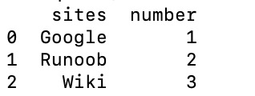

# Pandas 教程


**Pandas 是 Python 语言的一个扩展程序库，用于数据分析。**

Pandas 名字衍生自术语 "panel data"（面板数据）和 "**Python data analysis**"（Python 数据分析）。

Pandas 是一个开放源码、BSD 许可的库，提供高性能、易于使用的数据结构和数据分析工具。

Pandas 一个强大的分析结构化数据的工具集，基础是 [Numpy](https://www.runoob.com/numpy/numpy-tutorial.html)（提供高性能的矩阵运算）。

Pandas 可以从各种文件格式比如 CSV、JSON、SQL、Microsoft Excel 导入数据。

Pandas 可以对各种数据进行运算操作，比如归并、再成形、选择，还有数据清洗和数据加工特征。


------

## Pandas 应用

Pandas 的主要数据结构是 Series （一维数据）与 DataFrame（二维数据）。

Pandas 广泛应用在学术、金融、统计学等各个数据分析领域。

------

## 数据结构

**[Series](https://www.runoob.com/pandas/pandas-series.html)** 是一种类似于一维数组的对象，它由一组数据（各种 Numpy 数据类型）以及一组与之相关的数据标签（即索引）组成。

**DataFrame** 是一个表格型的数据结构，它含有一组有序的列，每列可以是不同的值类型（数值、字符串、布尔型值）。DataFrame 既有行索引也有列索引，它可以被看做由 Series 组成的字典（共同用一个索引）。

------

## 相关链接

- Pandas 官网 https://pandas.pydata.org/
- Pandas 源代码：https://github.com/pandas-dev/pandas

# Pandas 简介

Pandas 是一个开源的数据分析和数据处理库，它是基于 Python 编程语言的。

Pandas 提供了易于使用的数据结构和数据分析工具，特别适用于处理结构化数据，如表格型数据（类似于Excel表格）。

Pandas 是数据科学和分析领域中常用的工具之一，它使得用户能够轻松地从各种数据源中导入数据，并对数据进行高效的操作和分析。

Pandas 主要引入了两种新的数据结构：**DataFrame** 和 **Series**。

- **Series**： 类似于一维数组或列表，是由一组数据以及与之相关的数据标签（索引）构成。Series 可以看作是 DataFrame 中的一列，也可以是单独存在的一维数据结构。

  

- **DataFrame**： 类似于一个二维表格，它是 Pandas 中最重要的数据结构。DataFrame 可以看作是由多个 Series 按列排列构成的表格，它既有行索引也有列索引，因此可以方便地进行行列选择、过滤、合并等操作。


**DataFrame 可视为由多个 Series 组成的数据结构：**


Pandas 提供了丰富的功能，包括：

- 数据清洗：处理缺失数据、重复数据等。
- 数据转换：改变数据的形状、结构或格式。
- 数据分析：进行统计分析、聚合、分组等。
- 数据可视化：通过整合 Matplotlib 和 Seaborn 等库，可以进行数据可视化。

## Pandas 应用

Pandas 在数据科学和数据分析领域中具有广泛的应用，其主要优势在于能够处理和分析结构化数据。

以下是 Pandas 的一些主要应用领域：

- **数据清洗和预处理：** Pandas被广泛用于清理和预处理数据，包括处理缺失值、异常值、重复值等。它提供了各种方法来使数据更适合进行进一步的分析。
- **数据分析和统计：** Pandas使数据分析变得更加简单，通过DataFrame和Series的灵活操作，用户可以轻松地进行统计分析、汇总、聚合等操作。从均值、中位数到标准差和相关性分析，Pandas都提供了丰富的功能。
- **数据可视化：** 将Pandas与Matplotlib、Seaborn等数据可视化库结合使用，可以创建各种图表和图形，从而更直观地理解数据分布和趋势。这对于数据科学家、分析师和决策者来说都是关键的。
- **时间序列分析：** Pandas在处理时间序列数据方面表现出色，支持对日期和时间进行高效操作。这对于金融领域、生产领域以及其他需要处理时间序列的行业尤为重要。
- **机器学习和数据建模：** 在机器学习中，数据预处理是非常关键的一步，而Pandas提供了强大的功能来处理和准备数据。它可以帮助用户将数据整理成适用于机器学习算法的格式。
- **数据库操作：** Pandas可以轻松地与数据库进行交互，从数据库中导入数据到DataFrame中，进行分析和处理，然后将结果导回数据库。这在数据库管理和分析中非常有用。
- **实时数据分析：** 对于需要实时监控和分析数据的应用，Pandas的高效性能使其成为一个强大的工具。结合其他实时数据处理工具，可以构建实时分析系统。

Pandas 在许多领域中都是一种强大而灵活的工具，为数据科学家、分析师和工程师提供了处理和分析数据的便捷方式。

# Pandas 安装

安装 pandas 需要基础环境是 Python，Pandas 是一个基于 Python 的库，因此你需要先安装 Python，然后再通过 Python 的包管理工具 pip 安装 Pandas。

使用 pip 安装 pandas:

```
pip install pandas
```

安装成功后，我们就可以导入 pandas 包使用：

```
import pandas
```

## 实例 - 查看 pandas 版本

\>>> **import** pandas
 \>>> pandas.__version__  # 查看版本
 '1.1.5'

导入 pandas 一般使用别名 pd 来代替：

```
import pandas as pd
```

## 实例 - 查看 pandas 版本

\>>> **import** pandas **as** pd
 \>>> pd.__version__  # 查看版本
 '1.1.5'

一个简单的 pandas 实例：

## 实例

**import** pandas **as** pd

 mydataset = {
  'sites': ["Google", "Runoob", "Wiki"],
  'number': [1, 2, 3]
 }

 myvar = pd.DataFrame(mydataset)

 **print**(myvar)

执行以上代码，输出结果为：



# Pandas 数据结构 - Series

Pandas Series 类似表格中的一个列（column），类似于一维数组，可以保存任何数据类型。

### Series 特点：

- **索引：** 每个 `Series` 都有一个索引，它可以是整数、字符串、日期等类型。如果没有显式指定索引，Pandas 会自动创建一个默认的整数索引。
- **数据类型：** `Series` 可以容纳不同数据类型的元素，包括整数、浮点数、字符串等。


Series 是 Pandas 中的一种基本数据结构，类似于一维数组或列表，但具有标签（索引），使得数据在处理和分析时更具灵活性。

以下是关于 Pandas 中的 Series 的详细介绍： 创建 Series： 可以使用 pd.Series() 构造函数创建一个 Series 对象，传递一个数据数组（可以是列表、NumPy 数组等）和一个可选的索引数组。

```
pandas.Series( data, index, dtype, name, copy)
```

参数说明：

- **data**：一组数据(ndarray 类型)。
- **index**：数据索引标签，如果不指定，默认从 0 开始。
- **dtype**：数据类型，默认会自己判断。
- **name**：设置名称。
- **copy**：拷贝数据，默认为 False。

创建一个简单的 Series 实例：

## 实例

**import** pandas **as** pd

 a = [1, 2, 3]

 myvar = pd.Series(a)

 **print**(myvar)

输出结果如下：


从上图可知，如果没有指定索引，索引值就从 0 开始，我们可以根据索引值读取数据：

## 实例

**import** pandas **as** pd

 a = [1, 2, 3]

 myvar = pd.Series(a)

 **print**(myvar[1])

输出结果如下：

```
2
```

我们可以指定索引值，如下实例：

## 实例

**import** pandas **as** pd

 a = ["Google", "Runoob", "Wiki"]

 myvar = pd.Series(a, index = ["x", "y", "z"])

 **print**(myvar)

输出结果如下：


根据索引值读取数据:

## 实例

**import** pandas **as** pd

 a = ["Google", "Runoob", "Wiki"]

 myvar = pd.Series(a, index = ["x", "y", "z"])

 **print**(myvar["y"])

输出结果如下：

```
Runoob
```

我们也可以使用 key/value 对象，类似字典来创建 Series：

## 实例

**import** pandas **as** pd

 sites = {1: "Google", 2: "Runoob", 3: "Wiki"}

 myvar = pd.Series(sites)

 **print**(myvar)

输出结果如下：


从上图可知，字典的 key 变成了索引值。

如果我们只需要字典中的一部分数据，只需要指定需要数据的索引即可，如下实例：

## 实例

**import** pandas **as** pd

 sites = {1: "Google", 2: "Runoob", 3: "Wiki"}

 myvar = pd.Series(sites, index = [1, 2])

 **print**(myvar)

输出结果如下：


设置 Series 名称参数：

## 实例

**import** pandas **as** pd

 sites = {1: "Google", 2: "Runoob", 3: "Wiki"}

 myvar = pd.Series(sites, index = [1, 2], name="RUNOOB-Series-TEST" )

 **print**(myvar)


------

## 更多 Series 说明

**基本操作：**

```
# 获取值
value = series[2]  # 获取索引为2的值

# 获取多个值
subset = series[1:4]  # 获取索引为1到3的值

# 使用自定义索引
value = series_with_index['b']  # 获取索引为'b'的值

# 索引和值的对应关系
for index, value in series_with_index.items():
    print(f"Index: {index}, Value: {value}")
```

**基本运算：**

```
# 算术运算
result = series * 2  # 所有元素乘以2

# 过滤
filtered_series = series[series > 2]  # 选择大于2的元素

# 数学函数
import numpy as np
result = np.sqrt(series)  # 对每个元素取平方根
```

**属性和方法：**

```
# 获取索引
index = series_with_index.index

# 获取值数组
values = series_with_index.values

# 获取描述统计信息
stats = series_with_index.describe()

# 获取最大值和最小值的索引
max_index = series_with_index.idxmax()
min_index = series_with_index.idxmin()
```

**注意事项：**

- `Series` 中的数据是有序的。
- 可以将 `Series` 视为带有索引的一维数组。
- 索引可以是唯一的，但不是必须的。
- 数据可以是标量、列表、NumPy 数组等。

# Pandas 数据结构 - DataFrame

DataFrame 是一个表格型的数据结构，它含有一组有序的列，每列可以是不同的值类型（数值、字符串、布尔型值）。DataFrame 既有行索引也有列索引，它可以被看做由 Series 组成的字典（共同用一个索引）。

**DataFrame 特点：**

- **列和行：** `DataFrame` 由多个列组成，每一列都有一个名称，可以看作是一个 `Series`。同时，`DataFrame` 有一个行索引，用于标识每一行。
- **二维结构：** `DataFrame` 是一个二维表格，具有行和列。可以将其视为多个 `Series` 对象组成的字典。
- **列的数据类型：** 不同的列可以包含不同的数据类型，例如整数、浮点数、字符串等。


DataFrame 构造方法如下：

```
pandas.DataFrame( data, index, columns, dtype, copy)
```

参数说明：

- **data**：一组数据(ndarray、series, map, lists, dict 等类型)。
- **index**：索引值，或者可以称为行标签。
- **columns**：列标签，默认为 RangeIndex (0, 1, 2, …, n) 。
- **dtype**：数据类型。
- **copy**：拷贝数据，默认为 False。

Pandas DataFrame 是一个二维的数组结构，类似二维数组。

## 实例 - 使用列表创建

**import** pandas **as** pd

 data = [['Google', 10], ['Runoob', 12], ['Wiki', 13]]

 \# 创建DataFrame
 df = pd.DataFrame(data, columns=['Site', 'Age'])

 \# 使用astype方法设置每列的数据类型
 df['Site'] = df['Site'].astype(str)
 df['Age'] = df['Age'].astype(float)

 **print**(df)

也可以使用字典来创建：

## 实例 - 使用字典创建

**import** pandas **as** pd

 data = {'Site':['Google', 'Runoob', 'Wiki'], 'Age':[10, 12, 13]}

 df = pd.DataFrame(data)

 **print** (df)

输出结果如下：


以下实例使用 ndarrays 创建，ndarray 的长度必须相同， 如果传递了 index，则索引的长度应等于数组的长度。如果没有传递索引，则默认情况下，索引将是range(n)，其中n是数组长度。

ndarrays 可以参考：[NumPy Ndarray 对象](https://www.runoob.com/numpy/numpy-ndarray-object.html)

## 实例 - 使用 ndarrays  创建

**import** numpy **as** np
 **import** pandas **as** pd

 \# 创建一个包含网站和年龄的二维ndarray
 ndarray_data = np.array([
   ['Google', 10],
   ['Runoob', 12],
   ['Wiki', 13]
 ])

 \# 使用DataFrame构造函数创建数据帧
 df = pd.DataFrame(ndarray_data, columns=['Site', 'Age'])

 \# 打印数据帧
 **print**(df)

输出结果如下：


从以上输出结果可以知道， DataFrame 数据类型一个表格，包含 rows（行） 和 columns（列）：


还可以使用字典（key/value），其中字典的 key 为列名:

## 实例 - 使用字典创建

**import** pandas **as** pd

 data = [{'a': 1, 'b': 2},{'a': 5, 'b': 10, 'c': 20}]

 df = pd.DataFrame(data)

 **print** (df)

输出结果为：

```
   a   b     c
0  1   2   NaN
1  5  10  20.0
```

没有对应的部分数据为 **NaN**。

Pandas 可以使用 loc 属性返回指定行的数据，如果没有设置索引，第一行索引为 **0**，第二行索引为 **1**，以此类推：

## 实例

**import** pandas **as** pd

 data = {
  "calories": [420, 380, 390],
  "duration": [50, 40, 45]
 }

 \# 数据载入到 DataFrame 对象
 df = pd.DataFrame(data)

 \# 返回第一行
 **print**(df.loc[0])
 \# 返回第二行
 **print**(df.loc[1])

输出结果如下：

```
calories    420
duration     50
Name: 0, dtype: int64
calories    380
duration     40
Name: 1, dtype: int64
```

**注意：**返回结果其实就是一个  Pandas Series 数据。

也可以返回多行数据，使用 [[ ... ]] 格式，... 为各行的索引，以逗号隔开：

## 实例

**import** pandas **as** pd

 data = {
  "calories": [420, 380, 390],
  "duration": [50, 40, 45]
 }

 \# 数据载入到 DataFrame 对象
 df = pd.DataFrame(data)

 \# 返回第一行和第二行
 **print**(df.loc[[0, 1]])

输出结果为：

```
   calories  duration
0       420        50
1       380        40
```

**注意：**返回结果其实就是一个  Pandas DataFrame 数据。

我们可以指定索引值，如下实例：

## 实例

**import** pandas **as** pd

 data = {
  "calories": [420, 380, 390],
  "duration": [50, 40, 45]
 }

 df = pd.DataFrame(data, index = ["day1", "day2", "day3"])

 **print**(df) 

输出结果为：

```
      calories  duration
day1       420        50
day2       380        40
day3       390        45
```

Pandas 可以使用 loc 属性返回指定索引对应到某一行：

## 实例

**import** pandas **as** pd

 data = {
  "calories": [420, 380, 390],
  "duration": [50, 40, 45]
 }

 df = pd.DataFrame(data, index = ["day1", "day2", "day3"])

 \# 指定索引
 **print**(df.loc["day2"])

输出结果为：

```
calories    380
duration     40
Name: day2, dtype: int64
```

------

## 更多 DataFrame 说明

**基本操作：**

```
# 获取列
name_column = df['Name']

# 获取行
first_row = df.loc[0]

# 选择多列
subset = df[['Name', 'Age']]

# 过滤行
filtered_rows = df[df['Age'] > 30]
```

**属性和方法：**

```
# 获取列名
columns = df.columns

# 获取形状（行数和列数）
shape = df.shape

# 获取索引
index = df.index

# 获取描述统计信息
stats = df.describe()
```

**数据操作：**

```
# 添加新列
df['Salary'] = [50000, 60000, 70000]

# 删除列
df.drop('City', axis=1, inplace=True)

# 排序
df.sort_values(by='Age', ascending=False, inplace=True)

# 重命名列
df.rename(columns={'Name': 'Full Name'}, inplace=True)
```

**从外部数据源创建 DataFrame：**

```
# 从CSV文件创建 DataFrame
df_csv = pd.read_csv('example.csv')

# 从Excel文件创建 DataFrame
df_excel = pd.read_excel('example.xlsx')

# 从字典列表创建 DataFrame
data_list = [{'Name': 'Alice', 'Age': 25}, {'Name': 'Bob', 'Age': 30}]
df_from_list = pd.DataFrame(data_list)
```

**注意事项：**

- `DataFrame` 是一种灵活的数据结构，可以容纳不同数据类型的列。
- 列名和行索引可以是字符串、整数等。
- `DataFrame` 可以通过多种方式进行数据选择、过滤、修改和分析。
- 通过对 `DataFrame` 的操作，可以进行数据清洗、转换、分析和可视化等工作。

# Pandas CSV 文件

CSV（Comma-Separated Values，逗号分隔值，有时也称为字符分隔值，因为分隔字符也可以不是逗号），其文件以纯文本形式存储表格数据（数字和文本）。

CSV 是一种通用的、相对简单的文件格式，被用户、商业和科学广泛应用。

Pandas 可以很方便的处理  CSV 文件，本文以 [nba.csv](https://static.jyshare.com/download/nba.csv) 为例，你可以[下载 nba.csv](https://static.jyshare.com/download/nba.csv) 或[打开 nba.csv](https://static.jyshare.com/download/nba.csv.txt) 查看。

## 实例

**import** pandas **as** pd

 df = pd.read_csv('nba.csv')

 **print**(df.to_string()) 

to_string() 用于返回 DataFrame 类型的数据，如果不使用该函数，则输出结果为数据的前面 5 行和末尾 5 行，中间部分以 ... 代替。

## 实例

**import** pandas **as** pd

 df = pd.read_csv('nba.csv')

 **print**(df) 

输出结果为：

```
              Name            Team  Number Position   Age Height  Weight            College     Salary
0    Avery Bradley  Boston Celtics     0.0       PG  25.0    6-2   180.0              Texas  7730337.0
1      Jae Crowder  Boston Celtics    99.0       SF  25.0    6-6   235.0          Marquette  6796117.0
2     John Holland  Boston Celtics    30.0       SG  27.0    6-5   205.0  Boston University        NaN
3      R.J. Hunter  Boston Celtics    28.0       SG  22.0    6-5   185.0      Georgia State  1148640.0
4    Jonas Jerebko  Boston Celtics     8.0       PF  29.0   6-10   231.0                NaN  5000000.0
..             ...             ...     ...      ...   ...    ...     ...                ...        ...
453   Shelvin Mack       Utah Jazz     8.0       PG  26.0    6-3   203.0             Butler  2433333.0
454      Raul Neto       Utah Jazz    25.0       PG  24.0    6-1   179.0                NaN   900000.0
455   Tibor Pleiss       Utah Jazz    21.0        C  26.0    7-3   256.0                NaN  2900000.0
456    Jeff Withey       Utah Jazz    24.0        C  26.0    7-0   231.0             Kansas   947276.0
457            NaN             NaN     NaN      NaN   NaN    NaN     NaN                NaN        NaN
```

我们也可以使用 to_csv() 方法将 DataFrame 存储为 csv 文件：

## 实例

**import** pandas **as** pd 

 \# 三个字段 name, site, age
 nme = ["Google", "Runoob", "Taobao", "Wiki"]
 st = ["www.google.com", "www.runoob.com", "www.taobao.com", "www.wikipedia.org"]
 ag = [90, 40, 80, 98]

 \# 字典
 dict = {'name': nme, 'site': st, 'age': ag} 
    
 df = pd.DataFrame(dict)

 \# 保存 dataframe
 df.to_csv('site.csv')

执行成功后，我们打开 site.csv 文件，显示结果如下：


------

## 数据处理

### head()

head( *n* ) 方法用于读取前面的 n 行，如果不填参数 n ，默认返回 5 行。

## 实例 - 读取前面 5 行

**import** pandas **as** pd

 df = pd.read_csv('nba.csv')

 **print**(df.head())

输出结果为：

```
            Name            Team  Number Position   Age Height  Weight            College     Salary
0  Avery Bradley  Boston Celtics     0.0       PG  25.0    6-2   180.0              Texas  7730337.0
1    Jae Crowder  Boston Celtics    99.0       SF  25.0    6-6   235.0          Marquette  6796117.0
2   John Holland  Boston Celtics    30.0       SG  27.0    6-5   205.0  Boston University        NaN
3    R.J. Hunter  Boston Celtics    28.0       SG  22.0    6-5   185.0      Georgia State  1148640.0
4  Jonas Jerebko  Boston Celtics     8.0       PF  29.0   6-10   231.0                NaN  5000000.0
```

## 实例 - 读取前面 10 行

**import** pandas **as** pd

 df = pd.read_csv('nba.csv')

 **print**(df.head(10))

输出结果为：

```
            Name            Team  Number Position   Age Height  Weight            College      Salary
0  Avery Bradley  Boston Celtics     0.0       PG  25.0    6-2   180.0              Texas   7730337.0
1    Jae Crowder  Boston Celtics    99.0       SF  25.0    6-6   235.0          Marquette   6796117.0
2   John Holland  Boston Celtics    30.0       SG  27.0    6-5   205.0  Boston University         NaN
3    R.J. Hunter  Boston Celtics    28.0       SG  22.0    6-5   185.0      Georgia State   1148640.0
4  Jonas Jerebko  Boston Celtics     8.0       PF  29.0   6-10   231.0                NaN   5000000.0
5   Amir Johnson  Boston Celtics    90.0       PF  29.0    6-9   240.0                NaN  12000000.0
6  Jordan Mickey  Boston Celtics    55.0       PF  21.0    6-8   235.0                LSU   1170960.0
7   Kelly Olynyk  Boston Celtics    41.0        C  25.0    7-0   238.0            Gonzaga   2165160.0
8   Terry Rozier  Boston Celtics    12.0       PG  22.0    6-2   190.0         Louisville   1824360.0
9   Marcus Smart  Boston Celtics    36.0       PG  22.0    6-4   220.0     Oklahoma State   3431040.0
```

###  tail()

 tail( *n* ) 方法用于读取尾部的 n 行，如果不填参数 n ，默认返回 5 行，空行各个字段的值返回 **NaN**。

## 实例 - 读取末尾 5 行

**import** pandas **as** pd

 df = pd.read_csv('nba.csv')

 **print**(df.tail())

输出结果为：

```
             Name       Team  Number Position   Age Height  Weight College     Salary
453  Shelvin Mack  Utah Jazz     8.0       PG  26.0    6-3   203.0  Butler  2433333.0
454     Raul Neto  Utah Jazz    25.0       PG  24.0    6-1   179.0     NaN   900000.0
455  Tibor Pleiss  Utah Jazz    21.0        C  26.0    7-3   256.0     NaN  2900000.0
456   Jeff Withey  Utah Jazz    24.0        C  26.0    7-0   231.0  Kansas   947276.0
457           NaN        NaN     NaN      NaN   NaN    NaN     NaN     NaN        NaN
```

## 实例 - 读取末尾 10 行

**import** pandas **as** pd

 df = pd.read_csv('nba.csv')

 **print**(df.tail(10))

输出结果为：

```
               Name       Team  Number Position   Age Height  Weight   College      Salary
448  Gordon Hayward  Utah Jazz    20.0       SF  26.0    6-8   226.0    Butler  15409570.0
449     Rodney Hood  Utah Jazz     5.0       SG  23.0    6-8   206.0      Duke   1348440.0
450      Joe Ingles  Utah Jazz     2.0       SF  28.0    6-8   226.0       NaN   2050000.0
451   Chris Johnson  Utah Jazz    23.0       SF  26.0    6-6   206.0    Dayton    981348.0
452      Trey Lyles  Utah Jazz    41.0       PF  20.0   6-10   234.0  Kentucky   2239800.0
453    Shelvin Mack  Utah Jazz     8.0       PG  26.0    6-3   203.0    Butler   2433333.0
454       Raul Neto  Utah Jazz    25.0       PG  24.0    6-1   179.0       NaN    900000.0
455    Tibor Pleiss  Utah Jazz    21.0        C  26.0    7-3   256.0       NaN   2900000.0
456     Jeff Withey  Utah Jazz    24.0        C  26.0    7-0   231.0    Kansas    947276.0
457             NaN        NaN     NaN      NaN   NaN    NaN     NaN       NaN         NaN
```

### info()

info() 方法返回表格的一些基本信息：

## 实例

**import** pandas **as** pd

 df = pd.read_csv('nba.csv')

 **print**(df.info()) 

输出结果为：

```
<class 'pandas.core.frame.DataFrame'>
RangeIndex: 458 entries, 0 to 457          # 行数，458 行，第一行编号为 0
Data columns (total 9 columns):            # 列数，9列
 #   Column    Non-Null Count  Dtype       # 各列的数据类型
---  ------    --------------  -----  
 0   Name      457 non-null    object 
 1   Team      457 non-null    object 
 2   Number    457 non-null    float64
 3   Position  457 non-null    object 
 4   Age       457 non-null    float64
 5   Height    457 non-null    object 
 6   Weight    457 non-null    float64
 7   College   373 non-null    object         # non-null，意思为非空的数据    
 8   Salary    446 non-null    float64
dtypes: float64(4), object(5)                 # 类型
```

non-null 为非空数据，我们可以看到上面的信息中，总共 458 行，College 字段的空值最多。

# Pandas JSON

JSON（**J**ava**S**cript **O**bject **N**otation，JavaScript 对象表示法），是存储和交换文本信息的语法，类似 XML。

JSON 比 XML 更小、更快，更易解析，更多 JSON 内容可以参考 [JSON 教程](https://www.runoob.com/json/json-tutorial.html)。

Pandas 可以很方便的处理  JSON 数据，本文以 [sites.json](https://static.jyshare.com/download/sites.json) 为例，内容如下：

## 实例

[   {   "id": "A001",   "name": "菜鸟教程",   "url": "www.runoob.com",   "likes": 61   },   {   "id": "A002",   "name": "Google",   "url": "www.google.com",   "likes": 124   },   {   "id": "A003",   "name": "淘宝",   "url": "www.taobao.com",   "likes": 45   } ]

## 实例

**import** pandas **as** pd

 df = pd.read_json('sites.json')

 **print**(df.to_string()) 

to_string() 用于返回 DataFrame 类型的数据，我们也可以直接处理 JSON 字符串。

## 实例

**import** pandas **as** pd

 data =[
   {
    "id": "A001",
    "name": "菜鸟教程",
    "url": "www.runoob.com",
    "likes": 61
   },
   {
    "id": "A002",
    "name": "Google",
    "url": "www.google.com",
    "likes": 124
   },
   {
    "id": "A003",
    "name": "淘宝",
    "url": "www.taobao.com",
    "likes": 45
   }
 ]
 df = pd.DataFrame(data)

 **print**(df) 

以上实例输出结果为：

```
     id    name             url  likes
0  A001    菜鸟教程  www.runoob.com     61
1  A002  Google  www.google.com    124
2  A003      淘宝  www.taobao.com     45
```

JSON 对象与 Python 字典具有相同的格式，所以我们可以直接将 Python 字典转化为 DataFrame 数据：

## 实例

**import** pandas **as** pd


 \# 字典格式的 JSON                                                
 s = {
   "col1":{"row1":1,"row2":2,"row3":3},
   "col2":{"row1":"x","row2":"y","row3":"z"}
 }

 \# 读取 JSON 转为 DataFrame                                              
 df = pd.DataFrame(s)
 **print**(df)

以上实例输出结果为：

```
      col1 col2
row1     1    x
row2     2    y
row3     3    z
```

从 URL 中读取 JSON 数据：

## 实例

**import** pandas **as** pd

 URL = 'https://static.jyshare.com/download/sites.json'
 df = pd.read_json(URL)
 **print**(df)

以上实例输出结果为：

```
     id    name             url  likes
0  A001    菜鸟教程  www.runoob.com     61
1  A002  Google  www.google.com    124
2  A003      淘宝  www.taobao.com     45
```

### 内嵌的 JSON 数据

假设有一组内嵌的 JSON 数据文件 **nested_list.json** ：

## nested_list.json 文件内容

{
   "school_name": "ABC primary school",
   "class": "Year 1",
   "students": [
   {
     "id": "A001",
     "name": "Tom",
     "math": 60,
     "physics": 66,
     "chemistry": 61
   },
   {
     "id": "A002",
     "name": "James",
     "math": 89,
     "physics": 76,
     "chemistry": 51
   },
   {
     "id": "A003",
     "name": "Jenny",
     "math": 79,
     "physics": 90,
     "chemistry": 78
   }]
 }

使用以下代码格式化完整内容：

## 实例

**import** pandas **as** pd

 df = pd.read_json('nested_list.json')

 **print**(df)

以上实例输出结果为：

```
          school_name   class                                           students
0  ABC primary school  Year 1  {'id': 'A001', 'name': 'Tom', 'math': 60, 'phy...
1  ABC primary school  Year 1  {'id': 'A002', 'name': 'James', 'math': 89, 'p...
2  ABC primary school  Year 1  {'id': 'A003', 'name': 'Jenny', 'math': 79, 'p...
```

这时我们就需要使用到 json_normalize() 方法将内嵌的数据完整的解析出来：

## 实例

**import** pandas **as** pd
 **import** json

 \# 使用 Python JSON 模块载入数据
 **with** open('nested_list.json','r') **as** f:
   data = json.loads(f.read())

 \# 展平数据
 df_nested_list = pd.json_normalize(data, record_path =['students'])
 **print**(df_nested_list)

以上实例输出结果为：

```
     id   name  math  physics  chemistry
0  A001    Tom    60       66         61
1  A002  James    89       76         51
2  A003  Jenny    79       90         78
```

data = json.loads(f.read()) 使用 Python JSON 模块载入数据。

json_normalize() 使用了参数 **record_path** 并设置为 **['students']** 用于展开内嵌的 JSON 数据 **students**。

显示结果还没有包含 school_name 和 class 元素，如果需要展示出来可以使用 meta 参数来显示这些元数据：

## 实例

**import** pandas **as** pd
 **import** json

 \# 使用 Python JSON 模块载入数据
 **with** open('nested_list.json','r') **as** f:
   data = json.loads(f.read())

 \# 展平数据
 df_nested_list = pd.json_normalize(
   data, 
   record_path =['students'], 
   meta=['school_name', 'class']
 )
 **print**(df_nested_list)

以上实例输出结果为：

```
     id   name  math  physics  chemistry         school_name   class
0  A001    Tom    60       66         61  ABC primary school  Year 1
1  A002  James    89       76         51  ABC primary school  Year 1
2  A003  Jenny    79       90         78  ABC primary school  Year 1
```

接下来，让我们尝试读取更复杂的 JSON 数据，该数据嵌套了列表和字典，数据文件 **nested_mix.json** 如下：

## nested_mix.json 文件内容

{
   "school_name": "local primary school",
   "class": "Year 1",
   "info": {
    "president": "John Kasich",
    "address": "ABC road, London, UK",
    "contacts": {
     "email": "admin@e.com",
     "tel": "123456789"
    }
   },
   "students": [
   {
     "id": "A001",
     "name": "Tom",
     "math": 60,
     "physics": 66,
     "chemistry": 61
   },
   {
     "id": "A002",
     "name": "James",
     "math": 89,
     "physics": 76,
     "chemistry": 51
   },
   {
     "id": "A003",
     "name": "Jenny",
     "math": 79,
     "physics": 90,
     "chemistry": 78
   }]
 }

nested_mix.json 文件转换为 DataFrame：

## 实例

**import** pandas **as** pd
 **import** json

 \# 使用 Python JSON 模块载入数据
 **with** open('nested_mix.json','r') **as** f:
   data = json.loads(f.read())

 df = pd.json_normalize(
   data, 
   record_path =['students'], 
   meta=[
     'class',
     ['info', 'president'], 
     ['info', 'contacts', 'tel']
   ]
 )

 **print**(df)

以上实例输出结果为：

```
     id   name  math  physics  chemistry   class info.president info.contacts.tel
0  A001    Tom    60       66         61  Year 1    John Kasich         123456789
1  A002  James    89       76         51  Year 1    John Kasich         123456789
2  A003  Jenny    79       90         78  Year 1    John Kasich         123456789
```

### 读取内嵌数据中的一组数据

以下是实例文件 **nested_deep.json**，我们只读取内嵌中的 **math** 字段：

## nested_deep.json 文件内容

{
   "school_name": "local primary school",
   "class": "Year 1",
   "students": [
   {
     "id": "A001",
     "name": "Tom",
     "grade": {
       "math": 60,
       "physics": 66,
       "chemistry": 61
     }

   },
   {
     "id": "A002",
     "name": "James",
     "grade": {
       "math": 89,
       "physics": 76,
       "chemistry": 51
     }
     
   },
   {
     "id": "A003",
     "name": "Jenny",
     "grade": {
       "math": 79,
       "physics": 90,
       "chemistry": 78
     }
   }]
 }

这里我们需要使用到 **glom** 模块来处理数据套嵌，**glom** 模块允许我们使用 . 来访问内嵌对象的属性。

第一次使用我们需要安装 glom：

```
pip3 install glom
```

## 实例

**import** pandas **as** pd
 **from** glom **import** glom

 df = pd.read_json('nested_deep.json')

 data = df['students'].apply(**lambda** row: glom(row, 'grade.math'))
 **print**(data)

以上实例输出结果为：

```
0    60
1    89
2    79
Name: students, dtype: int64
```

# Pandas 数据清洗

数据清洗是对一些没有用的数据进行处理的过程。

很多数据集存在数据缺失、数据格式错误、错误数据或重复数据的情况，如果要使数据分析更加准确，就需要对这些没有用的数据进行处理。

在这个教程中，我们将利用  Pandas包来进行数据清洗。

本文使用到的测试数据 [property-data.csv](https://static.jyshare.com/download/property-data.csv) 如下：


上表包含了四种空数据：

- n/a
- NA
- —
- na

------

## Pandas 清洗空值

如果我们要删除包含空字段的行，可以使用 **dropna()** 方法，语法格式如下：

```
DataFrame.dropna(axis=0, how='any', thresh=None, subset=None, inplace=False)
```

**参数说明：**

- axis：默认为 **0**，表示逢空值剔除整行，如果设置参数 **axis＝1** 表示逢空值去掉整列。
- how：默认为 **'any'** 如果一行（或一列）里任何一个数据有出现 NA 就去掉整行，如果设置 **how='all'** 一行（或列）都是 NA 才去掉这整行。
- thresh：设置需要多少非空值的数据才可以保留下来的。
- subset：设置想要检查的列。如果是多个列，可以使用列名的 list 作为参数。
- inplace：如果设置 True，将计算得到的值直接覆盖之前的值并返回 None，修改的是源数据。

我们可以通过 isnull() 判断各个单元格是否为空。

## 实例

**import** pandas **as** pd

 df = pd.read_csv('property-data.csv')

 **print** (df['NUM_BEDROOMS'])
 **print** (df['NUM_BEDROOMS'].isnull())

以上实例输出结果如下：


以上例子中我们看到 Pandas 把 n/a 和 NA 当作空数据，na 不是空数据，不符合我们要求，我们可以指定空数据类型：

## 实例

**import** pandas **as** pd

 missing_values = ["n/a", "na", "--"]
 df = pd.read_csv('property-data.csv', na_values = missing_values)

 **print** (df['NUM_BEDROOMS'])
 **print** (df['NUM_BEDROOMS'].isnull())

以上实例输出结果如下：


接下来的实例演示了删除包含空数据的行。

## 实例

**import** pandas **as** pd

 df = pd.read_csv('property-data.csv')

 new_df = df.dropna()

 **print**(new_df.to_string())

以上实例输出结果如下：


**注意：**默认情况下，dropna() 方法返回一个新的 DataFrame，不会修改源数据。

如果你要修改源数据 DataFrame, 可以使用 **inplace = True** 参数:

## 实例

**import** pandas **as** pd

 df = pd.read_csv('property-data.csv')

 df.dropna(inplace = True)

 **print**(df.to_string())

以上实例输出结果如下：


我们也可以移除指定列有空值的行：

## 实例

移除 ST_NUM 列中字段值为空的行：

**import** pandas **as** pd

 df = pd.read_csv('property-data.csv')

 df.dropna(subset=['ST_NUM'], inplace = True)

 **print**(df.to_string())

以上实例输出结果如下：


我们也可以 **fillna()** 方法来替换一些空字段：

## 实例

使用 12345 替换空字段： 

**import** pandas **as** pd

 df = pd.read_csv('property-data.csv')

 df.fillna(12345, inplace = True)

 **print**(df.to_string())

以上实例输出结果如下：


我们也可以指定某一个列来替换数据：

## 实例

使用 12345 替换 PID 为空数据： 

**import** pandas **as** pd

 df = pd.read_csv('property-data.csv')

 df['PID'].fillna(12345, inplace = True)

 **print**(df.to_string())

以上实例输出结果如下：


替换空单元格的常用方法是计算列的均值、中位数值或众数。

Pandas使用 mean()、median() 和 mode() 方法计算列的均值（所有值加起来的平均值）、中位数值（排序后排在中间的数）和众数（出现频率最高的数）。

## 实例

使用 mean() 方法计算列的均值并替换空单元格： 

**import** pandas **as** pd

 df = pd.read_csv('property-data.csv')

 x = df["ST_NUM"].mean()

 df["ST_NUM"].fillna(x, inplace = True)

 **print**(df.to_string())

以上实例输出结果如下，红框为计算的均值替换来空单元格：


## 实例

使用 median() 方法计算列的中位数并替换空单元格： 

**import** pandas **as** pd

 df = pd.read_csv('property-data.csv')

 x = df["ST_NUM"].median()

 df["ST_NUM"].fillna(x, inplace = True)

 **print**(df.to_string())

以上实例输出结果如下，红框为计算的中位数替换来空单元格：


## 实例

使用 mode() 方法计算列的众数并替换空单元格： 

**import** pandas **as** pd

 df = pd.read_csv('property-data.csv')

 x = df["ST_NUM"].mode()

 df["ST_NUM"].fillna(x, inplace = True)

 **print**(df.to_string())

以上实例输出结果如下，红框为计算的众数替换来空单元格：


------

## Pandas 清洗格式错误数据

数据格式错误的单元格会使数据分析变得困难，甚至不可能。

我们可以通过包含空单元格的行，或者将列中的所有单元格转换为相同格式的数据。

以下实例会格式化日期：

## 实例

**import** pandas **as** pd

 \# 第三个日期格式错误
 data = {
  "Date": ['2020/12/01', '2020/12/02' , '20201226'],
  "duration": [50, 40, 45]
 }

 df = pd.DataFrame(data, index = ["day1", "day2", "day3"])

 df['Date'] = pd.to_datetime(df['Date'])

 **print**(df.to_string())

以上实例输出结果如下：

```
           Date  duration
day1 2020-12-01        50
day2 2020-12-02        40
day3 2020-12-26        45
```

------

## Pandas 清洗错误数据

数据错误也是很常见的情况，我们可以对错误的数据进行替换或移除。

以下实例会替换错误年龄的数据：

## 实例

**import** pandas **as** pd

 person = {
  "name": ['Google', 'Runoob' , 'Taobao'],
  "age": [50, 40, 12345]   # 12345 年龄数据是错误的
 }

 df = pd.DataFrame(person)

 df.loc[2, 'age'] = 30 # 修改数据

 **print**(df.to_string())

以上实例输出结果如下：

```
     name  age
0  Google   50
1  Runoob   40
2  Taobao   30
```

也可以设置条件语句：

## 实例

将 age 大于 120 的设置为 120:

**import** pandas **as** pd

 person = {
  "name": ['Google', 'Runoob' , 'Taobao'],
  "age": [50, 200, 12345]   
 }

 df = pd.DataFrame(person)

 **for** x **in** df.index:
  **if** df.loc[x, "age"] > 120:
   df.loc[x, "age"] = 120

 **print**(df.to_string())

以上实例输出结果如下：

```
     name  age
0  Google   50
1  Runoob  120
2  Taobao  120
```

也可以将错误数据的行删除：

## 实例

将 age 大于 120 的删除:

**import** pandas **as** pd

 person = {
  "name": ['Google', 'Runoob' , 'Taobao'],
  "age": [50, 40, 12345]   # 12345 年龄数据是错误的
 }

 df = pd.DataFrame(person)

 **for** x **in** df.index:
  **if** df.loc[x, "age"] > 120:
   df.drop(x, inplace = True)

 **print**(df.to_string())

以上实例输出结果如下：

```
     name  age
0  Google   50
1  Runoob   40
```

------

## Pandas 清洗重复数据

如果我们要清洗重复数据，可以使用 **duplicated()** 和 **drop_duplicates()** 方法。

如果对应的数据是重复的，**duplicated()** 会返回 True，否则返回 False。

## 实例

**import** pandas **as** pd

 person = {
  "name": ['Google', 'Runoob', 'Runoob', 'Taobao'],
  "age": [50, 40, 40, 23]  
 }
 df = pd.DataFrame(person)

 **print**(df.duplicated())

以上实例输出结果如下：

```
0    False
1    False
2     True
3    False
dtype: bool
```

删除重复数据，可以直接使用**drop_duplicates()** 方法。

## 实例

**import** pandas **as** pd

 persons = {
  "name": ['Google', 'Runoob', 'Runoob', 'Taobao'],
  "age": [50, 40, 40, 23]  
 }

 df = pd.DataFrame(persons)

 df.drop_duplicates(inplace = True)
 **print**(df)

以上实例输出结果如下：

```
     name  age
0  Google   50
1  Runoob   40
3  Taobao   23
```

# Pandas 常用函数

以下列出了 Pandas 常用的一些函数及使用实例：

## 读取数据

| 函数                                  | 说明                       |
| ------------------------------------- | -------------------------- |
| pd.read_csv(filename)                 | 读取 CSV 文件；            |
| pd.read_excel(filename)               | 读取 Excel 文件；          |
| pd.read_sql(query, connection_object) | 从 SQL 数据库读取数据；    |
| pd.read_json(json_string)             | 从 JSON 字符串中读取数据； |
| pd.read_html(url)                     | 从 HTML 页面中读取数据。   |

## 实例

**import** pandas **as** pd

 \# 从 CSV 文件中读取数据
 df = pd.read_csv('data.csv')

 \# 从 Excel 文件中读取数据
 df = pd.read_excel('data.xlsx')

 \# 从 SQL 数据库中读取数据
 **import** sqlite3
 conn = sqlite3.connect('database.db')
 df = pd.read_sql('SELECT * FROM table_name', conn)

 \# 从 JSON 字符串中读取数据
 json_string = '{"name": "John", "age": 30, "city": "New York"}'
 df = pd.read_json(json_string)

 \# 从 HTML 页面中读取数据
 url = 'https://www.runoob.com'
 dfs = pd.read_html(url)
 df = dfs[0] # 选择第一个数据框

------

## 查看数据

| 函数          | 说明                                                       |
| ------------- | ---------------------------------------------------------- |
| df.head(n)    | 显示前 n 行数据；                                          |
| df.tail(n)    | 显示后 n 行数据；                                          |
| df.info()     | 显示数据的信息，包括列名、数据类型、缺失值等；             |
| df.describe() | 显示数据的基本统计信息，包括均值、方差、最大值、最小值等； |
| df.shape      | 显示数据的行数和列数。                                     |

## 实例

\# 显示前五行数据
 df.head()

 \# 显示后五行数据
 df.tail()

 \# 显示数据信息
 df.info()

 \# 显示基本统计信息
 df.describe()

 \# 显示数据的行数和列数
 df.shape

## 实例

**import** pandas **as** pd

 data = [
   {"name": "Google", "likes": 25, "url": "https://www.google.com"},
   {"name": "Runoob", "likes": 30, "url": "https://www.runoob.com"},
   {"name": "Taobao", "likes": 35, "url": "https://www.taobao.com"}
 ]

 df = pd.DataFrame(data)
 \# 显示前两行数据
 **print**(df.head(2))
 \# 显示前最后一行数据
 **print**(df.tail(1))

以上实例输出结果为：

```
     name  likes                     url
0  Google     25  https://www.google.com
1  Runoob     30  https://www.runoob.com
     name  likes                     url
2  Taobao     35  https://www.taobao.com
```

------

## 数据清洗

| 函数                             | 说明                     |
| -------------------------------- | ------------------------ |
| df.dropna()                      | 删除包含缺失值的行或列； |
| df.fillna(value)                 | 将缺失值替换为指定的值； |
| df.replace(old_value, new_value) | 将指定值替换为新值；     |
| df.duplicated()                  | 检查是否有重复的数据；   |
| df.drop_duplicates()             | 删除重复的数据。         |

## 实例

\# 删除包含缺失值的行或列
 df.dropna()

 \# 将缺失值替换为指定的值
 df.fillna(0)

 \# 将指定值替换为新值
 df.replace('old_value', 'new_value')

 \# 检查是否有重复的数据
 df.duplicated()

 \# 删除重复的数据
 df.drop_duplicates()

------

## 数据选择和切片

| 函数                                          | 说明                         |
| --------------------------------------------- | ---------------------------- |
| df[column_name]                               | 选择指定的列；               |
| df.loc[row_index, column_name]                | 通过标签选择数据；           |
| df.iloc[row_index, column_index]              | 通过位置选择数据；           |
| df.ix[row_index, column_name]                 | 通过标签或位置选择数据；     |
| df.filter(items=[column_name1, column_name2]) | 选择指定的列；               |
| df.filter(regex='regex')                      | 选择列名匹配正则表达式的列； |
| df.sample(n)                                  | 随机选择 n 行数据。          |

## 实例

\# 选择指定的列
 df['column_name']

 \# 通过标签选择数据
 df.loc[row_index, column_name]

 \# 通过位置选择数据
 df.iloc[row_index, column_index]

 \# 通过标签或位置选择数据
 df.ix[row_index, column_name]

 \# 选择指定的列
 df.filter(items=['column_name1', 'column_name2'])

 \# 选择列名匹配正则表达式的列
 df.filter(regex='regex')

 \# 随机选择 n 行数据
 df.sample(n=5)

------

## 数据排序

| 函数                                                         | 说明                 |
| ------------------------------------------------------------ | -------------------- |
| df.sort_values(column_name)                                  | 按照指定列的值排序； |
| df.sort_values([column_name1, column_name2], ascending=[True, False]) | 按照多个列的值排序； |
| df.sort_index()                                              | 按照索引排序。       |

## 实例

\# 按照指定列的值排序
 df.sort_values('column_name')

 \# 按照多个列的值排序
 df.sort_values(['column_name1', 'column_name2'], ascending=[True, False])

 \# 按照索引排序
 df.sort_index()

------

## 数据分组和聚合

| 函数                                            | 说明                         |
| ----------------------------------------------- | ---------------------------- |
| df.groupby(column_name)                         | 按照指定列进行分组；         |
| df.aggregate(function_name)                     | 对分组后的数据进行聚合操作； |
| df.pivot_table(values, index, columns, aggfunc) | 生成透视表。                 |

## 实例

\# 按照指定列进行分组
 df.groupby('column_name')

 \# 对分组后的数据进行聚合操作
 df.aggregate('function_name')

 \# 生成透视表
 df.pivot_table(values='value', index='index_column', columns='column_name', aggfunc='function_name')

------

## 数据合并

| 函数                               | 说明                             |
| ---------------------------------- | -------------------------------- |
| pd.concat([df1, df2])              | 将多个数据框按照行或列进行合并； |
| pd.merge(df1, df2, on=column_name) | 按照指定列将两个数据框进行合并。 |

## 实例

\# 将多个数据框按照行或列进行合并
 df = pd.concat([df1, df2])

 \# 按照指定列将两个数据框进行合并
 df = pd.merge(df1, df2, on='column_name')

------

## 数据选择和过滤

| 函数                                 | 说明                                   |
| ------------------------------------ | -------------------------------------- |
| df.loc[row_indexer, column_indexer]  | 按标签选择行和列。                     |
| df.iloc[row_indexer, column_indexer] | 按位置选择行和列。                     |
| df[df['column_name'] > value]        | 选择列中满足条件的行。                 |
| df.query('column_name > value')      | 使用字符串表达式选择列中满足条件的行。 |

------

## 数据统计和描述

| 函数          | 说明                                                 |
| ------------- | ---------------------------------------------------- |
| df.describe() | 计算基本统计信息，如均值、标准差、最小值、最大值等。 |
| df.mean()     | 计算每列的平均值。                                   |
| df.median()   | 计算每列的中位数。                                   |
| df.mode()     | 计算每列的众数。                                     |
| df.count()    | 计算每列非缺失值的数量。                             |

------

## 实例

假设我们有如下的 JSON 数据，数据保存到 data.json 文件：

## data.json 文件

[
  {
   "name": "Alice",
   "age": 25,
   "gender": "female",
   "score": 80
  },
  {
   "name": "Bob",
   "age": **null**,
   "gender": "male",
   "score": 90
  },
  {
   "name": "Charlie",
   "age": 30,
   "gender": "male",
   "score": **null**
  },
  {
   "name": "David",
   "age": 35,
   "gender": "male",
   "score": 70
  }
 ]

我们可以使用 Pandas 读取 JSON 数据，并进行数据清洗和处理、数据选择和过滤、数据统计和描述等操作，具体如下：

## 实例

**import** pandas **as** pd

 \# 读取 JSON 数据
 df = pd.read_json('data.json')

 \# 删除缺失值
 df = df.dropna()

 \# 用指定的值填充缺失值
 df = df.fillna({'age': 0, 'score': 0})

 \# 重命名列名
 df = df.rename(columns={'name': '姓名', 'age': '年龄', 'gender': '性别', 'score': '成绩'})

 \# 按成绩排序
 df = df.sort_values(by='成绩', ascending=False)

 \# 按性别分组并计算平均年龄和成绩
 grouped = df.groupby('性别').agg({'年龄': 'mean', '成绩': 'mean'})

 \# 选择成绩大于等于90的行，并只保留姓名和成绩两列
 df = df.loc[df['成绩'] >= 90, ['姓名', '成绩']]

 \# 计算每列的基本统计信息
 stats = df.describe()

 \# 计算每列的平均值
 mean = df.mean()

 \# 计算每列的中位数
 median = df.median()

 \# 计算每列的众数
 mode = df.mode()

 \# 计算每列非缺失值的数量
 count = df.count()

输出结果如下：

```
# df
   姓名  年龄 性别  成绩
1  Bob   0  male  90

# grouped
             年龄  成绩
性别                
female  25.000000  80
male    27.500000  80

# stats
         成绩
count   1.0
mean   90.0
std     NaN
min    90.0
25%    90.0
50%    90.0
75%    90.0
max    90.0

# mean
成绩    90.0
dtype: float64

# median
成绩    90.0
dtype: float64

# mode
    姓名    成绩
0  Bob  90.0

# count
姓名    1
成绩    1
dtype: int64
```

# Pandas 相关性分析

在 Pandas 中，数据相关性分析是通过计算不同变量之间的相关系数来了解它们之间的关系。

在 Pandas 中，数据相关性是一项重要的分析任务，它帮助我们理解数据中各个变量之间的关系。

Pandas 使用 corr() 方法计算数据集中每列之间的关系。

```
df.corr(method='pearson', min_periods=1)
```

- **method** (可选): 字符串类型，用于指定计算相关系数的方法。默认是 'pearson'，还可以选择 'kendall'（Kendall Tau 相关系数）或 'spearman'（Spearman 秩相关系数）。
- **min_periods** (可选): 表示计算相关系数时所需的最小观测值数量。默认值是 1，即只要有至少一个非空值，就会进行计算。如果指定了 `min_periods`，并且在某些列中的非空值数量小于该值，则相应列的相关系数将被设为 NaN。

df.corr() 方法返回一个相关系数矩阵，矩阵的行和列对应数据框的列名，矩阵的元素是对应列之间的相关系数。

常见的相关性系数包括 Pearson 相关系数和 Spearman 秩相关系数：

- **Pearson 相关系数:** 即皮尔逊相关系数，用于衡量了两个变量之间的线性关系强度和方向。它的取值范围在 -1 到 1 之间，其中 -1 表示完全负相关，1 表示完全正相关，0 表示无线性相关。可以使用 corr() 方法计算数据框中各列之间的 Pearson 相关系数。
- **Spearman 相关系数：**即斯皮尔曼相关系数，是一种秩相关系数。用于衡量两个变量之间的单调关系，即不一定是线性关系。它通过比较变量的秩次来计算相关性。可以使用 corr(method='spearman') 方法计算数据框中各列之间的 Spearman 相关系数。

**Pearson 相关系数**

## 实例

**import** pandas **as** pd

 \# 创建一个示例数据框
 data = {'A': [1, 2, 3, 4, 5], 'B': [5, 4, 3, 2, 1]}
 df = pd.DataFrame(data)

 \# 计算 Pearson 相关系数
 correlation_matrix = df.corr()
 **print**(correlation_matrix)

输出结果：

```
     A    B
A  1.0 -1.0
B -1.0  1.0
```

**说明**：由于数据集是线性相关的，因此 Pearson 相关系数矩阵对角线上的值为 1，而非对角线上的值为 -1 表示完全负相关。

**Spearman 秩相关系数**

## 实例

**import** pandas **as** pd

 \# 创建一个示例数据框
 data = {'A': [1, 2, 3, 4, 5], 'B': [5, 4, 3, 2, 1]}
 df = pd.DataFrame(data)

 \# 计算 Spearman 相关系数
 spearman_correlation_matrix = df.corr(method='spearman')
 **print**(spearman_correlation_matrix)

输出结果：

```
     A    B
A  1.0 -1.0
B -1.0  1.0
```

**说明：**Spearman 相关系数矩阵的结果与 Pearson 相关系数矩阵相同，因为这两个变量之间是完全的单调负相关。

**可视化相关性**

这里我们要使用 Python 的 Seaborn 库， Seaborn 是一个基于 Matplotlib 的数据可视化库，专注于统计图形的绘制，旨在简化数据可视化的过程。

Seaborn 提供了一些简单的高级接口，可以轻松地绘制各种统计图形，包括散点图、折线图、柱状图、热图等，而且具有良好的美学效果。

安装 Seaborn：

```
pip install seaborn
```

## 实例

**import** seaborn **as** sns
 **import** matplotlib.pyplot **as** plt
 **import** pandas **as** pd

 \# 创建一个示例数据框
 data = {'A': [1, 2, 3, 4, 5], 'B': [5, 4, 3, 2, 1]}
 df = pd.DataFrame(data)

 \# 计算 Pearson 相关系数
 correlation_matrix = df.corr()
 \# 使用热图可视化 Pearson 相关系数
 sns.heatmap(correlation_matrix, annot=True, cmap='coolwarm', fmt=".2f")
 plt.show()

**说明：**这段代码将生成一个热图，用颜色表示相关系数的强度，其中正相关用温暖色调表示，负相关用冷色调表示。**annot=True** 参数在热图上显示具体的数值。


**选择相关性阈值**