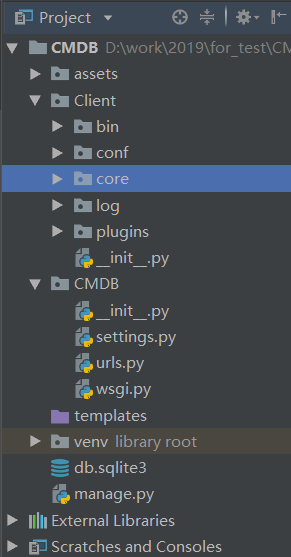
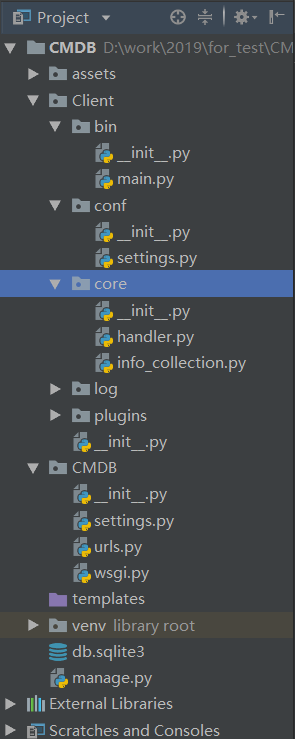

# 3.数据收集客户端


------

CMDB最主要的管理对象是各种类型大量的服务器，其数据信息自然不可能通过手工收集，必须以客户端的方式，定时自动收集并报告给远程的服务器。

下面，让我们暂时忘掉Django，进入Python运维的世界......

## 一、客户端程序组织

编写客户端，不能一个py脚本包打天下，要有组织有目的，通常我们会采取下面的结构：



在Pycharm中，项目根目录下，创建一个Client目录，作为客户端的根目录。

在Client下，创建下面的包。注意是包，不是文件夹：

- bin：客户端启动脚本的所在目录
- conf：配置文件目录
- core：核心代码目录
- log：日志文件目录
- plugins：插件或工具目录

## 二、开发数据收集客户端

### 1.程序入口脚本

在bin目录中新建`main.py`文件，写入下面的代码：

```
#!/usr/bin/env python
# -*- coding:utf-8 -*-

"""
完全可以把客户端信息收集脚本做成windows和linux两个不同的版本。
"""
import os
import sys

BASE_DIR = os.path.dirname(os.getcwd())
# 设置工作目录，使得包和模块能够正常导入
sys.path.append(BASE_DIR)

from core import handler

if __name__ == '__main__':

    handler.ArgvHandler(sys.argv)
```

**在pycharm中可能出现导入失败的红色波浪线警告信息，其实是可以导入的，请忽略它。**

- 通过os和sys模块的配合，将当前客户端所在目录设置为工作目录，如果不这么做，会无法导入其它模块；
- handler模块是核心代码模块，在core目录中，我们一会来实现它。
- 以后调用客户端就只需要执行`python main.py 参数`就可以了

**这里有个问题一定要强调一下，那就是Python解释器的调用，执行命令的方式和代码第一行`#!/usr/bin/env python`的指定方式一定不能冲突，要根据你的实际情况实际操作和修改代码！**

### 2.主功能模块

在core下，创建`handler.py`文件，写入下面的代码：

```
# -*- coding:utf-8 -*-

import json
import time
import urllib.parse
import urllib.request
from core import info_collection
from conf import settings


class ArgvHandler(object):

    def __init__(self, args):
        self.args = args
        self.parse_args()

    def parse_args(self):
        """
        分析参数，如果有参数指定的方法，则执行该功能，如果没有，打印帮助说明。
        :return:
        """
        if len(self.args) > 1 and hasattr(self, self.args[1]):
            func = getattr(self, self.args[1])
            func()
        else:
            self.help_msg()

    @staticmethod
    def help_msg():
        """
        帮助说明
        :return:
        """
        msg = '''
        参数名               功能

        collect_data        测试收集硬件信息的功能

        report_data         收集硬件信息并汇报
        '''
        print(msg)

    @staticmethod
    def collect_data():
        """收集硬件信息,用于测试！"""
        info = info_collection.InfoCollection()
        asset_data = info.collect()
        print(asset_data)

    @staticmethod
    def report_data():
        """
        收集硬件信息，然后发送到服务器。
        :return:
        """
        # 收集信息
        info = info_collection.InfoCollection()
        asset_data = info.collect()
        # 将数据打包到一个字典内，并转换为json格式
        data = {"asset_data": json.dumps(asset_data)}
        # 根据settings中的配置，构造url
        url = "http://%s:%s%s" % (settings.Params['server'], settings.Params['port'], settings.Params['url'])
        print('正在将数据发送至： [%s]  ......' % url)
        try:
            # 使用Python内置的urllib.request库，发送post请求。
            # 需要先将数据进行封装，并转换成bytes类型
            data_encode = urllib.parse.urlencode(data).encode()
            response = urllib.request.urlopen(url=url, data=data_encode, timeout=settings.Params['request_timeout'])
            print("\033[31;1m发送完毕！\033[0m ")
            message = response.read().decode()
            print("返回结果：%s" % message)
        except Exception as e:
            message = '发送失败' + "   错误原因：  {}".format(e)
            print("\033[31;1m发送失败，错误原因： %s\033[0m" % e)
        # 记录发送日志
        with open(settings.PATH, 'ab') as f:  # 以byte的方式写入，防止出现编码错误
            log = '发送时间：%s \t 服务器地址：%s \t 返回结果：%s \n' % (time.strftime('%Y-%m-%d %H:%M:%S'), url, message)
            f.write(log.encode())
            print("日志记录成功！")
```

说明：

- handler模块中只有一个ArgvHandler类；
- 在main模块中也是实例化了一个ArgvHandler类的对象，并将调用参数传递进去；
- 首先，初始化方法会保存调用参数，然后执行parse_args()方法分析参数；
- 如果ArgvHandler类有参数指定的功能，则执行该功能，如果没有，打印帮助说明。
- 目前ArgvHandler类只有两个核心方法：`collect_data`和`report_data`；
- `collect_data`收集数据并打印到屏幕，用于测试；`report_data`方法才会将实际的数据发往服务器。
- 数据的收集由`info_collection.InfoCollection`类负责，一会再看；
- `report_data`方法会将收集到的数据打包到一个字典内，并转换为json格式；
- 然后通过settings中的配置，构造发送目的地url；
- 通过Python内置的urllib.parse对数据进行封装；
- 通过urllib.request将数据发送到目的url；
- 接收服务器返回的信息；
- 将成功或者失败的信息写入日志文件中。

以后，我们要测试数据收集，执行`python main.py collect_data`；要实际往服务器发送收集到的数据，则执行`python main.py report_data`。

### 3.配置文件

要将所有可能修改的数据、常量、配置等都尽量以配置文件的形式组织起来，尽量不要在代码中写死任何数据。

在conf中，新建`settings.py`文件，写入下面的代码：

```
# -*- coding:utf-8 -*-

import os

# 远端接收数据的服务器
Params = {
    "server": "192.168.0.100",
    "port": 8000,
    'url': '/assets/report/',
    'request_timeout': 30,
}

# 日志文件配置

PATH = os.path.join(os.path.dirname(os.getcwd()), 'log', 'cmdb.log')


# 更多配置，请都集中在此文件中
```

这里，配置了服务器地址、端口、发送的url、请求的超时时间，以及日志文件路径。请根据你的实际情况进行修改。

### 4.信息收集模块

在core中新建`info_collection.py`文件，写入下面的代码：

```
# -*- coding:utf-8 -*-

import sys
import platform


class InfoCollection(object):

    def collect(self):
        # 收集平台信息
        # 首先判断当前平台，根据平台的不同，执行不同的方法
        try:
            func = getattr(self, platform.system().lower())
            info_data = func()
            formatted_data = self.build_report_data(info_data)
            return formatted_data
        except AttributeError:
            sys.exit("不支持当前操作系统： [%s]! " % platform.system())

    @staticmethod
    def linux():
        from plugins.collect_linux_info import collect
        return collect()

    @staticmethod
    def windows():
        from plugins.collect_windows_info import Win32Info
        return Win32Info().collect()

    @staticmethod
    def build_report_data(data):
        # 留下一个接口，方便以后增加功能或者过滤数据
        pass
        return data
```

该模块的作用很简单：

- 首先通过Python内置的platform模块获取执行main脚本的操作系统类别，通常是windows和Linux，暂时不支持其它操作系统；
- 根据操作系统的不同，反射获取相应的信息收集方法，并执行；
- 如果是客户端不支持的操作系统，比如苹果系统，则提示并退出客户端。

因为windows和Linux两大操作系统的巨大平台差异，我们必须写两个收集信息的脚本。

到目前为止，我们的客户端结构如下图所示：



------