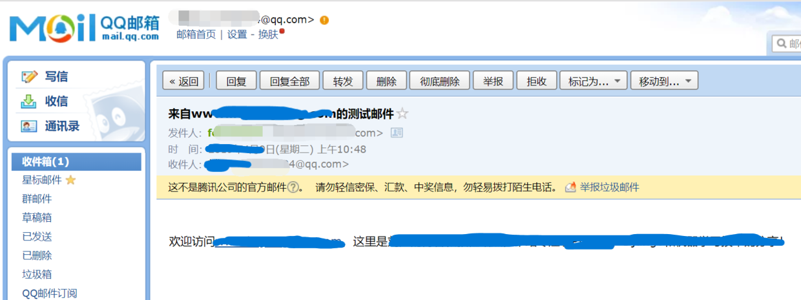
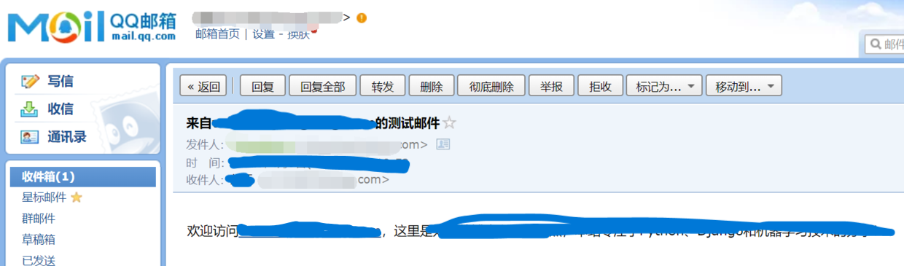

# 11.Django发送邮件


------

通常而言，我们在用户注册成功，实际登陆之前，会发送一封电子邮件到对方的注册邮箱中，表示欢迎。进一步的还可能要求用户点击邮件中的链接，进行注册确认。

下面就让我们先看看如何在Django中发送邮件吧。

## 一、在Django中发送邮件

其实在Python中已经内置了一个smtp邮件发送模块，Django在此基础上进行了简单地封装。

首先，我们需要在项目的settings文件中配置邮件发送参数，分别如下：

```
EMAIL_BACKEND = 'django.core.mail.backends.smtp.EmailBackend'
EMAIL_HOST = 'smtp.sina.com'
EMAIL_PORT = 25
EMAIL_HOST_USER = 'xxx@sina.com'
EMAIL_HOST_PASSWORD = 'xxxxxxxxxxx'
```

- 第一行指定发送邮件的后端模块，大多数情况下照抄！
- 第二行，不用说，发送方的smtp服务器地址，建议使用新浪家的；
- 第三行，smtp服务端口，默认为25；
- 第四行，你在发送服务器的用户名；
- 第五行，对应用户的密码。

特别说明：

- 某些邮件公司可能不开放smtp服务
- 某些公司要求使用ssl安全机制
- 某些smtp服务对主机名格式有要求

这些都是前人踩过的坑。如果你在测试中出现了问题，请不要找Django的麻烦，99%的原因和你的邮件服务有关。

配置好了参数，就可以先测试一下邮件功能了。

在项目根目录下新建一个`send_mail.py`文件，然后写入下面的内容：

```
import os
from django.core.mail import send_mail

os.environ['DJANGO_SETTINGS_MODULE'] = 'mysite.settings'

if __name__ == '__main__':   

    send_mail(
        '测试邮件',
        '测试邮件的分享！',
        'xxx@sina.com',
        ['xxx@qq.com'],
    )
```

对于send_mail方法，第一个参数是邮件主题subject；第二个参数是邮件具体内容；第三个参数是邮件发送方，需要和你settings中的一致；第四个参数是接受方的邮件地址列表。请按你自己实际情况修改发送方和接收方的邮箱地址。

另外，由于我们当前是单独运行`send_mail.py`文件，无法自动链接Django环境，需要通过os模块对环境变量进行设置，也就是：

```
os.environ['DJANGO_SETTINGS_MODULE'] = 'mysite.settings'
```

运行`send_mail.py`文件，注意不是运行Django服务器。然后到你的目的地邮箱查看邮件是否收到。



## 二、发送HTML格式的邮件

通常情况下，我们发送的邮件内容都是纯文本格式。但是很多情况下，我们需要发送带有HTML格式的内容，比如说超级链接。一般情况下，为了安全考虑，很多邮件服务提供商都会禁止使用HTML内容，幸运的是对于以`http`和`https`开头的链接还是可以点击的。

下面是发送HTML格式的邮件例子。删除`send_mail.py`原来的所有内容，添加下面的代码：

```
import os
from django.core.mail import EmailMultiAlternatives

os.environ['DJANGO_SETTINGS_MODULE'] = 'mysite.settings'

if __name__ == '__main__':

    subject, from_email, to = '来自test.com的测试邮件', 'xxx@sina.com', 'xxx@qq.com'
    text_content = '欢迎访问www.liujiangblog.com，这里测试邮件！'
    html_content = '<p>欢迎访问<a href="http://www.liujiangblog.com" target=blank>test.com</a>，这里是测试邮件，来自Django的分享！</p>'
    msg = EmailMultiAlternatives(subject, text_content, from_email, [to])
    msg.attach_alternative(html_content, "text/html")
    msg.send()
```

其中的`text_content`是用于当HTML内容无效时的替代txt文本。

打开测试用的接收邮箱，可以看到链接能够正常点击，如下图所示：



这个`send_mail.py`文件只是一个测试脚本，使用完毕后可以从项目里删除。