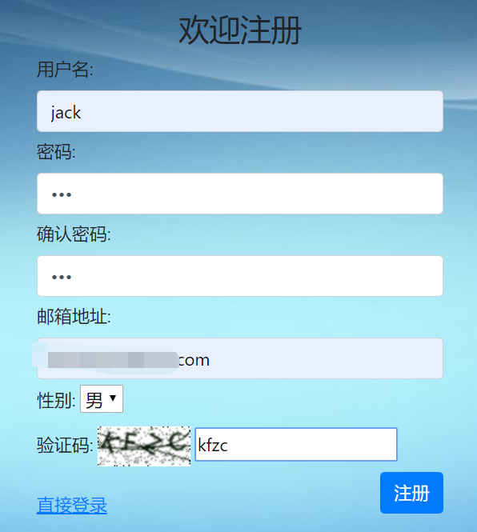
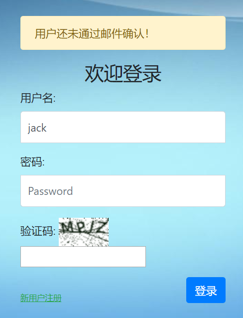
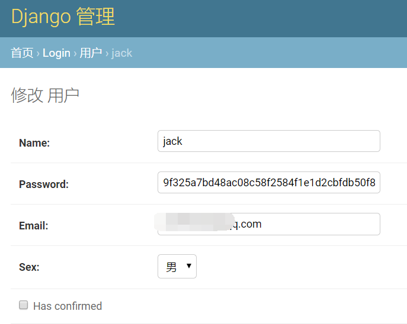
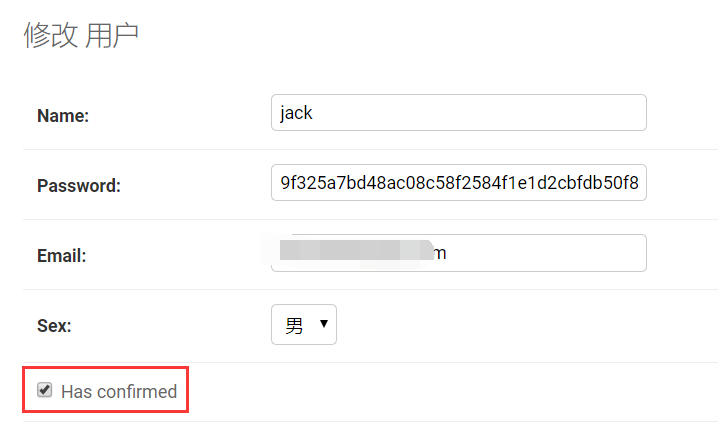

# 12. 邮件注册确认


------

很自然地，我们会想到如果能用邮件确认的方式对新注册用户进行审查，既安全又正式，也是目前很多站点的做法。

## 一、 创建模型

既然要区分通过和未通过邮件确认的用户，那么必须给用户添加一个是否进行过邮件确认的属性。

另外，我们要创建一张新表，用于保存用户的确认码以及注册提交的时间。

全新、完整的`/login/models.py`文件如下：

```
from django.db import models

# Create your models here.


class User(models.Model):

    gender = (
        ('male', "男"),
        ('female', "女"),
    )

    name = models.CharField(max_length=128, unique=True)
    password = models.CharField(max_length=256)
    email = models.EmailField(unique=True)
    sex = models.CharField(max_length=32, choices=gender, default="男")
    c_time = models.DateTimeField(auto_now_add=True)
    has_confirmed = models.BooleanField(default=False)

    def __str__(self):
        return self.name

    class Meta:
        ordering = ["-c_time"]
        verbose_name = "用户"
        verbose_name_plural = "用户"


class ConfirmString(models.Model):
    code = models.CharField(max_length=256)
    user = models.OneToOneField('User', on_delete=models.CASCADE)
    c_time = models.DateTimeField(auto_now_add=True)

    def __str__(self):
        return self.user.name + ":   " + self.code

    class Meta:

        ordering = ["-c_time"]
        verbose_name = "确认码"
        verbose_name_plural = "确认码"
```

说明：

- User模型新增了`has_confirmed`字段，这是个布尔值，默认为False，也就是未进行邮件注册；
- ConfirmString模型保存了用户和注册码之间的关系，一对一的形式；
- code字段是哈希后的注册码；
- user是关联的一对一用户；
- `c_time`是注册的提交时间。

这里有个问题可以讨论一下：是否需要创建ConfirmString新表？可否都放在User表里？我认为如果全都放在User中，不利于管理，查询速度慢，创建新表有利于区分已确认和未确认的用户。最终的选择可以根据你的实际情况具体分析。

模型修改和创建完毕，需要执行migrate命令，一定不要忘了。

顺便修改一下admin.py文件，方便我们在后台修改和观察数据。

```
# login/admin.py

from django.contrib import admin

# Register your models here.

from . import models

admin.site.register(models.User)
admin.site.register(models.ConfirmString)
```

## 二、修改视图

首先，要修改我们的`register()`视图的逻辑：

```
def register(request):
    if request.session.get('is_login', None):
        return redirect('/index/')

    if request.method == 'POST':
        register_form = forms.RegisterForm(request.POST)
        message = "请检查填写的内容！"
        if register_form.is_valid():
            username = register_form.cleaned_data.get('username')
            password1 = register_form.cleaned_data.get('password1')
            password2 = register_form.cleaned_data.get('password2')
            email = register_form.cleaned_data.get('email')
            sex = register_form.cleaned_data.get('sex')

            if password1 != password2:
                message = '两次输入的密码不同！'
                return render(request, 'login/register.html', locals())
            else:
                same_name_user = models.User.objects.filter(name=username)
                if same_name_user:
                    message = '用户名已经存在'
                    return render(request, 'login/register.html', locals())
                same_email_user = models.User.objects.filter(email=email)
                if same_email_user:
                    message = '该邮箱已经被注册了！'
                    return render(request, 'login/register.html', locals())

                new_user = models.User()
                new_user.name = username
                new_user.password = hash_code(password1)
                new_user.email = email
                new_user.sex = sex
                new_user.save()

                code = make_confirm_string(new_user)
                send_email(email, code)

                message = '请前往邮箱进行确认！'
                return render(request, 'login/confirm.html', locals())
        else:
            return render(request, 'login/register.html', locals())
    register_form = forms.RegisterForm()
    return render(request, 'login/register.html', locals())
```

关键是多了下面两行：

```
code = make_confirm_string(new_user)
send_email(email, code)
```

`make_confirm_string()`是创建确认码对象的方法，代码如下：

```
import datetime

def make_confirm_string(user):
    now = datetime.datetime.now().strftime("%Y-%m-%d %H:%M:%S")
    code = hash_code(user.name, now)
    models.ConfirmString.objects.create(code=code, user=user,)
    return code
```

在文件顶部要先导入`datetime`模块。

`make_confirm_string()`方法接收一个用户对象作为参数。首先利用datetime模块生成一个当前时间的字符串now，再调用我们前面编写的`hash_code()`方法以用户名为基础，now为‘盐’，生成一个独一无二的哈希值，再调用ConfirmString模型的create()方法，生成并保存一个确认码对象。最后返回这个哈希值。

`send_email(email, code)`方法接收两个参数，分别是注册的邮箱和前面生成的哈希值，代码如下：

```
from django.conf import settings

def send_email(email, code):

    from django.core.mail import EmailMultiAlternatives

    subject = '来自注册测试确认邮件'

    text_content = '''感谢注册技术的分享！\
                    如果你看到这条消息，说明你的邮箱服务器不提供HTML链接功能，请联系管理员！'''

    html_content = '''
                    <p>感谢注册<a href="http://{}/confirm/?code={}" target=blank>www.liujiangblog.com</a>，\
                    测试</p>
                    <p>请点击站点链接完成注册确认！</p>
                    <p>此链接有效期为{}天！</p>
                    '''.format('127.0.0.1:8000', code, settings.CONFIRM_DAYS)

    msg = EmailMultiAlternatives(subject, text_content, settings.EMAIL_HOST_USER, [email])
    msg.attach_alternative(html_content, "text/html")
    msg.send()
```

首先我们需要导入settings配置文件`from django.conf import settings`。

邮件内容中的所有字符串都可以根据你的实际情况进行修改。其中关键在于`<a href=''>`中链接地址的格式，我这里使用了硬编码的'127.0.0.1:8000'，请酌情修改，url里的参数名为`code`，它保存了关键的注册确认码，最后的有效期天数为设置在settings中的`CONFIRM_DAYS`。所有的这些都是可以定制的！

下面是邮件相关的settings配置：

```
# 邮件配置
EMAIL_BACKEND = 'django.core.mail.backends.smtp.EmailBackend'
EMAIL_HOST = 'smtp.sina.com'
EMAIL_PORT = 25
EMAIL_HOST_USER = 'xxx@sina.com'
EMAIL_HOST_PASSWORD = 'xxxxxx'

# 注册有效期天数
CONFIRM_DAYS = 7
```

## 三、处理邮件确认请求

首先，在根目录的`urls.py`中添加一条url：

```
path('confirm/', views.user_confirm),
```

其次，在`login/views.py`中添加一个`user_confirm`视图。

```
def user_confirm(request):
    code = request.GET.get('code', None)
    message = ''
    try:
        confirm = models.ConfirmString.objects.get(code=code)
    except:
        message = '无效的确认请求!'
        return render(request, 'login/confirm.html', locals())

    c_time = confirm.c_time
    now = datetime.datetime.now()
    if now > c_time + datetime.timedelta(settings.CONFIRM_DAYS):
        confirm.user.delete()
        message = '您的邮件已经过期！请重新注册!'
        return render(request, 'login/confirm.html', locals())
    else:
        confirm.user.has_confirmed = True
        confirm.user.save()
        confirm.delete()
        message = '感谢确认，请使用账户登录！'
        return render(request, 'login/confirm.html', locals())
```

说明：

- 通过`request.GET.get('code', None)`从请求的url地址中获取确认码;
- 先去数据库内查询是否有对应的确认码;
- 如果没有，返回`confirm.html`页面，并提示;
- 如果有，获取注册的时间`c_time`，加上设置的过期天数，这里是7天，然后与现在时间点进行对比；
- 如果时间已经超期，删除注册的用户，同时注册码也会一并删除，然后返回`confirm.html`页面，并提示;
- 如果未超期，修改用户的`has_confirmed`字段为True，并保存，表示通过确认了。然后删除注册码，但不删除用户本身。最后返回`confirm.html`页面，并提示。

这里需要一个`confirm.html`页面，我们将它创建在`/login/templates/login/`下面：

```
<!DOCTYPE html>
<html lang="en">
<head>
    <meta charset="UTF-8">
    <title>注册确认</title>
</head>
<body>


    <h1 style="margin-left: 100px;">{{ message }}</h1>

    <script>
        window.setTimeout("window.location='/login/'",2000);
    </script>

</body>
</html>
```

页面中通过JS代码，设置2秒后自动跳转到登录页面。

confirm.html页面仅仅是个示意的提示页面，你可以根据自己的需要去除或者美化。

## 四、修改登录规则

既然未进行邮件确认的用户不能登录，那么我们就必须修改登录规则，如下所示：

```
def login(request):
    if request.session.get('is_login', None):  # 不允许重复登录
        return redirect('/index/')
    if request.method == 'POST':
        login_form = forms.UserForm(request.POST)
        message = '请检查填写的内容！'
        if login_form.is_valid():
            username = login_form.cleaned_data.get('username')
            password = login_form.cleaned_data.get('password')

            try:
                user = models.User.objects.get(name=username)
            except :
                message = '用户不存在！'
                return render(request, 'login/login.html', locals())

            if not user.has_confirmed:
                message = '该用户还未经过邮件确认！'
                return render(request, 'login/login.html', locals())

            if user.password == hash_code(password):
                request.session['is_login'] = True
                request.session['user_id'] = user.id
                request.session['user_name'] = user.name
                return redirect('/index/')
            else:
                message = '密码不正确！'
                return render(request, 'login/login.html', locals())
        else:
            return render(request, 'login/login.html', locals())

    login_form = forms.UserForm()
    return render(request, 'login/login.html', locals())
```

关键是下面的部分：

```
if not user.has_confirmed:
    message = '该用户还未经过邮件确认！'
    return render(request, 'login/login.html', locals())
```

最后，贴出view.py的整体代码，供大家参考：

```
from django.shortcuts import render
from django.shortcuts import redirect
from django.conf import settings
from . import models
from . import forms
import hashlib
import datetime
# Create your views here.


def hash_code(s, salt='mysite'):
    h = hashlib.sha256()
    s += salt
    h.update(s.encode())
    return h.hexdigest()


def make_confirm_string(user):
    now = datetime.datetime.now().strftime("%Y-%m-%d %H:%M:%S")
    code = hash_code(user.name, now)
    models.ConfirmString.objects.create(code=code, user=user)
    return code


def send_email(email, code):

    from django.core.mail import EmailMultiAlternatives

    subject = '来自www.liujiangblog.com的注册确认邮件'

    text_content = '''注册测试的分享！\
                    如果你看到这条消息，说明你的邮箱服务器不提供HTML链接功能，请联系管理员！'''

    html_content = '''
                    <p>感谢注册<a href="http://{}/confirm/?code={}" target=blank>test.com</a>，\
                    测试注册的分享！</p>
                    <p>请点击站点链接完成注册确认！</p>
                    <p>此链接有效期为{}天！</p>
                    '''.format('127.0.0.1:8000', code, settings.CONFIRM_DAYS)

    msg = EmailMultiAlternatives(subject, text_content, settings.EMAIL_HOST_USER, [email])
    msg.attach_alternative(html_content, "text/html")
    msg.send()


def index(request):
    if not request.session.get('is_login', None):
        return redirect('/login/')
    return render(request, 'login/index.html')


def login(request):
    if request.session.get('is_login', None):  # 不允许重复登录
        return redirect('/index/')
    if request.method == 'POST':
        login_form = forms.UserForm(request.POST)
        message = '请检查填写的内容！'
        if login_form.is_valid():
            username = login_form.cleaned_data.get('username')
            password = login_form.cleaned_data.get('password')

            try:
                user = models.User.objects.get(name=username)
            except :
                message = '用户不存在！'
                return render(request, 'login/login.html', locals())

            if not user.has_confirmed:
                message = '该用户还未经过邮件确认！'
                return render(request, 'login/login.html', locals())

            if user.password == hash_code(password):
                request.session['is_login'] = True
                request.session['user_id'] = user.id
                request.session['user_name'] = user.name
                return redirect('/index/')
            else:
                message = '密码不正确！'
                return render(request, 'login/login.html', locals())
        else:
            return render(request, 'login/login.html', locals())

    login_form = forms.UserForm()
    return render(request, 'login/login.html', locals())


def register(request):
    if request.session.get('is_login', None):
        return redirect('/index/')

    if request.method == 'POST':
        register_form = forms.RegisterForm(request.POST)
        message = "请检查填写的内容！"
        if register_form.is_valid():
            username = register_form.cleaned_data.get('username')
            password1 = register_form.cleaned_data.get('password1')
            password2 = register_form.cleaned_data.get('password2')
            email = register_form.cleaned_data.get('email')
            sex = register_form.cleaned_data.get('sex')

            if password1 != password2:
                message = '两次输入的密码不同！'
                return render(request, 'login/register.html', locals())
            else:
                same_name_user = models.User.objects.filter(name=username)
                if same_name_user:
                    message = '用户名已经存在'
                    return render(request, 'login/register.html', locals())
                same_email_user = models.User.objects.filter(email=email)
                if same_email_user:
                    message = '该邮箱已经被注册了！'
                    return render(request, 'login/register.html', locals())

                new_user = models.User()
                new_user.name = username
                new_user.password = hash_code(password1)
                new_user.email = email
                new_user.sex = sex
                new_user.save()

                code = make_confirm_string(new_user)
                send_email(email, code)

                message = '请前往邮箱进行确认！'
                return render(request, 'login/confirm.html', locals())
        else:
            return render(request, 'login/register.html', locals())
    register_form = forms.RegisterForm()
    return render(request, 'login/register.html', locals())


def logout(request):
    if not request.session.get('is_login', None):
        return redirect('/login/')

    request.session.flush()
    # del request.session['is_login']
    return redirect("/login/")


def user_confirm(request):
    code = request.GET.get('code', None)
    message = ''

    try:
        confirm = models.ConfirmString.objects.get(code=code)
    except:
        message = '无效的确认请求！'
        return render(request, 'login/confirm.html', locals())

    c_time = confirm.c_time
    now = datetime.datetime.now()
    if now > c_time + datetime.timedelta(settings.CONFIRM_DAYS):
        confirm.user.delete()
        message = '您的邮件已经过期！请重新注册！'
        return render(request, 'login/confirm.html', locals())
    else:
        confirm.user.has_confirmed = True
        confirm.user.save()
        confirm.delete()
        message = '感谢确认，请使用账户登录！'
        return render(request, 'login/confirm.html', locals())
```

## 五、功能展示

首先，通过admin后台删除原来所有的用户。

进入注册页面，如下图所示：



点击注册后，跳转到提示信息页面，2秒后再跳转到登录页面。

尝试登录用户，但提示还未进行邮件确认：



进入admin后台，查看刚才建立的用户，可以看到其处于未确认状态：



进入你的测试邮箱，查看注册邮件：

点击链接，自动跳转到确认成功提示页面，2秒后再跳转到登录页面。这个时候再次查看admin后台，可以看到用户已经处于登录确认状态，并且确认码也被自动删除了，不会第二次被使用：



使用该用户正常登录吧！Very Good！一切都很不错！

## 六、总结说明

关于邮件注册，还有很多内容可以探讨，比如定时删除未在有效期内进行邮件确认的用户，这个可以用Django的celery实现，或者使用Linux的cronb功能。

关于邮件注册的工作逻辑，项目里只是抛砖引玉，做个展示，并不够严谨，也需要你自己根据实际环境去设计。

最后，其实Django生态圈有一个现成的邮件注册模块django-registration，但是这个模块灵活度不高，并且绑定了Auth框架，有兴趣的可以去看看其英文文档，中文资料较少。