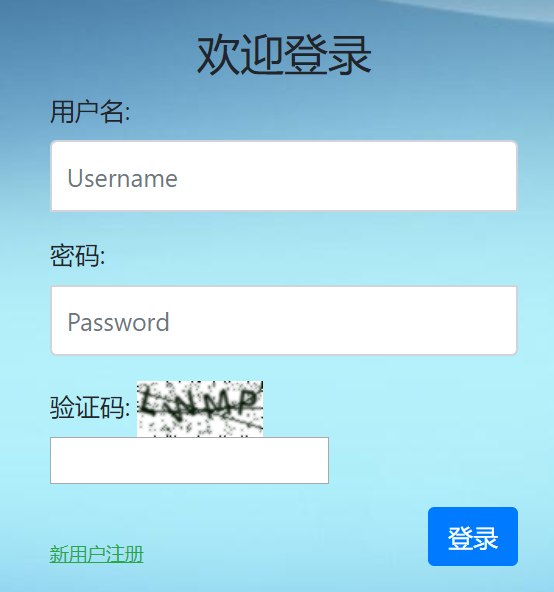
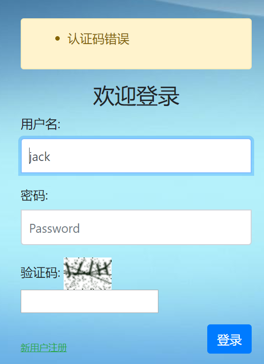

# 8. 图片验证码


------

为了防止机器人频繁登录网站或者破坏分子恶意登录，很多用户登录和注册系统都提供了图形验证码功能。

验证码（CAPTCHA）是“Completely Automated Public Turing test to tell  Computers and Humans  Apart”（全自动区分计算机和人类的图灵测试）的缩写，是一种区分用户是计算机还是人的公共全自动程序。可以防止恶意破解密码、刷票、论坛灌水，有效防止某个黑客对某一个特定注册用户用特定程序暴力破解方式进行不断的登陆尝试。

图形验证码的历史比较悠久，到现在已经有点英雄末路的味道了。因为机器学习、图像识别的存在，机器人已经可以比较正确的识别图像内的字符了。但不管怎么说，作为一种防御手段，至少还是可以抵挡一些低级入门的攻击手段，抬高了攻击者的门槛。

在Django中实现图片验证码功能非常简单，有现成的第三方库可以使用，我们不必自己开发（也要能开发得出来，囧）。这个库叫做`django-simple-captcha`。

## 一、安装captcha

在Pycharm的terminal中，使用pip安装第三方库：

```
执行命令：pip install django-simple-captcha
(venv) D:\work\2019\for_test\mysite>pip install django-simple-captcha
Collecting django-simple-captcha
  Downloading https://files.pythonhosted.org/packages/86/d4/5baf10bfc9eb7844872c256898a405e81f22f7213e008ec90875689f913d/django-simple-captcha-0
.5.11.zip (234kB)
    100% |████████████████████████████████| 235kB 596kB/s
Collecting six>=1.2.0 (from django-simple-captcha)
  Downloading https://files.pythonhosted.org/packages/73/fb/00a976f728d0d1fecfe898238ce23f502a721c0ac0ecfedb80e0d88c64e9/six-1.12.0-py2.py3-none
-any.whl
Requirement already satisfied: Django>=1.8 in d:\work\2019\for_test\mysite\venv\lib\site-packages (from django-simple-captcha) (2.2)
Collecting Pillow!=5.1.0,>=2.2.2 (from django-simple-captcha)
  Downloading https://files.pythonhosted.org/packages/40/f2/a424d4d5dd6aa8c26636969decbb3da1c01286d344e71429b1d648bccb64/Pillow-6.0.0-cp37-cp37m
-win_amd64.whl (2.0MB)
    100% |████████████████████████████████| 2.0MB 2.2MB/s
Collecting django-ranged-response==0.2.0 (from django-simple-captcha)
  Downloading https://files.pythonhosted.org/packages/70/e3/9372fcdca8e9c3205e7979528ccd1a14354a9a24d38efff11c1846ff8bf1/django-ranged-response-
0.2.0.tar.gz
Requirement already satisfied: sqlparse in d:\work\2019\for_test\mysite\venv\lib\site-packages (from Django>=1.8->django-simple-captcha) (0.3.0)

Requirement already satisfied: pytz in d:\work\2019\for_test\mysite\venv\lib\site-packages (from Django>=1.8->django-simple-captcha) (2018.9)
Installing collected packages: six, Pillow, django-ranged-response, django-simple-captcha
  Running setup.py install for django-ranged-response ... done
  Running setup.py install for django-simple-captcha ... done
Successfully installed Pillow-6.0.0 django-ranged-response-0.2.0 django-simple-captcha-0.5.11 six-1.12.0
```

pip自动帮我们安装了相关的依赖库`six`、`olefile`和`Pillow`，其中的Pillow是大名鼎鼎的绘图模块。

## 二、注册captcha

在settings中，将‘captcha’注册到app列表里：

```
# Application definition

INSTALLED_APPS = [
    'django.contrib.admin',
    'django.contrib.auth',
    'django.contrib.contenttypes',
    'django.contrib.sessions',
    'django.contrib.messages',
    'django.contrib.staticfiles',
    'login',
    'captcha',
]
```

captcha需要在数据库中建立自己的数据表，所以需要执行migrate命令生成数据表：

```
(venv) D:\work\2019\for_test\mysite>python manage.py migrate
Operations to perform:
  Apply all migrations: admin, auth, captcha, contenttypes, login, sessions
Running migrations:
  Applying captcha.0001_initial... OK
```

## 三、添加url路由

在根目录下的urls.py文件中增加captcha对应的url：

```
from django.contrib import admin
from django.urls import path
from django.urls import include
from login import views

urlpatterns = [
    path('admin/', admin.site.urls),
    path('index/', views.index),
    path('login/', views.login),
    path('register/', views.register),
    path('logout/', views.logout),
    path('captcha/', include('captcha.urls'))   # 增加这一行
]
```

由于使用了二级路由机制，需要在顶部`from django.urls import include`。

## 四、修改forms.py

如果上面都OK了，就可以直接在我们的forms.py文件中添加CaptchaField了。

```
from django import forms
from captcha.fields import CaptchaField

class UserForm(forms.Form):
    username = forms.CharField(label="用户名", max_length=128, widget=forms.TextInput(attrs={'class': 'form-control', 'placeholder': "Username",'autofocus': ''}))
    password = forms.CharField(label="密码", max_length=256, widget=forms.PasswordInput(attrs={'class': 'form-control',  'placeholder': "Password"}))
    captcha = CaptchaField(label='验证码')
```

注意需要提前导入`from captcha.fields import CaptchaField`，然后就像写普通的form字段一样添加一个captcha字段就可以了！

## 五、修改login.html

由于我们前面是手动生成的form表单，所以还要修改一下，添加captcha的相关内容，如下所示：

```

<!doctype html>
<html lang="en">
  <head>
    <!-- Required meta tags -->
    <meta charset="utf-8">
    <meta name="viewport" content="width=device-width, initial-scale=1, shrink-to-fit=no">
    <!-- 上述meta标签*必须*放在最前面，任何其他内容都*必须*跟随其后！ -->
    <!-- Bootstrap CSS -->
    <link href="https://cdn.bootcss.com/twitter-bootstrap/4.3.1/css/bootstrap.min.css" rel="stylesheet">
    <link href="" rel="stylesheet"/>
    <title>登录</title>
  </head>
  <body>
    <div class="container">
            <div class="col">
                <form class="form-login" action="/login/" method="post">

                
                    <div class="alert alert-warning">{{ login_form.captcha.errors }}</div>
                
                    <div class="alert alert-warning">{{ message }}</div>
                

                  
                  <h3 class="text-center">欢迎登录</h3>

                  <div class="form-group">
                    {{ login_form.username.label_tag }}
                    {{ login_form.username}}
                  </div>

                  <div class="form-group">
                    {{ login_form.password.label_tag }}
                    {{ login_form.password }}
                  </div>

                  <div class="form-group">
                    {{ login_form.captcha.label_tag }}
                    {{ login_form.captcha }}
                  </div>

                  <div>
                      <a href="/register/" class="text-success " ><ins>新用户注册</ins></a>
                      <button type="submit" class="btn btn-primary float-right">登录</button>
                  </div>
                </form>
            </div>
    </div> <!-- /container -->

    <!-- Optional JavaScript -->
    <!-- jQuery first, then Popper.js, then Bootstrap JS -->
    {#    以下三者的引用顺序是固定的#}
    <script src="https://cdn.bootcss.com/jquery/3.3.1/jquery.js"></script>
    <script src="https://cdn.bootcss.com/popper.js/1.15.0/umd/popper.js"></script>
    <script src="https://cdn.bootcss.com/twitter-bootstrap/4.3.1/js/bootstrap.min.js"></script>

  </body>
</html>
```

这里在顶部的消息处，在``模板代码中，额外增加了一条`{{ login_form.captcha.errors }}`的判断，用于明确指示用户的验证码不正确。

## 六、查看效果

重启服务器，进入登录页面，尝试用用户名错误、密码不对、验证码不对、全对的不同情况，看看我们新增的四位验证码的效果如何。





就是这么简单！我们加入了一个防止机器人或者恶意登录的图形验证码功能，虽然界面难看了点，但底子是好的，你可以根据需要进行美化。其中验证图形码是否正确的工作都是在后台自动完成的，只需要使用`is_valid()`这个forms内置的验证方法就一起进行了，完全不需要在视图函数中添加任何的验证代码，非常方便快捷！

关于captcha的功能，当然绝不仅限于此，你可以设置六位、八位验证码，可以对图形噪点的生成模式进行定制，这些就留待你自己学习和研究了。